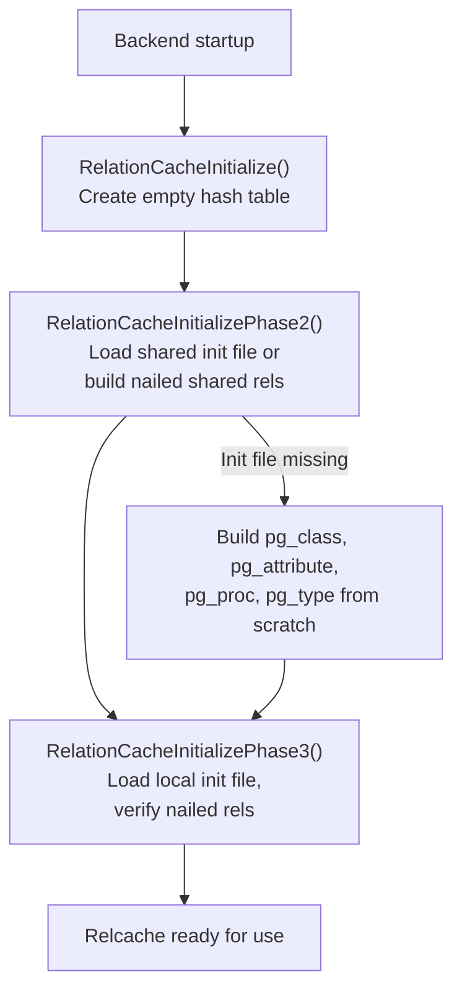
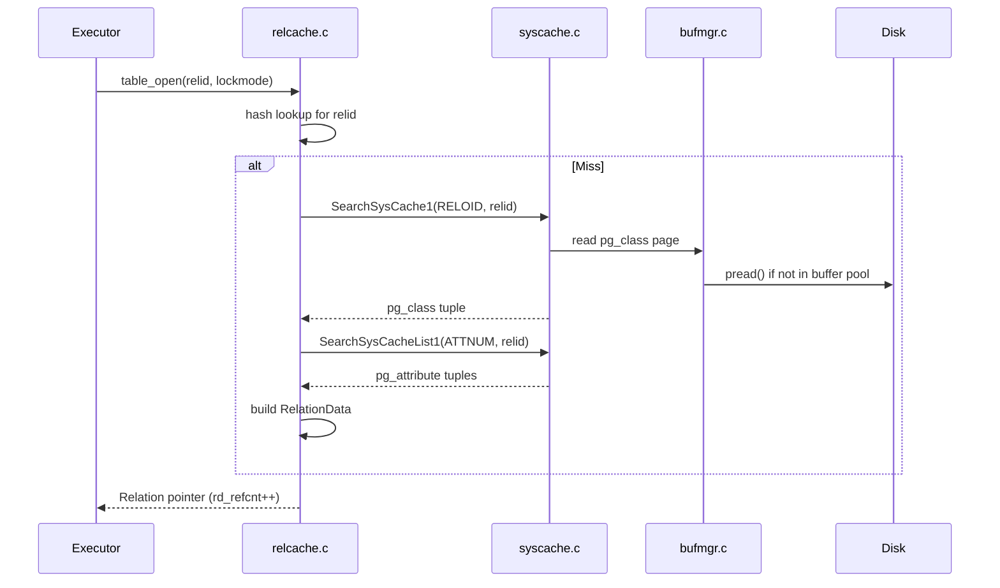

# Relation Cache (relcache)

The **relation cache** maintains a per-backend hash table of `RelationData` structs -- fully materialized descriptors for every relation (table, index, view, sequence, etc.) the backend has accessed. A `RelationData` aggregates information from multiple system catalogs (`pg_class`, `pg_attribute`, `pg_index`, `pg_am`, `pg_constraint`, `pg_trigger`, etc.) into a single in-memory structure that the executor, planner, and storage layer can use without repeated catalog lookups.

## Overview

Opening a relation by OID (`RelationIdGetRelation()`) is one of the most frequent operations in PostgreSQL. The relcache ensures this is fast after the first access. Building a `RelationData` from scratch, however, requires dozens of syscache lookups and is expensive. PostgreSQL mitigates cold-start cost with **relcache init files** (`pg_internal.init`) -- serialized snapshots of critical relcache entries written to disk and loaded during backend startup.

## Key Source Files

| File | Role |
|------|------|
| `src/backend/utils/cache/relcache.c` | Core implementation: build, invalidate, init file management |
| `src/include/utils/relcache.h` | Public API: `RelationIdGetRelation()`, `RelationClose()`, init file routines |
| `src/include/utils/rel.h` | `RelationData` struct definition |
| `src/backend/utils/cache/relmapper.c` | OID-to-relfilenumber mapping for nailed relations |

## How It Works

### Three-Phase Bootstrap

The relcache has a chicken-and-egg problem: to look up catalog tuples, you need the relcache entries for the catalog tables themselves. PostgreSQL solves this with a three-phase initialization:

1. **`RelationCacheInitialize()`** -- Creates the relcache hash table (empty). Sets up `CacheMemoryContext`.

2. **`RelationCacheInitializePhase2()`** -- Loads the relcache init file (if it exists) to populate entries for shared catalogs (`pg_authid`, `pg_database`, etc.) needed before we can access database-local catalogs. If no init file exists, it manually builds entries for the hardcoded "nailed" relations.

3. **`RelationCacheInitializePhase3()`** -- Loads the local relcache init file for database-specific catalogs. Verifies that all nailed-in-cache relations are present and up to date. Rebuilds any entries that are stale.



### Opening a Relation: RelationIdGetRelation

```
RelationIdGetRelation(Oid relationId)
  1. Look up relationId in the relcache hash table
  2. If found and entry is valid:
       - Increment reference count
       - Return the Relation pointer
  3. If found but marked invalid (rd_isvalid == false):
       - Rebuild the entry from catalog lookups (RelationBuildDesc or RelationRebuildRelation)
       - Return the refreshed entry
  4. If not found:
       - Call RelationBuildDesc() to construct a new RelationData
       - Insert into the hash table
       - Return the new entry
```

### RelationBuildDesc

This is the expensive path. It performs syscache lookups for:
- `pg_class` tuple (basic relation metadata)
- `pg_attribute` tuples (column definitions, used to build the `TupleDesc`)
- `pg_index` tuples (if the relation is an index, or to find the relation's indexes)
- Access method info (`pg_am`)
- Rewrite rules (`pg_rewrite`)
- Triggers (`pg_trigger`)
- Row security policies
- Publication membership

The result is a fully populated `RelationData` struct allocated in `CacheMemoryContext`.

### Reference Counting

Every call to `RelationIdGetRelation()` (or its wrapper `table_open()` / `relation_open()`) increments `rd_refcnt`. `RelationClose()` decrements it. A relation with `rd_refcnt > 0` cannot be physically removed from the cache, even if invalidated. Invalidation sets `rd_isvalid = false`, and the next opener rebuilds the entry in place.

### The Relcache Init File

To avoid the cost of building dozens of catalog relation entries at startup, PostgreSQL serializes the most critical relcache entries to `pg_internal.init` (one per database, plus one for shared catalogs in `global/`). The init file contains:
- A magic number (`RELCACHE_INIT_FILEMAGIC = 0x573266`)
- Serialized `RelationData` structs with their `TupleDesc`, index info, and access method data

When any relcache entry for a relation that appears in the init file is invalidated, the init file is deleted (`RelationCacheInitFilePreInvalidate()`). It will be recreated by the next backend that starts up and finds it missing.

{: .warning }
The init file is invalidated (deleted) synchronously during DDL on system catalogs. If many backends are starting concurrently during heavy DDL, they will each rebuild the init file, causing a brief performance dip.

### Invalidation

Relcache invalidation comes in two flavors:

1. **Single-relation invalidation** (`RelationCacheInvalidateEntry(Oid relid)`) -- Marks one entry as `rd_isvalid = false`. Triggered by DDL on a specific table.

2. **Full relcache invalidation** (`RelationCacheInvalidate()`) -- Marks all entries invalid. Triggered by catalog-wide events like `RESET` or when `debug_discard_caches` is enabled.

Both are driven by sinval messages of type `SHAREDINVALRELCACHE_ID`, dispatched through `inval.c`.

At transaction end, `AtEOXact_RelationCache()` checks for entries created during the transaction and either finalizes them (on commit) or removes them (on abort).

## Key Data Structures

### RelationData (simplified)

```
RelationData
  +-- rd_id                  Relation OID (hash key)
  +-- rd_refcnt              reference count
  +-- rd_isvalid             false if entry needs rebuild
  +-- rd_rel                 pg_class tuple (Form_pg_class)
  +-- rd_att                 TupleDesc with column definitions
  +-- rd_index               pg_index tuple (for indexes)
  +-- rd_indexlist            List of index OIDs
  +-- rd_indextuple          raw pg_index HeapTuple
  +-- rd_am                  pg_am tuple (access method)
  +-- rd_amhandler           access method handler OID
  +-- rd_tableam             TableAmRoutine (for tables)
  +-- rd_indexcxt            private memory context for index info
  +-- rd_rules               rewrite rules
  +-- rd_triggers            trigger info (TriggerDesc)
  +-- rd_rowsecurity         row security policies
  +-- rd_fkeylist            foreign key constraints
  +-- rd_smgr                storage manager relation
  +-- rd_rel->relfilenode    physical file identifier
  +-- rd_createSubid         SubXactId of creation (0 if committed)
  +-- rd_newRelfilelocatorSubid  SubXactId of relfilenumber change
```

### Relcache Hash Table

The relcache uses `dynahash.c` (PostgreSQL's general-purpose hash table) with OID keys. The initial size is 400 buckets, which grows dynamically.

### Nailed Relations

Certain system catalog relations are "nailed" into the relcache and cannot be flushed. These include `pg_class`, `pg_attribute`, `pg_proc`, `pg_type`, and their indexes. Nailed entries bypass the normal invalidation logic -- instead of being removed, they are rebuilt in place when invalidated.

## Relation Cache and Buffer Manager Interaction



## Connections

- **[Catalog Cache](catalog-cache)** -- The relcache is built from multiple catcache/syscache lookups.
- **[Invalidation](invalidation)** -- Relcache entries are invalidated via `SHAREDINVALRELCACHE_ID` sinval messages.
- **[Plan Cache](plan-cache)** -- Plan invalidation callbacks watch for relcache invalidation events.
- **Chapter 1 (Storage)** -- `RelationData.rd_smgr` links to the storage manager for physical I/O.
- **Chapter 2 (Access Methods)** -- `rd_tableam` and `rd_amhandler` link to the access method API.
- **Chapter 5 (Locking)** -- `table_open()` acquires a lock before opening the relcache entry, ensuring DDL cannot invalidate a relation that is locked.
