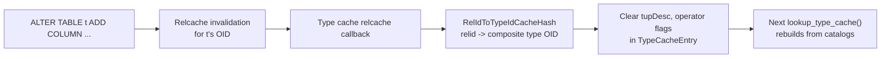

# Type Cache (typcache)

The **type cache** speeds up lookups of information about data types that is not directly stored in `pg_type` but must be derived from operator classes, operator families, and other catalog tables. Its primary consumers are generic routines like `array_eq()`, `record_cmp()`, and `hash_array()` -- functions that need to compare or hash values of arbitrary types without knowing the type at compile time.

## Overview

Given a type OID, the type cache can quickly answer questions like:
- What is the default equality operator for this type?
- What is the default btree comparison function?
- What is the hash function?
- What is the tuple descriptor for this composite type?
- What are the domain constraints for this domain type?
- What is the range subtype and its comparison function?

Without the type cache, answering each of these questions would require multiple syscache lookups into `pg_opclass`, `pg_amop`, `pg_amproc`, and other catalogs. The type cache performs these lookups once and stores the results in a per-backend hash table keyed by type OID.

## Key Source Files

| File | Role |
|------|------|
| `src/backend/utils/cache/typcache.c` | Core implementation: lookup, invalidation, domain constraints |
| `src/include/utils/typcache.h` | `TypeCacheEntry` struct, flag constants, public API |

## How It Works

### Lookup: lookup_type_cache

The central API is `lookup_type_cache(Oid type_id, int flags)`. The `flags` argument is a bitmask specifying which fields the caller needs populated. The function:

1. Looks up the type OID in `TypeCacheHash` (a `dynahash` hash table).
2. If not found, creates a new `TypeCacheEntry` with basic `pg_type` data.
3. Checks which of the requested fields are already computed (tracked by internal `flags` in the entry).
4. For any missing fields, performs the necessary catalog lookups:

| Flag | What It Populates | Catalog Source |
|------|-------------------|----------------|
| `TYPECACHE_EQ_OPR` | `eq_opr` | Default btree opclass for the type |
| `TYPECACHE_LT_OPR` | `lt_opr` | Default btree opclass |
| `TYPECACHE_GT_OPR` | `gt_opr` | Default btree opclass |
| `TYPECACHE_CMP_PROC` | `cmp_proc` | btree comparison support function |
| `TYPECACHE_HASH_PROC` | `hash_proc` | Default hash opclass |
| `TYPECACHE_EQ_OPR_FINFO` | `eq_opr_finfo` | Pre-built `FmgrInfo` for equality |
| `TYPECACHE_CMP_PROC_FINFO` | `cmp_proc_finfo` | Pre-built `FmgrInfo` for comparison |
| `TYPECACHE_HASH_PROC_FINFO` | `hash_proc_finfo` | Pre-built `FmgrInfo` for hashing |
| `TYPECACHE_TUPDESC` | `tupDesc` | Composite type's tuple descriptor |
| `TYPECACHE_RANGE_INFO` | `rngelemtype`, `rng_cmp_proc_finfo`, etc. | `pg_range` catalog |
| `TYPECACHE_DOMAIN_BASE_INFO` | `domainBaseType`, `domainBaseTypmod` | `pg_type.typbasetype` |
| `TYPECACHE_DOMAIN_CONSTR_INFO` | `domainData` | `pg_constraint` lookups |

The lazy population strategy means a `TypeCacheEntry` is only as expensive as the information actually requested.

### Why FmgrInfo Caching Matters

The `FmgrInfo` struct (function manager info) is relatively expensive to initialize -- it requires a syscache lookup of `pg_proc` plus function pointer resolution. Functions like `array_eq()` are called repeatedly for each element comparison. By storing pre-initialized `FmgrInfo` structs in the type cache, PostgreSQL avoids reinitializing them on every call. Since type cache entries live for the backend's lifetime, this is safe from memory leak concerns.

### Composite Type Tuple Descriptors

For composite types (row types), the type cache stores a reference-counted `TupleDesc`. Each `TupleDesc` has a unique `tupDesc_identifier` that changes whenever the type's definition changes (e.g., via `ALTER TABLE`). Callers can cheaply detect staleness by comparing identifiers.

### Domain Constraint Caching

Domain types can have CHECK constraints. The type cache caches the compiled constraint expressions in a `DomainConstraintCache`, which is reference-counted and shared across all `DomainConstraintRef` holders. When the domain's constraints change (detected via relcache invalidation of `pg_constraint`), the old cache is released and a new one is built on demand.

Callers maintain a `DomainConstraintRef` that automatically tracks the current version:

```c
DomainConstraintRef ref;
InitDomainConstraintRef(domainTypeOid, &ref, context, true);
/* ... later ... */
UpdateDomainConstraintRef(&ref);  /* picks up any constraint changes */
```

### Enum Type Ordering

For enum types, the type cache stores a `TypeCacheEnumData` that maps enum OIDs to their sort order positions. This is used by `compare_values_of_enum()` to provide efficient comparison without repeated catalog lookups. The data is rebuilt if `pg_enum` changes.

## Key Data Structures

### TypeCacheEntry

```
TypeCacheEntry
  +-- type_id               type OID (hash key)
  +-- type_id_hash          precomputed hash of OID

  /* Basic pg_type data */
  +-- typlen, typbyval, typalign, typstorage
  +-- typtype               'b'ase, 'c'omposite, 'd'omain, 'e'num, 'r'ange, etc.
  +-- typrelid              for composite types: relation OID
  +-- typelem               element type for arrays
  +-- typcollation          default collation

  /* Operator family info (lazily populated) */
  +-- btree_opf             default btree operator family
  +-- hash_opf              default hash operator family
  +-- eq_opr                equality operator OID
  +-- lt_opr, gt_opr        ordering operator OIDs
  +-- cmp_proc              btree comparison function OID
  +-- hash_proc             hash function OID

  /* Pre-built FmgrInfo (avoids repeated pg_proc lookups) */
  +-- eq_opr_finfo
  +-- cmp_proc_finfo
  +-- hash_proc_finfo

  /* Composite type info */
  +-- tupDesc               TupleDesc (reference-counted)
  +-- tupDesc_identifier    unique ID, changes on ALTER TABLE

  /* Range type info */
  +-- rngelemtype           TypeCacheEntry for element type
  +-- rng_opfamily          comparison opfamily
  +-- rng_cmp_proc_finfo    comparison function

  /* Domain info */
  +-- domainBaseType, domainBaseTypmod
  +-- domainData            DomainConstraintCache

  /* Internal state */
  +-- flags                 which fields have been computed
  +-- enumData              cached enum ordering
  +-- nextDomain            linked list of domain entries
```

### RelIdToTypeIdCacheHash

A secondary hash table that maps relation OIDs to their composite type OIDs. When a relcache invalidation arrives for a relation, this mapping allows the type cache to find and invalidate the corresponding `TypeCacheEntry` without scanning the entire type cache.

## Invalidation

The type cache registers several callbacks:

1. **`pg_type` syscache callback** -- Clears the `TCFLAGS_HAVE_PG_TYPE_DATA` flag, forcing a reload of basic type data on the next lookup.

2. **`pg_opclass` syscache callback** -- Clears the operator-related flags (`TCFLAGS_CHECKED_BTREE_OPCLASS`, etc.), forcing re-derivation of operator and function OIDs.

3. **Relcache callback** -- For composite types, invalidates the `TupleDesc` and operator info when the underlying relation changes. Uses `RelIdToTypeIdCacheHash` for efficient lookup.

4. **`pg_constraint` changes** -- For domain types, triggers rebuild of the `DomainConstraintCache`.



{: .note }
Type cache entries are never freed, even if the type is dropped. The entry becomes wasted memory, but this is acceptable because type drops are rare and entries are small. This design allows other code to cache pointers to `TypeCacheEntry` in long-lived data structures without worrying about dangling references.

## Connections

- **[Catalog Cache](catalog-cache)** -- The type cache uses syscache lookups to find operator classes and functions.
- **[Relation Cache](relation-cache)** -- Composite type tuple descriptors depend on relcache entries. Relcache invalidation triggers type cache updates.
- **[Invalidation](invalidation)** -- The type cache registers both syscache and relcache callbacks.
- **Chapter 2 (Access Methods)** -- Operator family and operator class lookups are essential for index scans and sort operations.
- **Chapter 8 (Executor)** -- Array and record comparison functions in the executor rely heavily on the type cache.
