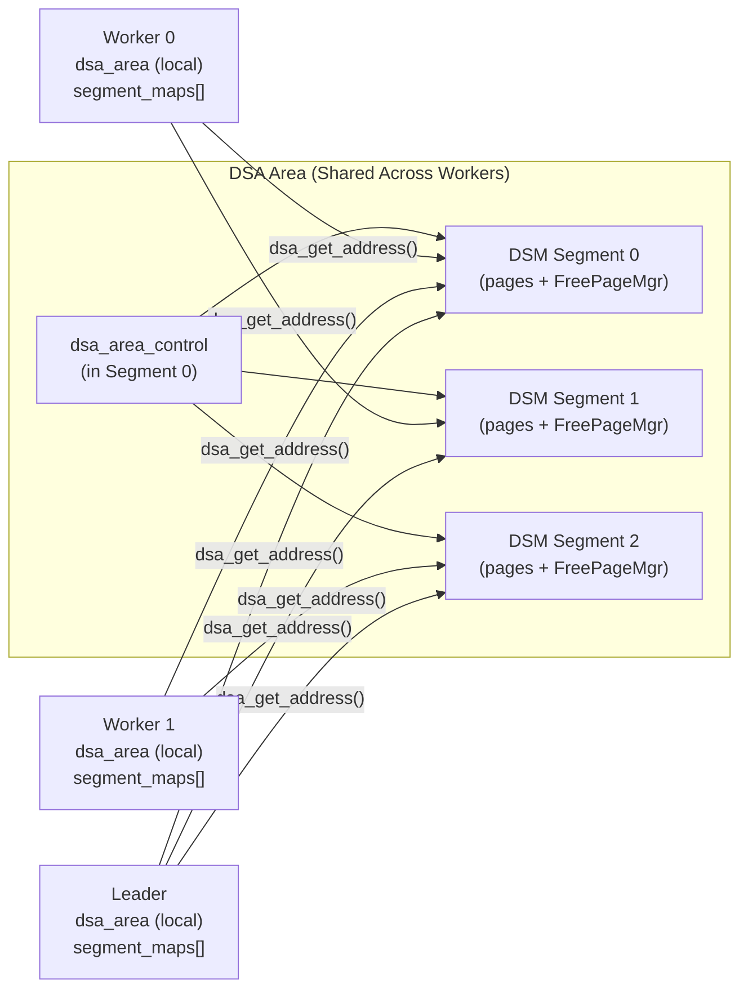

# Dynamic Shared Areas (DSA)

> *DSA gives parallel query workers a shared heap allocator built on top of dynamically attached DSM segments, using fat pointers that encode both a segment index and an offset so that allocations can be shared across processes with different virtual address mappings.*

## Summary

Process-local memory contexts cannot be shared between parallel workers because each
backend has its own address space. The **Dynamic Shared Area (DSA)** system solves this
by providing `dsa_allocate()` and `dsa_free()` --- a malloc-like interface that operates
on shared memory backed by one or more DSM (Dynamic Shared Memory) segments.

DSA returns `dsa_pointer` values rather than raw pointers. A `dsa_pointer` encodes a
segment index and an offset, making it valid across all backends attached to the same
area. To dereference a `dsa_pointer`, a backend calls `dsa_get_address()`, which maps
the segment into its local address space if needed and returns a local pointer.

Internally, DSA uses a two-tier allocation scheme: large requests (above 8 KB) get
consecutive pages from a free page manager; small requests are served from **superblocks**
that are divided into fixed-size objects managed with per-size-class **span** freelists.
This design is similar to classic slab allocators such as tcmalloc.

## Overview

### Why Not Just Use Shared Buffers?

PostgreSQL's shared buffer pool is a fixed-size, pre-allocated array of 8 KB pages
designed for caching relation data. It cannot dynamically grow, and its granularity is
wrong for arbitrary-sized allocations. Parallel hash joins need to share hash tables,
tuple stores, and sort runs --- structures that vary in size and don't map neatly onto
fixed-size buffer pages.

DSM segments provide dynamically allocated shared memory, but they are coarse-grained:
each segment is a single contiguous region. DSA adds fine-grained allocation within
and across multiple DSM segments, automatically creating new segments as needed and
reclaiming empty ones.

### The dsa_pointer

On a 64-bit system, a `dsa_pointer` is a `uint64` with this layout:

```
 63          40  39                            0
+-------------+-------------------------------+
| segment idx |          offset               |
|  (24 bits)  |         (40 bits)             |
+-------------+-------------------------------+
```

- **DSA_OFFSET_WIDTH = 40**: allows up to 1 TB per segment.
- **Remaining bits**: allow up to 1024 segments (capped by `DSA_MAX_SEGMENTS`).
- **InvalidDsaPointer** is defined as 0.

On 32-bit systems, `dsa_pointer` is a `uint32` with 27 offset bits (128 MB per segment,
32 segments max).

This encoding means a `dsa_pointer` is meaningful only within the context of a specific
`dsa_area`. Two different areas could use the same numeric pointer to refer to
completely different memory.

## Key Source Files

| File | Role |
|------|------|
| `src/include/utils/dsa.h` | Public API: `dsa_pointer`, `dsa_allocate`, `dsa_free`, `dsa_get_address` |
| `src/backend/utils/mmgr/dsa.c` | Full implementation: area control, segments, spans, pools, size classes |
| `src/include/utils/freepage.h` | Free page manager used within each DSM segment |
| `src/backend/utils/mmgr/freepage.c` | Free page manager implementation (buddy-system style) |
| `src/include/storage/dsm.h` | Dynamic shared memory segment API (underlying transport) |

## How It Works

### Creating and Attaching

A leader backend creates a DSA area:

```c
dsa_area *area = dsa_create(lwlock_tranche_id);
dsa_handle handle = dsa_get_handle(area);
/* Share 'handle' with workers via shared memory or DSM */
```

Workers attach using the handle:

```c
dsa_area *area = dsa_attach(handle);
dsa_pin_mapping(area);  /* keep segments mapped for session lifetime */
```

The `dsa_create` macro calls `dsa_create_ext` with default initial and maximum segment
sizes (1 MB initial, up to 1 TB max). The first DSM segment is created immediately and
holds the `dsa_area_control` structure at its beginning.

### Segment Management

DSA manages an array of up to `DSA_MAX_SEGMENTS` (1024) DSM segments. Segments grow
geometrically: after creating `DSA_NUM_SEGMENTS_AT_EACH_SIZE` (2) segments of a given
size, the next segment is twice as large, up to `max_segment_size`.

Each segment is divided into 4 KB pages. A `FreePageManager` within each segment
tracks free page runs using a buddy-system algorithm. Segments are binned by their
largest contiguous free run so that allocation can quickly find a segment with enough
space.

```
dsa_area_control (in segment 0)
+-- segment_handles[0..1023]     (DSM handles for each segment)
+-- segment_bins[0..15]          (lists of segments by free run size)
+-- pools[0..35]                 (one pool per size class)
+-- lock                         (LWLock for segment-level operations)
```



### Small Object Allocation

Small allocations (up to 8 KB) use size-class pools. There are 36 size classes:

```c
static const uint16 dsa_size_classes[] = {
    sizeof(dsa_area_span), 0,   /* special: span-of-spans, large spans */
    8, 16, 24, 32, 40, 48, 56, 64,           /* 8-byte spacing */
    80, 96, 112, 128,                          /* 16-byte spacing */
    160, 192, 224, 256,                        /* 32-byte spacing */
    320, 384, 448, 512,                        /* 64-byte spacing */
    640, 768, 896, 1024,                       /* 128-byte spacing */
    1280, 1560, 1816, 2048,                    /* ~256-byte spacing */
    2616, 3120, 3640, 4096,                    /* ~512-byte spacing */
    5456, 6552, 7280, 8192                     /* ~1024-byte spacing */
};
```

Each pool has an `LWLock` and maintains linked lists of **spans** (superblocks) grouped
by fullness class (4 classes, roughly quartiles).

**Allocation flow for a small object (e.g., 100 bytes):**

1. Round 100 up to 8-byte boundary: 104. Look up `dsa_size_class_map[104/8]` to find
   size class index (e.g., class 11 = 112 bytes).
2. Acquire `pools[11].lock`.
3. Find the active span (fullness class 1, head of list).
4. Pop an object from the span's freelist (`firstfree` index).
5. If the span is exhausted, try to initialize more objects from uninitialised space
   (`ninitialized < nmax`).
6. If no span has space, allocate a new 16-page (64 KB) superblock from the free page
   manager and initialize a new span.
7. Release pool lock, return `dsa_pointer`.

### Large Object Allocation

Requests larger than 8 KB bypass the pool system:

1. Acquire the area-level lock.
2. Calculate the number of pages needed.
3. Find the best segment (smallest segment with a large enough free run).
4. If no segment has space, create a new DSM segment.
5. Allocate consecutive pages from the segment's `FreePageManager`.
6. Record the span in the page map so `dsa_free` can find it.
7. Release area lock, return `dsa_pointer`.

### The Span Structure

Every allocation --- small or large --- is tracked by a `dsa_area_span`:

```c
typedef struct
{
    dsa_pointer pool;           /* owning pool */
    dsa_pointer prevspan;       /* doubly-linked within fullness class */
    dsa_pointer nextspan;
    dsa_pointer start;          /* start of the superblock's data area */
    size_t      npages;         /* pages in this superblock */
    uint16      size_class;     /* which size class */
    uint16      ninitialized;   /* objects carved out so far */
    uint16      nallocatable;   /* currently free objects */
    uint16      firstfree;      /* head of per-span freelist */
    uint16      nmax;           /* max objects that fit */
    uint16      fclass;         /* current fullness class (0-3) */
} dsa_area_span;
```

Spans themselves must be allocated from shared memory. To avoid a chicken-and-egg
problem, span objects for "span-of-spans" blocks are stored **inline** at the beginning
of a single-page block (size class `DSA_SCLASS_BLOCK_OF_SPANS`).

### Freeing Memory

`dsa_free(area, dp)`:

1. Convert `dp` to a local address.
2. Look up the page map to find the span.
3. If small object: push onto span's freelist, update fullness class.
4. If the span becomes completely empty, return its pages to the free page manager
   and destroy the span.
5. If large object: return pages directly to the free page manager.
6. If an entire segment becomes empty, detach and free it.

### Pinning and Lifetime

- **`dsa_pin(area)`**: Increments a reference count so the area persists beyond the
  creating backend's lifetime. Used when the area must survive until the last attached
  backend detaches.
- **`dsa_pin_mapping(area)`**: Keeps DSM segment mappings alive for the session. Without
  this, mappings are owned by a `ResourceOwner` and would be released at transaction end.
- **`dsa_detach(area)`**: Detaches the backend from the area. If the area is pinned,
  it survives for other backends; otherwise, refcount hits zero and segments are freed.

## Key Data Structures

### dsa_area_control (shared memory)

```
+----------------------------------+
| dsa_segment_header               |  (magic, usable_pages, size, bin linkage)
+----------------------------------+
| dsa_handle  handle               |
| dsm_handle  segment_handles[1024]|  (one per possible segment)
| dsa_segment_index segment_bins[16]| (segments binned by free run size)
| dsa_area_pool pools[36]          |  (one LWLock + 4 span lists per size class)
| size_t total_segment_size        |
| size_t max_total_segment_size    |
| LWLock lock                      |  (area-wide lock)
+----------------------------------+
```

### dsa_area (per-backend, local memory)

```c
struct dsa_area
{
    dsa_area_control *control;              /* points into shared memory */
    ResourceOwner     resowner;             /* tracks DSM segment lifetimes */
    dsa_segment_map   segment_maps[1024];   /* per-backend mapping cache */
    dsa_segment_index high_segment_index;   /* highest segment ever mapped */
    size_t            freed_segment_counter;/* detect segment frees */
};
```

### Segment Internal Layout

```
+---------------------------+  <- mapped_address
| dsa_segment_header        |
+---------------------------+
| FreePageManager state     |
+---------------------------+
| Page map (dsa_pointer[])  |  one entry per page
+---------------------------+
| Page 0                    |  4 KB
| Page 1                    |
| ...                       |
| Page N                    |
+---------------------------+
```

## Diagrams

### DSA Allocation: Small Object

```
dsa_allocate(area, 100)
    |
    v
size_class = dsa_size_class_map[ceil(100/8)] --> class 11 (112 bytes)
    |
    v
LWLock Acquire: pools[11].lock
    |
    v
Find active span (fullness class 1, head of list)
    |
    +-- span.nallocatable > 0?
    |       |
    |      YES --> pop from span freelist, return dsa_pointer
    |       |
    |      NO --> span.ninitialized < span.nmax?
    |                |
    |               YES --> carve new object, increment ninitialized
    |                |
    |               NO --> try next span or allocate new superblock
    |                        |
    |                        v
    |                   LWLock Acquire: area lock
    |                   Allocate 16 pages from FreePageManager
    |                   Create new span
    |                   LWLock Release: area lock
    v
LWLock Release: pools[11].lock
Return dsa_pointer = (segment_index << 40) | offset
```

### DSA Pointer Resolution

```
dsa_get_address(area, dp)
    |
    v
segment_index = dp >> DSA_OFFSET_WIDTH
offset = dp & DSA_OFFSET_BITMASK
    |
    v
segment_map = &area->segment_maps[segment_index]
    |
    v
segment_map->mapped_address != NULL?
   /          \
  YES          NO
  |             |
  v             v
  ptr =      dsm_attach(control->segment_handles[segment_index])
  mapped +   map into local address space
  offset     store in segment_maps[segment_index]
  |             |
  v             v
return ptr   return mapped + offset
```

## Connections

- **Parallel Query:** Parallel hash joins (`nodeHashjoin.c`) create a DSA area in the
  leader and share the handle with workers. The shared hash table, batch files, and
  tuple stores are all allocated from this area.
- **Parallel Sort:** `tuplesort.c` uses DSA for sharing sort runs between workers.
- **Resource Owners** ([resource-owners.md](resource-owners.md)): DSM segments backing
  a DSA area are tracked by the creating backend's resource owner. If the transaction
  aborts, the segments are automatically released. `dsa_pin_mapping()` detaches from
  the resource owner for session-lifetime usage.
- **Memory Contexts** ([memory-contexts.md](memory-contexts.md)): DSA is complementary
  to memory contexts. Contexts manage process-local memory; DSA manages cross-process
  shared memory. They serve different needs and are never interchangeable.
- **DSM (Dynamic Shared Memory):** DSA is built on top of `dsm.c`. Each DSA segment is
  a DSM segment. DSA adds the allocation layer (free page manager, size classes, spans)
  that DSM does not provide.
