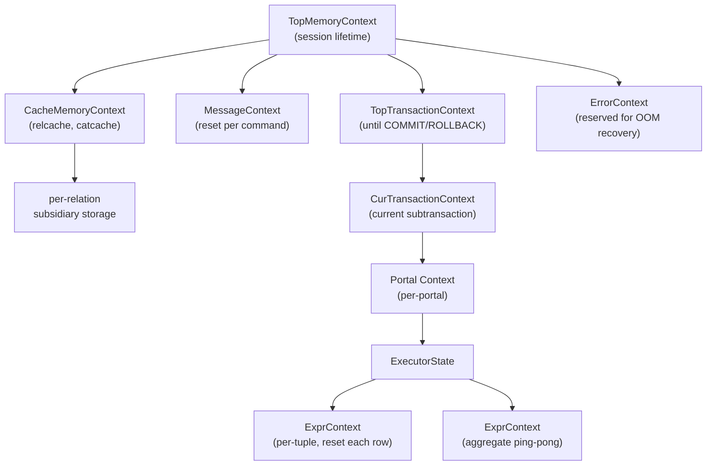

# Memory Contexts

> *Every palloc'd byte belongs to a context, every context belongs to a tree, and resetting a node in that tree frees the entire subtree --- giving PostgreSQL deterministic, bulk memory reclamation in plain C.*

## Summary

PostgreSQL's memory context system is an arena allocator with a tree structure. Each
`MemoryContext` is an abstract node whose concrete behavior is determined by one of four
allocator implementations: **AllocSet** (general-purpose, power-of-two freelists),
**Slab** (fixed-size objects), **Generation** (FIFO-lifetime batches), and **Bump**
(headerless, append-only). All four share the same `palloc`/`pfree` API via a virtual
function table stored in `MemoryContextMethods`.

The context tree mirrors lifetime nesting: `TopMemoryContext` at the root lives forever;
`TopTransactionContext` and its children die at transaction end; per-tuple
`ExprContext` contexts reset after every row. When any context is reset or deleted, all
its children are recursively deleted first, guaranteeing that no child allocation
outlives its parent.

## Overview

### The Problem

A database backend executing queries must allocate memory for parse trees, plan trees,
executor state, expression results, sort buffers, and temporary strings. Many of these
allocations are small, numerous, and short-lived. Others persist for the lifetime of a
transaction or even a session. Using raw `malloc`/`free` requires:

- Pairing every allocation with a corresponding free, even across error paths.
- Knowing the exact lifetime of each object at the point of allocation.
- Handling out-of-memory gracefully, including during error recovery.

Memory contexts solve all three problems.

### The Solution

1. **Allocate into a context** with `palloc()` (uses `CurrentMemoryContext`) or
   `MemoryContextAlloc(ctx, size)`.
2. **Reset or delete the context** when its lifetime ends. This frees all contained
   memory in one operation, regardless of how many chunks were allocated.
3. **Organize contexts into a tree** so that parent lifetimes always encompass child
   lifetimes. Deleting a parent cascades to all children.

The API never returns NULL on failure. `palloc()` raises `ERROR` on out-of-memory, which
triggers the error recovery path that resets the current transaction's context tree.
The pre-allocated `ErrorContext` ensures that even the error reporting code has memory
to work with.

## Key Source Files

| File | Role |
|------|------|
| `src/include/utils/palloc.h` | `palloc`, `pfree`, `MemoryContextSwitchTo`, `MemoryContextCallback` |
| `src/include/nodes/memnodes.h` | `MemoryContextData`, `MemoryContextMethods`, `MemoryContextCounters` |
| `src/include/utils/memutils.h` | Well-known contexts, `AllocSetContextCreate`, size presets |
| `src/include/utils/memutils_internal.h` | `MemoryContextMethodID` enum, internal function prototypes |
| `src/include/utils/memutils_memorychunk.h` | `MemoryChunk` header bit layout |
| `src/backend/utils/mmgr/mcxt.c` | Context tree operations, `palloc`/`pfree` dispatch |
| `src/backend/utils/mmgr/aset.c` | AllocSet implementation |
| `src/backend/utils/mmgr/slab.c` | Slab implementation |
| `src/backend/utils/mmgr/generation.c` | Generation implementation |
| `src/backend/utils/mmgr/bump.c` | Bump implementation |

## How It Works

### The Context Tree

At backend startup, `MemoryContextInit()` creates two contexts:

- **TopMemoryContext** --- the root of the entire tree. Never reset, never deleted.
  Equivalent to a session-lifetime arena.
- **ErrorContext** --- a sibling or child of Top, pre-allocated with a few KB so that
  error reporting can function even when main memory is exhausted.

As the backend processes queries, additional contexts are created and attached to the
tree:

```
TopMemoryContext
+-- CacheMemoryContext           (relcache, catcache; lives for session)
|     +-- CacheMemoryContext:    (per-relation subsidiary storage)
+-- MessageContext               (current command string; reset per command)
+-- TopTransactionContext        (lives until top-level COMMIT/ROLLBACK)
|     +-- CurTransactionContext  (current subtransaction)
|           +-- Portal context   (per-portal)
|                 +-- ExecutorState
|                       +-- ExprContext   (per-tuple, reset each row)
|                       +-- ExprContext   (aggregate ping-pong)
+-- ErrorContext                 (reserved for OOM recovery)
```



The tree is maintained through linked-list pointers in `MemoryContextData`:

```c
typedef struct MemoryContextData
{
    NodeTag     type;               /* AllocSetContext, SlabContext, etc. */
    bool        isReset;            /* true if no allocations since last reset */
    bool        allowInCritSection; /* allow palloc in critical sections */
    Size        mem_allocated;      /* total bytes obtained from malloc for this context */
    const MemoryContextMethods *methods;  /* virtual function table */
    MemoryContext parent;           /* NULL for TopMemoryContext */
    MemoryContext firstchild;       /* head of child linked list */
    MemoryContext prevchild;        /* sibling linkage */
    MemoryContext nextchild;        /* sibling linkage */
    const char  *name;             /* constant string, e.g. "ExecutorState" */
    const char  *ident;            /* optional variable identifier */
    MemoryContextCallback *reset_cbs;  /* callbacks invoked before reset/delete */
} MemoryContextData;
```

**Key invariant:** Every context except `TopMemoryContext` has exactly one parent.
`MemoryContextDelete(ctx)` first recursively deletes all children, then invokes
reset callbacks, then calls the implementation's `delete_context` method.

### The MemoryChunk Header

Every allocated chunk (except in Bump contexts) is preceded by an 8-byte
`MemoryChunk` header. This single `uint64` value (`hdrmask`) encodes three fields
using bit packing:

```
 63                   34  33           5  4    1   0
+----------------------+---------------+------+---+
|   block offset (30)  |  value (30)   | ext  | method ID (4) |
+----------------------+---------------+------+---+
```

- **Bits 0-3: MemoryContextMethodID** --- identifies which allocator type owns this
  chunk. Used by `pfree` to dispatch to the correct free function via
  `mcxt_methods[id]`.
- **Bit 4: external flag** --- when set, bits 5-63 store a magic number instead of
  offset/value. The context must find the block through its own mechanism.
- **Bits 5-34: value** --- typically the chunk size or freelist index (30 bits, max
  ~1 GB).
- **Bits 34-63: block offset** --- byte distance from chunk to the start of its
  containing block (30 bits, shared lowest bit with value field since both are
  MAXALIGN'd).

This design means `pfree(ptr)` can determine the allocator type, the owning block,
and the chunk size by reading a single 8-byte value immediately before the pointer,
without any external lookup.

### The Virtual Function Table

```c
typedef struct MemoryContextMethods
{
    void *(*alloc)(MemoryContext context, Size size, int flags);
    void  (*free_p)(void *pointer);
    void *(*realloc)(void *pointer, Size size, int flags);
    void  (*reset)(MemoryContext context);
    void  (*delete_context)(MemoryContext context);
    MemoryContext (*get_chunk_context)(void *pointer);
    Size  (*get_chunk_space)(void *pointer);
    bool  (*is_empty)(MemoryContext context);
    void  (*stats)(MemoryContext context, ...);
#ifdef MEMORY_CONTEXT_CHECKING
    void  (*check)(MemoryContext context);
#endif
} MemoryContextMethods;
```

The `mcxt_methods[]` array in `mcxt.c` maps `MemoryContextMethodID` values to the
corresponding methods struct. When `pfree(ptr)` is called:

1. Read the `uint64` at `(ptr - 8)`.
2. Extract the low 4 bits to get the method ID.
3. Call `mcxt_methods[id].free_p(ptr)`.

No context pointer is needed. This is how `pfree` works on any chunk regardless of
which context it belongs to.

### palloc and CurrentMemoryContext

```c
void *
palloc(Size size)
{
    /* Dispatch: CurrentMemoryContext->methods->alloc(...) */
    return MemoryContextAlloc(CurrentMemoryContext, size);
}
```

`MemoryContextSwitchTo()` is an inline function that swaps `CurrentMemoryContext`
and returns the old value:

```c
static inline MemoryContext
MemoryContextSwitchTo(MemoryContext context)
{
    MemoryContext old = CurrentMemoryContext;
    CurrentMemoryContext = context;
    return old;
}
```

The typical pattern for short-lived work:

```c
MemoryContext oldctx = MemoryContextSwitchTo(short_lived_ctx);
/* ... do work, palloc temporary data ... */
MemoryContextSwitchTo(oldctx);
MemoryContextReset(short_lived_ctx);  /* free all temp data */
```

### Reset Callbacks

Contexts support callbacks that fire just before a reset or delete. This enables
non-memory resources (open files, reference counts, malloc'd buffers from external
libraries) to be cleaned up when the context is reclaimed:

```c
typedef struct MemoryContextCallback
{
    MemoryContextCallbackFunction func;
    void       *arg;
    struct MemoryContextCallback *next;
} MemoryContextCallback;
```

Callbacks are called in reverse registration order. Child context callbacks fire
before parent callbacks.

---

## The Four Allocator Implementations

### 1. AllocSet (aset.c) --- General Purpose

AllocSet is the default and most widely used allocator. It uses a **power-of-two
freelist** design with 11 size classes ranging from 8 bytes to 8 KB.

**Key data structure:**

```c
typedef struct AllocSetContext
{
    MemoryContextData header;
    AllocBlock  blocks;                          /* linked list of blocks */
    MemoryChunk *freelist[ALLOCSET_NUM_FREELISTS]; /* 11 freelists */
    uint32      initBlockSize;                   /* e.g. 8192 */
    uint32      maxBlockSize;                    /* e.g. 8388608 (8 MB) */
    uint32      nextBlockSize;                   /* doubles each time */
    uint32      allocChunkLimit;                 /* max chunk for freelists */
    int         freeListIndex;                   /* context recycling, or -1 */
} AllocSetContext;
```

**Allocation algorithm:**

1. Round the requested size up to the next power of two (minimum 8 bytes).
2. Determine the freelist index: `idx = pg_leftmost_one_pos(size) - ALLOC_MINBITS`.
3. If a free chunk exists on `freelist[idx]`, pop it and return.
4. Otherwise, carve a new chunk from the current block's free space.
5. If the current block is exhausted, allocate a new block (doubling size up to
   `maxBlockSize`).
6. If the request exceeds `allocChunkLimit` (8 KB), allocate a dedicated block from
   `malloc()`. This block is freed immediately on `pfree`, not held in a freelist.

**Block structure:**

```
+-----------------+
| AllocBlockData  |  (header: owning set, prev/next, freeptr, endptr)
+-----------------+
| MemoryChunk hdr |  chunk 1
| user data ...   |
+-----------------+
| MemoryChunk hdr |  chunk 2
| user data ...   |
+-----------------+
| ... free space  |
+-----------------+
      ^
      freeptr
```

**The keeper block:** The first block is allocated in the same `malloc()` call as the
`AllocSetContext` struct itself. On `MemoryContextReset`, this keeper block is cleared
but not freed, avoiding malloc thrashing for contexts that are repeatedly reset (such
as per-tuple contexts).

**Context freelists:** Small, frequently-created-and-destroyed AllocSet contexts (such
as per-tuple contexts) can be recycled through a global freelist
(`context_freelists[]`), avoiding repeated malloc/free of the context struct itself.

### 2. Slab (slab.c) --- Fixed-Size Objects

Slab is optimized for allocating many objects of exactly the same size. The chunk
size is fixed at context creation time.

**Use cases:** WAL record reconstruction buffers, reorder buffer tuples, and other
scenarios where all allocations are the same size.

**Key design:**

```c
typedef struct SlabContext
{
    MemoryContextData header;
    uint32      chunkSize;       /* fixed allocation size */
    uint32      fullChunkSize;   /* chunkSize + alignment + header */
    uint32      blockSize;       /* bytes per block */
    int32       chunksPerBlock;  /* how many chunks fit in one block */
    int32       curBlocklistIdx; /* lowest non-empty blocklist index */
    int32       blocklist_shift; /* for mapping nfree to blocklist index */
    dlist_head  blocklist[SLAB_BLOCKLIST_COUNT];  /* blocks by fullness */
    dlist_head  emptyblocks;     /* completely empty blocks for reuse */
    long        nemptyblocks;    /* number of empty blocks kept */
} SlabContext;
```

**Allocation strategy:**

1. Look at the lowest-indexed non-empty `blocklist[]` entry (blocks with fewest free
   chunks).
2. Allocate from that block, preferring the free list over unused chunks.
3. If the block's fullness changes range, move it to the appropriate blocklist.

**Why fullest-first?** By allocating from the fullest blocks first, Slab encourages
empty blocks to stay empty (and be returned to the OS), rather than distributing
allocations evenly across all blocks and preventing any from becoming fully empty.

### 3. Generation (generation.c) --- FIFO Lifetimes

Generation is designed for workloads where chunks are freed in roughly the same order
they were allocated, or in generational batches.

**Use cases:** Tuple processing pipelines, logical replication message handling ---
anywhere objects are produced, consumed, and discarded in FIFO order.

**Key data structure:**

```c
typedef struct GenerationContext
{
    MemoryContextData header;
    uint32      initBlockSize;
    uint32      maxBlockSize;
    uint32      nextBlockSize;
    uint32      allocChunkLimit;
    GenerationBlock *block;      /* current block being allocated from */
    GenerationBlock *freeblock;  /* one recycled empty block, or NULL */
    dlist_head  blocks;          /* all blocks */
} GenerationContext;

struct GenerationBlock
{
    dlist_node  node;
    GenerationContext *context;
    Size        blksize;
    int         nchunks;         /* total chunks allocated on this block */
    int         nfree;           /* chunks freed so far */
    char       *freeptr;         /* next allocation point */
    char       *endptr;          /* end of block */
};
```

**Key property:** When `nfree == nchunks` for a block, the entire block is empty and
can be freed (or recycled as `freeblock`). There is no freelist --- freed space within
a partially-used block is simply wasted. This trade-off works well when blocks empty
in order.

### 4. Bump (bump.c) --- Headerless Append-Only

Bump is the most minimal allocator. Chunks have **no header at all** (except in
`MEMORY_CONTEXT_CHECKING` builds). This means `pfree()`, `repalloc()`,
`GetMemoryChunkContext()`, and `GetMemoryChunkSpace()` are all unsupported operations
that will raise an ERROR.

**Use cases:** Building large numbers of small, short-lived allocations that are all
freed at once by resetting the context. The executor uses this for some internal node
state.

**Key data structure:**

```c
typedef struct BumpContext
{
    MemoryContextData header;
    uint32      initBlockSize;
    uint32      maxBlockSize;
    uint32      nextBlockSize;
    uint32      allocChunkLimit;
    dlist_head  blocks;     /* block list, current block at head */
} BumpContext;

struct BumpBlock
{
    dlist_node  node;
    char       *freeptr;    /* next allocation point */
    char       *endptr;     /* end of block */
};
```

**Why no header?** Without the 8-byte `MemoryChunk` header per allocation, Bump can
pack more data per cache line, which matters when allocating millions of tiny objects.
The cost is that you cannot free individual chunks --- only reset the whole context.

---

## Key Data Structures at a Glance

```
MemoryContextData (abstract base)
    |
    +-- AllocSetContext   (method ID = MCTX_ASET_ID = 3)
    |     blocks -> AllocBlockData -> AllocBlockData -> ...
    |     freelist[0..10] -> MemoryChunk -> MemoryChunk -> ...
    |
    +-- SlabContext       (method ID = MCTX_SLAB_ID = 5)
    |     blocklist[0..2] -> SlabBlock -> SlabBlock -> ...
    |     Each SlabBlock has a per-block freelist of fixed-size chunks
    |
    +-- GenerationContext (method ID = MCTX_GENERATION_ID = 4)
    |     blocks (dlist) -> GenerationBlock -> GenerationBlock -> ...
    |     block -> current GenerationBlock (append point)
    |
    +-- BumpContext       (method ID = MCTX_BUMP_ID = 7)
          blocks (dlist) -> BumpBlock -> BumpBlock -> ...
          No chunk headers, no freelists
```

## Diagrams

### AllocSet Allocation Flow

```
palloc(120)
    |
    v
Round to power-of-2 --> 128 bytes
    |
    v
freelist index = log2(128) - 3 = 4
    |
    v
freelist[4] non-empty?
   /        \
  YES        NO
  |           |
  v           v
Pop chunk   Current block has space?
return ptr     /         \
             YES          NO
              |            |
              v            v
        Carve from     malloc new block
        freeptr        (size = nextBlockSize)
              |            |
              v            v
         Return ptr   Set freeptr, carve, return
```

### Context Reset Cascade

```
MemoryContextReset(TopTransactionContext)
    |
    v
For each child of TopTransactionContext:
    MemoryContextDelete(child)     <-- recursive
        |
        v
    Delete grandchildren first
        |
        v
    Call reset callbacks (reverse order)
        |
        v
    child->methods->delete_context(child)
        |
        v
    Unlink from parent's child list
    |
    v
Call TopTransactionContext reset callbacks
    |
    v
TopTransactionContext->methods->reset(TopTransactionContext)
    |
    v
Free all blocks except keeper block
Clear keeper block, set isReset = true
```

## Connections

- **Resource Owners** ([resource-owners.md](resource-owners.md)): Resource owners track
  non-memory resources with the same tree structure. Often, a resource owner and a
  memory context have corresponding lifetimes (e.g., both exist per-portal), but they
  are separate objects.
- **DSA** ([dsa.md](dsa.md)): For shared memory, process-local memory contexts are not
  usable. DSA provides a different allocator that works across process boundaries.
- **Executor (ExprContext):** Each expression evaluation context has a private
  `MemoryContext` that is reset at the start of each tuple cycle, preventing per-tuple
  memory leaks.
- **Error Handling:** On `ERROR`, `AbortTransaction` calls `MemoryContextResetAndDeleteChildren`
  on `TopTransactionContext`, reclaiming all transient memory. `ErrorContext` is
  pre-allocated so that the error reporting path itself never runs out of memory.
- **Catalog Cache:** `CacheMemoryContext` persists for the session lifetime. Cache entries
  are allocated here, with per-entry child contexts for subsidiary data that can be
  freed independently when a cache entry is invalidated.
