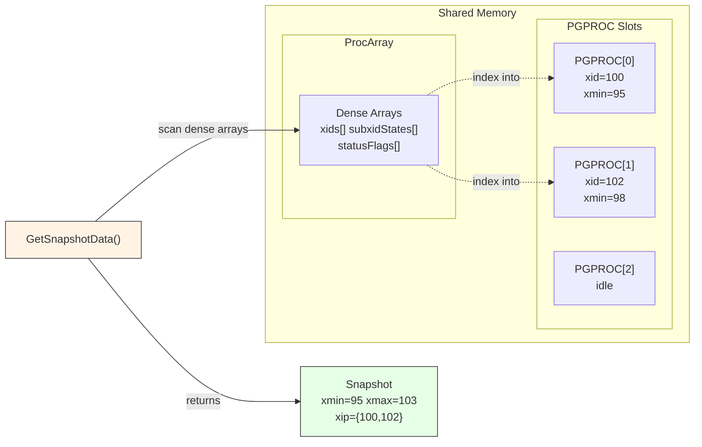

# ProcArray and PGPROC

Every PostgreSQL backend gets a `PGPROC` slot in shared memory. The **ProcArray**
is the subsystem that tracks which of those slots are active and maintains dense,
cache-friendly arrays of per-backend transaction state. Its most critical consumer
is `GetSnapshotData()`, which scans these arrays on every snapshot-taking query to
determine which transactions are currently in progress.



---

## Overview

Two distinct but related structures work together:

1. **PGPROC** -- A large struct in shared memory, one per backend (plus extras for
   autovacuum, background workers, prepared transactions, and auxiliary processes).
   Contains the backend's latch, lock wait state, XID, xmin, virtual XID, and more.

2. **ProcArray** -- A compact structure that indexes into the PGPROC array and
   maintains dense "mirrored" arrays for hot fields (`xids[]`, `subxidStates[]`,
   `statusFlags[]`). These dense arrays exist so that `GetSnapshotData()` can scan
   all running XIDs without touching the much larger PGPROC structs, minimizing
   cache line misses.

---

## Key Source Files

| File | Role |
|------|------|
| `src/include/storage/proc.h` | `PGPROC` struct, `PROC_HDR` (ProcGlobal), flag constants |
| `src/backend/storage/lmgr/proc.c` | PGPROC initialization, `InitProcess`, sleep/wakeup |
| `src/include/storage/procarray.h` | ProcArray public API |
| `src/backend/storage/ipc/procarray.c` | ProcArray management, `GetSnapshotData`, visibility horizons |
| `src/include/storage/procnumber.h` | `ProcNumber` type definition |

---

## How It Works

### PGPROC Allocation

At startup, `InitProcGlobal()` allocates a contiguous array of PGPROC structs:

```
Total PGPROCs = MaxBackends
              + NUM_SPECIAL_WORKER_PROCS (2: autovac launcher, slotsync)
              + max_prepared_xacts
              + NUM_AUXILIARY_PROCS (6 + MAX_IO_WORKERS)
```

These PGPROCs are linked into freelists (`ProcGlobal->freeProcs`,
`autovacFreeProcs`, `bgworkerFreeProcs`, `walsenderFreeProcs`). When a new backend
starts, `InitProcess()` pulls a PGPROC from the appropriate freelist, initializes
it, and calls `ProcArrayAdd()` to register it in the ProcArray.

### The Dense Arrays

`PROC_HDR` (aliased as `ProcGlobal`) holds both the PGPROC array and the mirrored
dense arrays:

```c
/* src/include/storage/proc.h */
typedef struct PROC_HDR
{
    PGPROC         *allProcs;          /* Full array of PGPROC structs */
    TransactionId  *xids;              /* Dense: mirrors PGPROC.xid */
    XidCacheStatus *subxidStates;      /* Dense: mirrors PGPROC.subxidStatus */
    uint8          *statusFlags;       /* Dense: mirrors PGPROC.statusFlags */
    uint32          allProcCount;      /* Length of allProcs */
    /* ... freelists, spinlocks, group clear state ... */
} PROC_HDR;
```

The dense arrays are indexed by `PGPROC->pgxactoff`, which is the backend's
current position within the ProcArray. This offset can change when backends are
added or removed, so accessing the dense arrays requires holding either
`ProcArrayLock` or `XidGenLock`.

The design rationale has three parts:

1. **Tight loops** -- `GetSnapshotData()` can iterate `ProcGlobal->xids[]` in a
   tight loop, hitting far fewer cache lines than if it had to chase pointers through
   scattered PGPROC structs.

2. **Cache isolation** -- Frequently changing fields (`xmin`) live in different cache
   lines from rarely changing fields (`xid`, `statusFlags`), preventing false sharing.

3. **Local fast path** -- A backend can read its own `MyProc->xid` without locks
   (it is the only writer), avoiding the need to touch the dense arrays for self-checks.

### ProcArray Structure

```c
/* src/backend/storage/ipc/procarray.c */
typedef struct ProcArrayStruct
{
    int     numProcs;                     /* Active entries */
    int     maxProcs;                     /* Array capacity */

    /* Hot standby: known-assigned XIDs from the primary */
    int     maxKnownAssignedXids;
    int     numKnownAssignedXids;
    int     tailKnownAssignedXids;
    int     headKnownAssignedXids;
    TransactionId lastOverflowedXid;

    /* Replication slot horizons */
    TransactionId replication_slot_xmin;
    TransactionId replication_slot_catalog_xmin;

    /* Flexible array of indexes into ProcGlobal->allProcs */
    int     pgprocnos[FLEXIBLE_ARRAY_MEMBER];
} ProcArrayStruct;
```

`pgprocnos[]` is the heart of ProcArray: it lists the `ProcNumber` of every
currently active backend. When combined with `ProcGlobal->allProcs`, it provides
O(1) lookup from ProcNumber to PGPROC.

---

## GetSnapshotData: The Hot Path

`GetSnapshotData()` is called at the start of every transaction (or statement, in
READ COMMITTED mode). It must determine:

- `xmin` -- The oldest XID that might still be running (nothing older can be
  considered in-progress).
- `xmax` -- One past the latest XID that was assigned before this snapshot.
- `xip[]` -- The list of XIDs that are currently in progress.

The algorithm (simplified):

```
1.  Acquire ProcArrayLock in shared mode
2.  Read the current nextXid as xmax
3.  For each entry in ProcGlobal->xids[0..numProcs-1]:
        if xid != InvalidTransactionId:
            add xid to snapshot->xip[]
            track oldest xid as xmin
4.  Handle subtransaction XIDs (subxidStates[], subxids caches)
5.  Release ProcArrayLock
6.  Store xmin into MyProc->xmin (under lock)
```

This is PostgreSQL's most contended read path. The dense array design ensures
that step 3 touches minimal memory. On modern hardware with SIMD support,
`pg_lfind32()` can be used to scan the XID array even faster.

### The Subxid Cache

Each PGPROC caches up to `PGPROC_MAX_CACHED_SUBXIDS` (64) subtransaction XIDs in
its `subxids` array. If a transaction has more than 64 subtransactions, the cache
overflows and `subxidStatus.overflowed` is set to `true`. When any cache has
overflowed, `GetSnapshotData` must also consult `pg_subtrans` to determine
subtransaction parentage, which is significantly slower.

---

## Key Data Structures

### PGPROC (Selected Fields)

```c
struct PGPROC
{
    /* List management */
    dlist_node    links;
    dlist_head   *procgloballist;      /* Which freelist owns us */

    /* Synchronization */
    PGSemaphore   sem;                 /* Sleep semaphore (for LWLock waits) */
    ProcWaitStatus waitStatus;
    Latch         procLatch;           /* Wake-up signal from other procs */

    /* Transaction identity */
    TransactionId xid;                 /* Current top-level XID, or Invalid */
    TransactionId xmin;                /* Oldest XID we consider running */

    /* Process identity */
    int           pid;                 /* OS process ID; 0 for prepared xacts */
    int           pgxactoff;           /* Index into dense arrays */
    struct {
        ProcNumber    procNumber;      /* Slot number in allProcs */
        LocalTransactionId lxid;       /* Local (virtual) transaction ID */
    } vxid;

    Oid           databaseId;
    Oid           roleId;
    BackendType   backendType;

    /* Lock wait state */
    uint8         lwWaiting;
    uint8         lwWaitMode;
    proclist_node lwWaitLink;
    LOCK         *waitLock;
    PROCLOCK     *waitProcLock;

    /* Checkpoint delay */
    int           delayChkptFlags;

    /* Status flags (mirrored in ProcGlobal->statusFlags) */
    uint8         statusFlags;         /* PROC_IS_AUTOVACUUM, PROC_IN_VACUUM, etc. */

    /* Subtransaction cache */
    XidCacheStatus subxidStatus;       /* {count, overflowed} */
    struct XidCache subxids;           /* Up to 64 cached subxids */

    /* Group XID clear (optimization for commit) */
    bool          procArrayGroupMember;
    pg_atomic_uint32 procArrayGroupNext;
    TransactionId procArrayGroupMemberXid;

    /* Wait event tracking */
    uint32        wait_event_info;

    /* Fast-path locking */
    LWLock        fpInfoLock;
    uint64       *fpLockBits;
    Oid          *fpRelId;

    /* Lock groups (for parallel query) */
    PGPROC       *lockGroupLeader;
    dlist_head    lockGroupMembers;
    dlist_node    lockGroupLink;
};
```

### Status Flags

| Flag | Meaning |
|------|---------|
| `PROC_IS_AUTOVACUUM` | This is an autovacuum worker |
| `PROC_IN_VACUUM` | Currently running VACUUM |
| `PROC_IN_SAFE_IC` | Running safe CREATE INDEX CONCURRENTLY |
| `PROC_VACUUM_FOR_WRAPAROUND` | Anti-wraparound vacuum |
| `PROC_IN_LOGICAL_DECODING` | Doing logical decoding outside a transaction |
| `PROC_AFFECTS_ALL_HORIZONS` | xmin counts for all databases |

---

## Diagram: ProcArray and Dense Arrays

```
ProcGlobal (PROC_HDR)
+-------------------------------------------------------+
| allProcs  ---->  [PGPROC 0] [PGPROC 1] ... [PGPROC N]|
|                                                        |
| xids[]           [  xid_0  ] [  xid_1  ] ... [xid_k]  |  Dense: only
| subxidStates[]   [ state_0 ] [ state_1 ] ... [stat_k]  |  active procs,
| statusFlags[]    [ flags_0 ] [ flags_1 ] ... [flg_k ]  |  k = numProcs
+-------------------------------------------------------+

ProcArrayStruct
+-------------------------------------------------------+
| numProcs = k                                           |
| pgprocnos[] = [ 3, 7, 12, 0, ... ]                    |
|                 |  |   |   |                           |
|                 |  |   |   +-> ProcGlobal->allProcs[0] |
|                 |  |   +----> ProcGlobal->allProcs[12] |
|                 |  +--------> ProcGlobal->allProcs[7]  |
|                 +-----------> ProcGlobal->allProcs[3]  |
+-------------------------------------------------------+

Mapping:
  ProcGlobal->xids[i]  mirrors  allProcs[pgprocnos[i]].xid
  where i = allProcs[pgprocnos[i]].pgxactoff
```

---

## Group XID Clear: Commit Optimization

When a transaction commits, it must clear its XID from the ProcArray. This requires
`ProcArrayLock` in exclusive mode, which creates contention under high commit rates.

The **group XID clear** optimization batches this work. Instead of each committing
backend acquiring the lock individually:

1. The committing backend adds itself to a lock-free linked list
   (`procArrayGroupFirst`, linked via `procArrayGroupNext`).
2. The first backend in the group acquires `ProcArrayLock` exclusively.
3. It walks the list and clears the XID for every member.
4. It releases the lock and wakes all group members.

This amortizes one lock acquisition across many commits, significantly reducing
contention on write-heavy workloads.

A similar group optimization exists for CLOG updates (`clogGroupFirst`).

---

## Visibility Horizons

ProcArray computes several critical XID thresholds used by VACUUM and HOT pruning:

- **`GetOldestNonRemovableTransactionId()`** -- The oldest XID that any running
  transaction, replication slot, or prepared transaction might need. VACUUM cannot
  remove tuples deleted by XIDs newer than this.

- **`GetOldestActiveTransactionId()`** -- The oldest XID with an active transaction.
  Used for computing safe truncation points.

- **GlobalVisTest** -- A two-phase visibility test that avoids scanning ProcArray
  on every visibility check. It computes `definitely_needed` and `maybe_needed`
  boundaries during snapshot creation, and only falls back to the full ProcArray
  scan when an XID falls in the ambiguous zone.

---

## Hot Standby: KnownAssignedXids

On a streaming replica, backends do not run their own transactions with XIDs.
However, the replica must know which XIDs are running on the primary to build
correct snapshots. The **KnownAssignedXids** array (part of `ProcArrayStruct`)
tracks these:

- `RecordKnownAssignedTransactionIds()` adds XIDs as they appear in WAL.
- `ExpireTreeKnownAssignedTransactionIds()` removes XIDs when their commit/abort
  records arrive.
- `GetSnapshotData()` on the standby merges KnownAssignedXids into the snapshot's
  `xip[]` array.

---

## Connections

- **[Shared Memory](shared-memory.md)** -- The entire PGPROC array and ProcArray
  are allocated from the fixed shared memory region at startup.

- **[Latches and Wait Events](latches-and-events.md)** -- `PGPROC.procLatch` is
  the primary mechanism for waking a backend. SetLatch is used after group XID
  clear to wake waiting committers.

- **Chapter 3 (Transactions)** -- `GetSnapshotData()` is the bridge between IPC and
  MVCC. Snapshot `xmin`/`xmax`/`xip[]` directly determine tuple visibility.

- **Chapter 5 (Locking)** -- PGPROC contains lock wait state (`waitLock`,
  `waitProcLock`, `lwWaitLink`) and fast-path lock slots.

- **Chapter 8 (Executor)** -- Parallel query uses `lockGroupLeader` and
  `lockGroupMembers` in PGPROC to treat the leader and workers as a single lock
  group, preventing self-deadlock.
