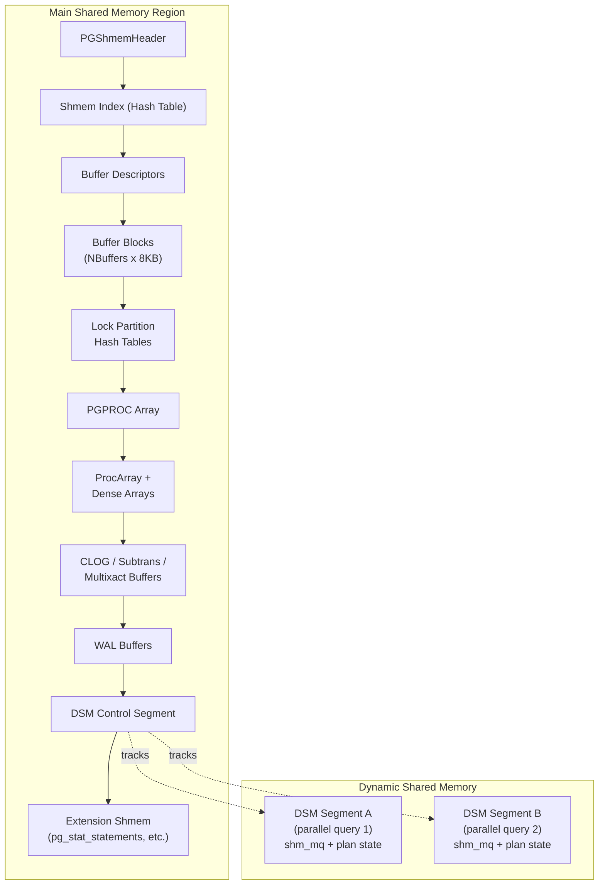

# Shared Memory

PostgreSQL allocates a single large shared memory region at postmaster startup.
Every backend inherits a mapping to this region via `fork()`. The region holds
the buffer pool, lock tables, ProcArray, PGPROC slots, and dozens of other
structures. For parallel queries and background workers, a second mechanism --
dynamic shared memory (DSM) -- creates additional segments on demand.

This page covers both the fixed shared memory allocator and the dynamic shared
memory subsystem.

---

## Overview

Shared memory in PostgreSQL has two layers:

1. **Fixed shared memory** (`shmem.c`) -- A bump allocator that carves the startup
   region into named chunks. Allocations are permanent; there is no `free`. Every
   subsystem requests its space during `CreateOrAttachShmemStructs()`.

2. **Dynamic shared memory** (`dsm.c`, `dsm_impl.c`) -- On-demand segments created
   after startup, primarily for parallel query. These segments have explicit
   lifetimes and are cleaned up automatically when all mappings are removed.



---

## Key Source Files

| File | Role |
|------|------|
| `src/backend/storage/ipc/shmem.c` | Bump allocator, Shmem Index hash table |
| `src/backend/storage/ipc/ipci.c` | Startup orchestration, `CalculateShmemSize()` |
| `src/include/storage/shmem.h` | Public API: `ShmemAlloc`, `ShmemInitStruct`, `ShmemInitHash` |
| `src/include/storage/pg_shmem.h` | OS-level segment header (`PGShmemHeader`) |
| `src/backend/port/sysv_shmem.c` | System V / mmap shared memory creation (Unix) |
| `src/backend/storage/ipc/dsm.c` | DSM segment lifecycle management |
| `src/backend/storage/ipc/dsm_impl.c` | Platform backends for DSM |
| `src/include/storage/dsm.h` | DSM public API |
| `src/include/storage/dsm_impl.h` | DSM backend constants and `dsm_op` enum |
| `src/backend/storage/ipc/dsm_registry.c` | Named DSM segments that persist across backends |

---

## How It Works: Fixed Shared Memory

### The Bump Allocator

The shared memory region starts with a `PGShmemHeader` at address zero, followed
by a contiguous pool of unallocated bytes. A global pointer (`ShmemFreeStart`)
advances monotonically as subsystems claim space:

```
PGShmemHeader
+------------------+
| totalsize        |    Total bytes in the region
| freeoffset       | -> Points to first free byte (bump pointer)
| ...              |
+------------------+
| Shmem Index (HT) |    Hash table mapping names -> {location, size}
+------------------+
| Buffer Descs     |    Allocated by BufferShmemInit
+------------------+
| Buffer Blocks    |    The actual 8 KB pages
+------------------+
| Lock Tables      |
+------------------+
| PGPROC Array     |
+------------------+
| ProcArray        |
+------------------+
| ...more...       |
+------------------+
| (free space)     |
+------------------+
```

`ShmemAlloc(size)` simply advances the free pointer by `size` (aligned to
`MAXIMUM_ALIGNOF`) and returns the old pointer. The spinlock `ShmemLock` protects
concurrent allocation, but in practice allocations only happen during startup
in the postmaster (single-threaded).

### The Shmem Index

Each named structure is registered in the **Shmem Index**, a shared hash table
whose entries are `ShmemIndexEnt`:

```c
/* src/include/storage/shmem.h */
typedef struct
{
    char    key[SHMEM_INDEX_KEYSIZE];   /* 48-byte string name */
    void   *location;                    /* address in shared memory */
    Size    size;                         /* requested size */
    Size    allocated_size;               /* actual allocated size */
} ShmemIndexEnt;
```

`ShmemInitStruct(name, size, &found)` looks up `name` in the index. If the
entry does not exist, it allocates `size` bytes and inserts the entry. If it
already exists, it returns the existing pointer and sets `found = true`. This
two-phase pattern allows both the postmaster (which creates) and forked backends
(which attach) to use identical code paths. It is especially important on
`EXEC_BACKEND` platforms (Windows) where backends cannot inherit pointers from
the postmaster.

### Startup Orchestration

`ipci.c` contains `CalculateShmemSize()`, which calls every subsystem's size
estimation function:

```c
/* Abbreviated from src/backend/storage/ipc/ipci.c */
size = 100000;                          /* base overhead */
size = add_size(size, shmem_cache_size());
size = add_size(size, BufferShmemSize());
size = add_size(size, LockShmemSize());
size = add_size(size, ProcGlobalShmemSize());
size = add_size(size, ProcArrayShmemSize());
/* ... dozens more ... */
size = add_size(size, total_addin_request);  /* extensions */
```

`add_size()` checks for overflow at each step. The resulting total is passed to
`PGSharedMemoryCreate()`, which allocates the OS-level segment.

---

## How It Works: Dynamic Shared Memory

### Motivation

The fixed region is sized at startup and cannot grow. Parallel queries need
per-query memory (tuple queues, worker state, hash tables) that varies wildly
in size and lifetime. DSM provides this.

### The DSM Control Segment

A small area of the fixed shared memory holds the **DSM control segment**: an
array of `dsm_control_item` slots, one per active DSM segment:

```c
/* src/backend/storage/ipc/dsm.c */
typedef struct dsm_control_item
{
    dsm_handle  handle;           /* Randomly generated 32-bit ID */
    uint32      control_slot;
    void       *impl_private_pm_handle;
    bool        pinned;           /* Pinned to postmaster lifetime? */
} dsm_control_item;
```

The number of slots is `PG_DYNSHMEM_FIXED_SLOTS + PG_DYNSHMEM_SLOTS_PER_BACKEND * MaxBackends`.

### Segment Lifecycle

```
  dsm_create(size)
      |
      |  1. Pick a random dsm_handle
      |  2. Call dsm_impl_op(DSM_OP_CREATE, ...) to create OS segment
      |  3. Map the segment into our address space
      |  4. Register in DSM control array
      |  5. Register resource-owner cleanup callback
      |
      v
  dsm_segment *seg  -->  seg->mapped_address  (usable memory)
      |
      |  Share seg->handle with workers (via bgworker args or shm_toc)
      |
  dsm_attach(handle)  [in worker]
      |
      |  1. Find handle in DSM control array
      |  2. Call dsm_impl_op(DSM_OP_ATTACH, ...)
      |  3. Map into worker's address space
      |
      v
  dsm_segment *seg  -->  same physical memory, different virtual address
      |
  dsm_detach(seg)  [automatic or explicit]
      |
      |  1. Run on_dsm_detach callbacks
      |  2. Call dsm_impl_op(DSM_OP_DETACH, ...)
      |  3. When last mapping removed: DSM_OP_DESTROY
```

### Pinning

By default, a DSM segment is destroyed when its creator's resource owner is
released. Two pinning mechanisms extend the lifetime:

- **`dsm_pin_mapping(seg)`** -- Pins the mapping to the session. The segment stays
  mapped even after the current resource owner is released.
- **`dsm_pin_segment(seg)`** -- Pins the segment to the postmaster. It survives
  until explicit `dsm_unpin_segment()` or postmaster shutdown.

### The `min_dynamic_shared_memory` GUC

When set to a nonzero value, PostgreSQL pre-allocates a pool of DSM space inside
the main shared memory region. Small DSM requests are carved from this pool using
a free-page manager (`FreePageManager`), avoiding the overhead of OS-level segment
creation. This is especially beneficial on systems where `shm_open()` or `shmget()`
has high latency.

---

## Key Data Structures

### dsm_segment (Backend-Local)

```c
/* src/backend/storage/ipc/dsm.c */
struct dsm_segment
{
    dlist_node  node;              /* Link in backend-local list */
    ResourceOwner resowner;        /* Owning resource owner */
    dsm_handle  handle;            /* 32-bit segment identifier */
    uint32      control_slot;      /* Slot in DSM control array */
    void       *impl_private;      /* OS-level handle (fd, shmid, etc.) */
    void       *mapped_address;    /* Virtual address of mapping */
    Size        mapped_size;       /* Size of the mapping */
    slist_head  on_detach;         /* Cleanup callback chain */
};
```

### dsm_impl Backends

The `dsm_impl_op()` function dispatches to one of four platform backends:

| Constant | Mechanism | Notes |
|----------|-----------|-------|
| `DSM_IMPL_POSIX` | `shm_open()` / `mmap()` | Default on Linux, macOS, FreeBSD. Uses `/dev/shm` on Linux. |
| `DSM_IMPL_SYSV` | `shmget()` / `shmat()` | Fallback on older Unix systems. Subject to kernel `SHMMAX`/`SHMALL` limits. |
| `DSM_IMPL_MMAP` | `open()` / `mmap()` on files in `pg_dynshmem/` | Filesystem-backed. Useful when POSIX shm and SysV are unavailable. |
| `DSM_IMPL_WINDOWS` | `CreateFileMapping()` | Windows-only. |

The GUC `dynamic_shared_memory_type` selects which backend to use. The default
is determined at compile time by `DEFAULT_DYNAMIC_SHARED_MEMORY_TYPE`.

### DSM Registry

`dsm_registry.c` provides **named DSM segments** that any backend can look up
by name. This is useful for extensions that need a shared memory region but
cannot predict which backend will create it first. The registry stores
`{name -> dsm_handle}` mappings in a hash table in the main shared memory region.

---

## Diagram: Shared Memory Layout

```
+==============================================================+
|                  Main Shared Memory Region                    |
|                                                               |
|  PGShmemHeader                                                |
|  +----------------------------------------------------------+ |
|  | Shmem Index (hash table)                                 | |
|  +----------------------------------------------------------+ |
|  | Buffer Descriptors  (NBuffers * sizeof(BufferDesc))      | |
|  +----------------------------------------------------------+ |
|  | Buffer Blocks       (NBuffers * BLCKSZ)                  | |
|  +----------------------------------------------------------+ |
|  | Lock Partition Hash Tables                                | |
|  +----------------------------------------------------------+ |
|  | PGPROC Array        (MaxBackends + aux + prepared)       | |
|  +----------------------------------------------------------+ |
|  | ProcArray + Dense Arrays (xids[], statusFlags[], ...)    | |
|  +----------------------------------------------------------+ |
|  | CLOG Buffers, Subtrans Buffers, Multixact Buffers        | |
|  +----------------------------------------------------------+ |
|  | WAL Buffers                                               | |
|  +----------------------------------------------------------+ |
|  | DSM Control Segment                                       | |
|  +----------------------------------------------------------+ |
|  | Pre-allocated DSM Pool (if min_dynamic_shared_memory > 0)| |
|  +----------------------------------------------------------+ |
|  | Extension shmem (pg_stat_statements, etc.)               | |
|  +----------------------------------------------------------+ |
|  | Free space (unused)                                       | |
|  +----------------------------------------------------------+ |
+==============================================================+

+========================+     +========================+
| DSM Segment A          |     | DSM Segment B          |
| (parallel query 1)     |     | (parallel query 2)     |
|                        |     |                        |
| shm_toc -> shm_mq x N |     | shm_toc -> shm_mq x M |
| query state, params    |     | query state, params    |
+========================+     +========================+
```

---

## Important Invariants

1. **Fixed shmem never shrinks.** Once allocated, a chunk in the main region is
   permanent. There is no deallocation. This simplifies the allocator to a single
   atomic bump pointer but means the region must be sized correctly at startup.

2. **Same virtual address in every process.** The main shared memory region is
   mapped at the same address in every backend. This allows raw pointers to be
   stored in shared structures (e.g., linked lists of `PGPROC` nodes).

3. **DSM segments may map at different addresses.** Unlike the main region, DSM
   segments can appear at different virtual addresses in different processes. Code
   that uses DSM must use offsets or `shm_toc` lookups, not raw pointers.

4. **Cleanup is automatic.** DSM segments are tied to resource owners. If a backend
   crashes, the postmaster detects the crash and cleans up orphaned segments at the
   next startup (or immediately if using the DSM control segment).

---

## Connections

- **[Latches and Wait Events](latches-and-events.md)** -- Latches (stored in PGPROC,
  which lives in fixed shared memory) are the signaling mechanism between processes.

- **[ProcArray](procarray.md)** -- The PGPROC array and ProcArray dense arrays are
  allocated from fixed shared memory during startup.

- **[Message Queues](message-queues.md)** -- `shm_mq` queues are laid out inside
  DSM segments, organized by `shm_toc`.

- **Chapter 1 (Storage)** -- The buffer pool is the single largest consumer of
  shared memory, often 90%+ of the total.

- **Chapter 5 (Locking)** -- LWLock tranches and heavyweight lock hash tables are
  allocated from fixed shared memory.

- **Chapter 10 (Memory)** -- DSA (Dynamic Shared Area) provides a `palloc`-style
  allocator on top of DSM segments, used by parallel hash joins and other consumers.
