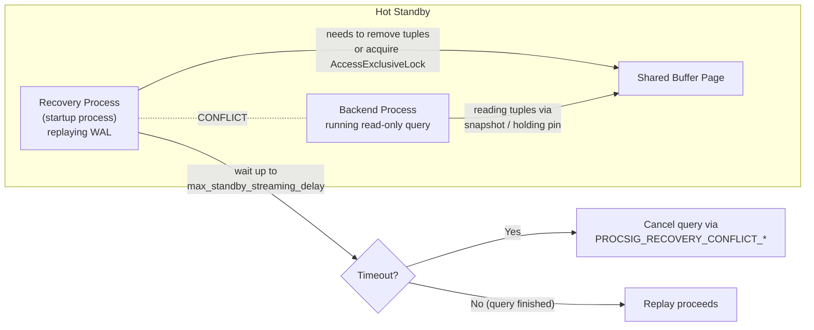

# Conflict Resolution

## Summary

Replication conflicts occur when the replication process interferes with
concurrent activity. PostgreSQL handles two distinct categories: **hot standby
conflicts**, where WAL replay on a physical standby collides with active
read queries, and **logical replication conflicts**, where incoming row changes
on a subscriber violate constraints or encounter missing data. The resolution
mechanisms differ fundamentally: hot standby conflicts are resolved by either
cancelling queries or delaying replay, while logical conflicts are resolved
through detection, logging, and configurable resolution strategies.

---

## Overview

### Hot Standby Conflicts

A physical standby running in Hot Standby mode accepts read-only queries
while simultaneously replaying WAL from the primary. This creates an inherent
tension: WAL replay modifies physical data pages, but queries need stable
visibility of those pages. Conflicts arise in several scenarios:



- **Lock conflicts** -- replay needs an `AccessExclusiveLock` that a query holds
- **Snapshot conflicts** -- replay removes rows still visible to a query's snapshot
- **Buffer pin conflicts** -- replay needs to modify a page pinned by a query
- **Tablespace conflicts** -- replay drops a tablespace containing temp files for a query
- **Database conflicts** -- replay drops a database where a query is connected

### Logical Replication Conflicts

Logical replication applies decoded row-level changes on an independent
subscriber server. Because the subscriber has its own data and indexes,
incoming changes can conflict with existing rows:

- **Insert conflicts** -- incoming insert violates a unique constraint
- **Update conflicts** -- row to update is missing or was modified by another origin
- **Delete conflicts** -- row to delete is missing or was modified by another origin

---

## Key Source Files

| File | Purpose |
|---|---|
| `src/backend/storage/ipc/standby.c` | Hot standby conflict detection and resolution |
| `src/backend/storage/ipc/procsignal.c` | Recovery conflict signaling mechanism |
| `src/include/storage/standby.h` | `RecoveryConflictReason` enum |
| `src/backend/replication/logical/conflict.c` | Logical replication conflict logging and detection |
| `src/include/replication/conflict.h` | `ConflictType` enum, `ConflictTupleInfo` struct |
| `src/backend/replication/logical/worker.c` | Apply worker conflict handling during row application |
| `src/backend/storage/ipc/procarray.c` | `GetConflictingVirtualXIDs()` for standby conflicts |

---

## How It Works: Hot Standby Conflicts

### 1. Conflict Detection

During WAL replay, the startup process detects conflicts by checking whether
any active query would be affected by the operation being replayed. The
detection varies by conflict type:

```
WAL Replay (startup process)                   Active Queries
  |                                                |
  | Replay: DROP TABLE foo                         |
  | Need AccessExclusiveLock on foo                |
  |                                                |
  | ResolveRecoveryConflictWithLock():             |
  |   GetConflictingVirtualXIDs()                  |
  |   --> finds query Q holding AccessShareLock    |
  |                                                |
  | Replay: VACUUM removes dead rows              |
  | Rows might be visible to query snapshot        |
  |                                                |
  | ResolveRecoveryConflictWithSnapshot():         |
  |   GetConflictingVirtualXIDs(latestRemovedXid)  |
  |   --> finds query Q whose snapshot can see     |
  |       the removed rows                         |
```

### 2. Resolution: The Waiting/Cancellation Algorithm

When a conflict is detected, PostgreSQL attempts a graduated response
controlled by `max_standby_streaming_delay` (or `max_standby_archive_delay`
for archive recovery):

```
ResolveRecoveryConflictWithVirtualXIDs(waitlist, reason):
    for each conflicting backend in waitlist:

        // Phase 1: Wait with timeout
        deadline = now + max_standby_streaming_delay

        while conflicting backend still active:
            if now >= deadline:
                goto cancel

            // Wait, checking periodically
            wait(STANDBY_DELAY_TIMEOUT)

            // Check if the conflict resolved naturally
            // (query finished, lock released, etc.)

        cancel:
        // Phase 2: Cancel or terminate the query
        if reason is LOCK conflict:
            SendProcSignal(PROCSIG_RECOVERY_CONFLICT_LOCK)
            // Cancels the query (like pg_cancel_backend)

        elif reason is SNAPSHOT conflict:
            SendProcSignal(PROCSIG_RECOVERY_CONFLICT_SNAPSHOT)
            // Cancels the query

        elif reason is BUFFERPIN conflict:
            SendRecoveryConflictWithBufferPin()
            // Special handling: sends PROCSIG and sets
            // STANDBY_LOCK_TIMEOUT for deadlock detection
```

The `max_standby_streaming_delay` setting controls the trade-off:
- **-1** -- wait forever (replay delays indefinitely; queries always complete)
- **0** -- cancel immediately (no replay delay; queries may be cancelled)
- **positive value** -- wait up to this many milliseconds before cancelling

### 3. Recovery Conflict Reasons

The `RecoveryConflictReason` enum catalogs all conflict types:

```c
typedef enum RecoveryConflictReason
{
    PROCSIG_RECOVERY_CONFLICT_BUFFERPIN,   /* replay needs to modify a pinned buffer */
    PROCSIG_RECOVERY_CONFLICT_LOCK,        /* replay needs an exclusive lock */
    PROCSIG_RECOVERY_CONFLICT_SNAPSHOT,     /* replay removes rows visible to a snapshot */
    PROCSIG_RECOVERY_CONFLICT_STARTUP_DEADLOCK, /* deadlock with startup process */
    PROCSIG_RECOVERY_CONFLICT_TABLESPACE,  /* replay drops a tablespace in use */
    PROCSIG_RECOVERY_CONFLICT_DATABASE,    /* replay drops the connected database */
    PROCSIG_RECOVERY_CONFLICT_LOGICALSLOT, /* replay invalidates a logical slot */
} RecoveryConflictReason;
```

### 4. Buffer Pin Conflicts

Buffer pin conflicts deserve special attention because they cannot be resolved
by simply cancelling a query. A buffer pin means the backend is actively
reading the page (not just holding a snapshot reference). The startup process:

1. Sends `PROCSIG_RECOVERY_CONFLICT_BUFFERPIN` to the offending backend
2. Sets a `STANDBY_LOCK_TIMEOUT` alarm
3. Waits for the pin to be released
4. If the timeout fires, sends a `SIGINT` (cancel) to the backend
5. If that does not help, sends a deadlock-timeout escalation

### 5. Hot Standby Feedback

The `hot_standby_feedback` mechanism proactively prevents snapshot conflicts
by communicating the standby's oldest active xmin back to the primary. The
primary uses this to prevent vacuum from removing rows that standby queries
might need:

```
Standby (walreceiver)                 Primary (walsender)
  |                                        |
  | Compute oldest active xmin             |
  | from standby's ProcArray               |
  |                                        |
  |-- HSFeedback: xmin=1000 ------------->|
  |                                        |
  |                    PhysicalReplicationSlotNewXmin(1000)
  |                    // sets slot->effective_xmin = 1000
  |                    // vacuum will not remove rows
  |                    // visible to xid >= 1000
```

The trade-off: hot standby feedback prevents snapshot conflicts on the standby
but can cause table bloat on the primary if the standby runs long queries.

---

## How It Works: Logical Replication Conflicts

### 1. Conflict Types

Logical replication conflicts are classified by the `ConflictType` enum:

```c
typedef enum
{
    CT_INSERT_EXISTS,              /* insert: unique constraint violation */
    CT_UPDATE_ORIGIN_DIFFERS,      /* update: row modified by different origin */
    CT_UPDATE_EXISTS,              /* update: new values violate unique constraint */
    CT_UPDATE_DELETED,             /* update: row was concurrently deleted */
    CT_UPDATE_MISSING,             /* update: target row not found */
    CT_DELETE_ORIGIN_DIFFERS,      /* delete: row modified by different origin */
    CT_DELETE_MISSING,             /* delete: target row not found */
    CT_MULTIPLE_UNIQUE_CONFLICTS,  /* multiple unique constraints violated */
} ConflictType;
```

### 2. Conflict Detection in the Apply Worker

The apply worker (`worker.c`) detects conflicts during row application:

```
Apply INSERT:
    ExecInsertIndexTuples()
    if unique violation:
        conflict = CT_INSERT_EXISTS
        // The existing row's origin and timestamp are examined
        GetTupleTransactionInfo(existingSlot, &xmin, &origin, &ts)

Apply UPDATE:
    // Find the row to update using replica identity
    table_tuple_lock(searchslot)
    if row not found:
        conflict = CT_UPDATE_MISSING
    elif row's origin != local origin:
        conflict = CT_UPDATE_ORIGIN_DIFFERS

Apply DELETE:
    table_tuple_lock(searchslot)
    if row not found:
        conflict = CT_DELETE_MISSING
    elif row's origin != local origin:
        conflict = CT_DELETE_ORIGIN_DIFFERS
```

### 3. Conflict Information (ConflictTupleInfo)

When a conflict is detected, details about the conflicting local row are
captured:

```c
typedef struct ConflictTupleInfo
{
    TupleTableSlot *slot;       /* the conflicting local tuple */
    Oid         indexoid;       /* index where conflict occurred */
    TransactionId xmin;         /* xid that last modified the local row */
    ReplOriginId origin;        /* origin of that modification */
    TimestampTz ts;             /* timestamp of that modification */
} ConflictTupleInfo;
```

The origin and timestamp information requires `track_commit_timestamp = on`.
Without it, the system cannot determine when or from where the conflicting
modification originated.

### 4. Conflict Reporting

Conflicts are reported via `ReportApplyConflict()`, which generates detailed
log messages including:

- The conflict type
- The relation and index involved
- Key values from the search tuple, local tuple, and remote tuple
- The origin and timestamp of the conflicting local modification

```c
void ReportApplyConflict(EState *estate, ResultRelInfo *relinfo,
                         int elevel, ConflictType type,
                         TupleTableSlot *searchslot,
                         TupleTableSlot *remoteslot,
                         List *conflicttuples)
{
    /* Builds detailed error message with tuple descriptions */
    /* Reports at the configured elevel (WARNING, ERROR, LOG) */
}
```

### 5. Conflict Resolution Strategies

PostgreSQL's built-in logical replication supports these resolution approaches:

**Missing row conflicts (UPDATE_MISSING, DELETE_MISSING):**
- Logged as warnings, the operation is skipped
- The subscriber continues applying subsequent changes

**Unique constraint conflicts (INSERT_EXISTS, UPDATE_EXISTS):**
- The apply worker can use the configured conflict resolution
- With default settings, raises an ERROR and the worker retries
- The `pg_conflict_detection` slot retains dead tuples for origin tracking

**Origin-differs conflicts (UPDATE_ORIGIN_DIFFERS, DELETE_ORIGIN_DIFFERS):**
- Detected when `track_commit_timestamp` is enabled
- Logged for administrator review
- Resolution depends on application-level conflict handling

### 6. The pg_conflict_detection Slot

PostgreSQL uses a reserved replication slot named `pg_conflict_detection` to
retain dead tuples needed for conflict detection. This slot holds back the
`nonremovable_xid` horizon so that the system can inspect the origin and
timestamp of recently-modified rows during conflict resolution.

---

## Key Data Structures

### RecoveryLock Tracking (standby.c)

Hot standby tracks exclusive locks from replayed transactions using two hash
tables:

```c
/* Maps (xid, dbOid, relOid) -> lock chain entry */
typedef struct RecoveryLockEntry
{
    xl_standby_lock key;           /* xid, dbOid, relOid */
    struct RecoveryLockEntry *next; /* chain link */
} RecoveryLockEntry;

/* Maps xid -> head of lock chain */
typedef struct RecoveryLockXidEntry
{
    TransactionId xid;
    struct RecoveryLockEntry *head;
} RecoveryLockXidEntry;
```

When WAL replay encounters an `xl_standby_lock` record (indicating a
transaction on the primary acquired an `AccessExclusiveLock`), the lock is
registered in `RecoveryLockHash`. When queries on the standby need to acquire
conflicting locks, they check this hash table.

### Standby Timeout Configuration

```c
/* GUC parameters (standby.c) */
int max_standby_archive_delay = 30 * 1000;   /* 30 seconds */
int max_standby_streaming_delay = 30 * 1000;  /* 30 seconds */
bool log_recovery_conflict_waits = false;
```

---

## Conflict Flow Diagrams

### Hot Standby: Snapshot Conflict

```
Primary                           Standby
  |                                  |
  | VACUUM removes dead tuples      |
  | (latestRemovedXid = 500)        |
  |                                  |
  | WAL record: heap_cleanup        |
  | includes latestRemovedXid       |
  |----- WAL stream ------>         |
  |                                  |
  |                   Startup process replays:
  |                     ResolveRecoveryConflictWithSnapshot(500):
  |                       find queries with snapshot xmin <= 500
  |                       |
  |                       +-- Query Q has xmin = 480
  |                       |
  |                       Wait up to max_standby_streaming_delay
  |                       |
  |                       +-- timeout: cancel Query Q
  |                       |   SendProcSignal(RECOVERY_CONFLICT_SNAPSHOT)
  |                       |
  |                   Query Q receives:
  |                     "ERROR: canceling statement due to
  |                      conflict with recovery"
  |                                  |
  |                   Replay proceeds
```

### Logical: Insert Conflict

```
Publisher                          Subscriber
  |                                    |
  | INSERT INTO t VALUES (1, 'a')      |
  |                                    |
  |--- logical change: INSERT(1,'a') ->|
  |                                    |
  |               Apply worker:         |
  |                 ExecInsert(1, 'a')  |
  |                 Unique violation!   |
  |                 Row (1, 'b') already exists
  |                                    |
  |               GetTupleTransactionInfo():
  |                 xmin=700, origin=0 (local), ts=...
  |                                    |
  |               ReportApplyConflict():
  |                 LOG: conflict detected on t
  |                 Type: insert_exists
  |                 Key: (id)=(1)
  |                 Existing local: (id, val) = (1, b)
  |                 Remote tuple: (id, val) = (1, a)
  |                                    |
  |               Resolution: depends on config
  |               (skip, error, or apply with override)
```

---

## Monitoring Conflicts

### Hot Standby

- `pg_stat_database_conflicts` -- counts of conflicts by type per database
- `log_recovery_conflict_waits = on` -- logs each conflict wait
- `pg_stat_activity.wait_event` -- shows `RecoveryConflict*` wait events

### Logical Replication

- `pg_stat_subscription_stats` -- conflict counts per subscription by type
  (columns: `conflict_count` broken down by `ConflictType`)
- Server log messages at the configured elevel
- `pg_replication_origin_status` -- tracks per-origin progress

---

## Tuning Recommendations

### Hot Standby Conflicts

| Strategy | Setting | Trade-off |
|---|---|---|
| Favor queries | `max_standby_streaming_delay = -1` | Replay can fall arbitrarily behind |
| Favor replay | `max_standby_streaming_delay = 0` | Queries may be cancelled immediately |
| Balanced | `max_standby_streaming_delay = 30s` | Default; 30-second grace period |
| Prevent conflicts | `hot_standby_feedback = on` | Bloat on primary from held-back vacuum |
| Short queries only | `statement_timeout` on standby | Limits conflict window |

### Logical Replication Conflicts

| Strategy | Approach |
|---|---|
| Avoid conflicts | Partition writes by origin (no overlapping updates) |
| Detect conflicts | Enable `track_commit_timestamp`, monitor `pg_stat_subscription_stats` |
| Last-writer-wins | Use commit timestamps to resolve in favor of the latest change |
| Application-level | Use conflict triggers or custom apply logic |

---

## Connections to Other Sections

- **[Streaming Replication](streaming.html)** -- Hot standby conflicts are a
  direct consequence of physical WAL replay on a standby that serves queries.
  The walreceiver's hot standby feedback mechanism is a preventive measure.

- **[Logical Replication](logical.html)** -- Logical conflicts occur in the
  apply worker when decoded changes violate subscriber constraints. The
  conflict detection in `conflict.c` is invoked during row application in
  `worker.c`.

- **[Synchronous Replication](synchronous.html)** -- With
  `synchronous_commit = remote_apply`, the primary knows that committed
  changes have been applied on the standby, which can simplify reasoning about
  conflict windows in application design.
