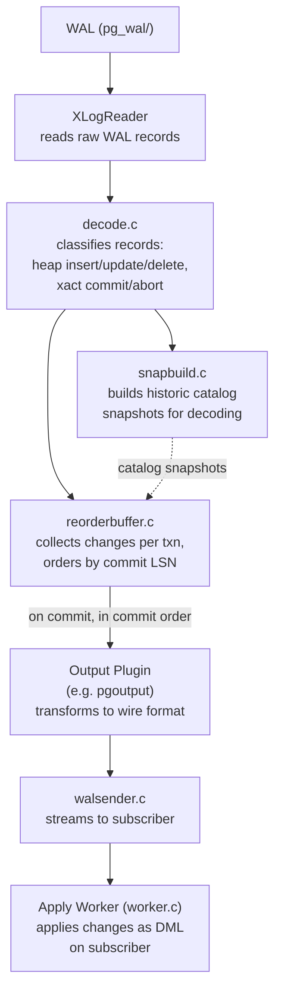

# Logical Replication

## Summary

Logical replication decodes the physical WAL stream into a sequence of
row-level change events (inserts, updates, deletes, truncates) that can be
selectively applied to a subscriber. The decoding pipeline has three core
components: the **WAL decoder** (`decode.c`) which reads WAL records and
classifies them, the **reorder buffer** (`reorderbuffer.c`) which reassembles
individual changes into complete transactions in commit order, and the
**snapshot builder** (`snapbuild.c`) which constructs historic catalog
snapshots needed to interpret the data in WAL records. An **output plugin**
transforms the decoded changes into a wire format for consumption.

---

## Overview

Physical replication ships raw WAL bytes, which means the consumer must be a
byte-identical PostgreSQL instance running the same major version. Logical
replication removes this constraint by interpreting the WAL and extracting
the semantic meaning of each change. This enables:

- **Selective replication** -- replicate specific tables, not the entire cluster
- **Cross-version replication** -- different PostgreSQL major versions on publisher and subscriber
- **Cross-platform replication** -- different architectures or operating systems
- **Data integration** -- feed changes to non-PostgreSQL systems

The cost is additional CPU on the publisher (to decode WAL) and the requirement
for `wal_level = logical`, which causes PostgreSQL to write extra WAL records
(notably `XLOG_HEAP2_NEW_CID` for catalog tuple modifications).

### Logical Decoding Pipeline



```
   WAL (pg_wal/)
       |
       v
 +------------------+
 | XLogReader       |  Reads raw WAL records from disk
 +------------------+
       |
       v
 +------------------+
 | decode.c         |  Classifies records (heap insert/update/delete,
 |                  |  xact commit/abort, running_xacts, etc.)
 +------------------+
       |                    |
       v                    v
 +------------------+  +------------------+
 | reorderbuffer.c  |  | snapbuild.c      |
 | Collects changes |  | Builds historic  |
 | per transaction, |  | catalog snapshots|
 | orders by commit |  | for decoding     |
 +------------------+  +------------------+
       |
       | (on commit, in commit order)
       v
 +------------------+
 | Output Plugin    |  Transforms changes into wire format
 | (e.g., pgoutput) |  (the built-in logical replication protocol)
 +------------------+
       |
       v
 +------------------+
 | walsender.c      |  Streams encoded changes to subscriber
 +------------------+
       |
       v
 +------------------+
 | Apply Worker     |  On subscriber: applies changes as DML
 | (worker.c)       |
 +------------------+
```

---

## Key Source Files

| File | Purpose |
|---|---|
| `src/backend/replication/logical/decode.c` | WAL record decoder -- dispatches records to reorderbuffer and snapbuild |
| `src/backend/replication/logical/reorderbuffer.c` | Collects changes per-transaction, reassembles in commit order |
| `src/backend/replication/logical/snapbuild.c` | Builds historic catalog snapshots from WAL |
| `src/backend/replication/logical/logical.c` | `LogicalDecodingContext` setup and management |
| `src/backend/replication/logical/logicalfuncs.c` | SQL-callable logical decoding functions |
| `src/backend/replication/logical/origin.c` | Replication origin tracking (prevents circular replication) |
| `src/backend/replication/logical/worker.c` | Apply worker on the subscriber side |
| `src/backend/replication/logical/launcher.c` | Launches and manages apply workers |
| `src/backend/replication/logical/tablesync.c` | Initial table synchronization for new subscriptions |
| `src/backend/replication/logical/proto.c` | Logical replication wire protocol encoding/decoding |
| `src/backend/replication/pgoutput/` | Built-in output plugin for logical replication |
| `src/include/replication/reorderbuffer.h` | `ReorderBuffer`, `ReorderBufferTXN`, `ReorderBufferChange` |
| `src/include/replication/snapbuild.h` | `SnapBuildState` enum, `SnapBuild` interface |
| `src/include/replication/snapbuild_internal.h` | Internal `SnapBuild` struct (serialization format) |
| `src/include/replication/logical.h` | `LogicalDecodingContext` |
| `src/include/replication/output_plugin.h` | Output plugin callback interface |

---

## How It Works

### 1. Logical Decoding Context Setup

When a logical walsender receives `START_REPLICATION SLOT s LOGICAL`, it
creates a `LogicalDecodingContext` which ties together all the decoding
components:

```c
LogicalDecodingContext:
    reader          -> XLogReaderState (reads WAL)
    slot            -> ReplicationSlot (tracks progress)
    reorder         -> ReorderBuffer (transaction reassembly)
    snapshot_builder -> SnapBuild (catalog snapshots)
    output_plugin_options -> plugin-specific config
    callbacks:
        begin_cb, change_cb, commit_cb,    /* per-transaction hooks */
        truncate_cb, message_cb,
        stream_start_cb, stream_stop_cb,   /* streaming large txns */
        stream_change_cb, stream_commit_cb
```

### 2. The Decode Pass (decode.c)

The decoder reads WAL records via `XLogReadRecord()` and dispatches them
based on resource manager ID. The main entry point is
`LogicalDecodingProcessRecord()`:

```
LogicalDecodingProcessRecord(ctx, record):
    switch (record->xl_rmid):
        case RM_HEAP_ID:
            switch (record->xl_info):
                case XLOG_HEAP_INSERT:
                    DecodeInsert(ctx, buf)
                        -> ReorderBufferQueueChange(INSERT, ...)
                case XLOG_HEAP_UPDATE:
                    DecodeUpdate(ctx, buf)
                        -> ReorderBufferQueueChange(UPDATE, ...)
                case XLOG_HEAP_DELETE:
                    DecodeDelete(ctx, buf)
                        -> ReorderBufferQueueChange(DELETE, ...)

        case RM_HEAP2_ID:
            case XLOG_HEAP2_MULTI_INSERT:
                DecodeMultiInsert(ctx, buf)
            case XLOG_HEAP2_NEW_CID:
                // catalog tuple cmin/cmax tracking
                -> SnapBuildProcessNewCid()
                -> ReorderBufferAddNewTupleCids()

        case RM_XACT_ID:
            case XLOG_XACT_COMMIT:
                DecodeCommit(ctx, buf)
                    -> SnapBuildCommitTxn()     // update snapshot state
                    -> ReorderBufferCommit()     // trigger output
            case XLOG_XACT_ABORT:
                DecodeAbort(ctx, buf)
                    -> ReorderBufferAbort()      // discard changes

        case RM_STANDBY_ID:
            case XLOG_RUNNING_XACTS:
                -> SnapBuildProcessRunningXacts()  // advance snapshot state
```

A critical filtering step occurs early: `DecodeTXNNeedSkip()` checks whether
a change should be skipped based on its database OID (logical decoding is
database-specific) and replication origin (to avoid replicating changes that
were themselves replicated from elsewhere).

### 3. The Reorder Buffer (reorderbuffer.c)

WAL records are written in LSN order, which interleaves changes from
concurrent transactions. The reorder buffer's job is to collect all changes
belonging to each transaction and emit them as complete units at commit time.

#### Transaction Tracking

Each in-flight transaction is tracked by a `ReorderBufferTXN`:

```c
typedef struct ReorderBufferTXN
{
    TransactionId xid;
    dlist_head  changes;           /* list of ReorderBufferChange */
    dlist_head  subtxns;           /* child subtransactions */
    struct ReorderBufferTXN *toptxn; /* parent, if subtransaction */

    XLogRecPtr  first_lsn;        /* LSN of first change */
    XLogRecPtr  end_lsn;          /* LSN of commit/abort record */
    XLogRecPtr  final_lsn;        /* commit record's LSN */

    Size        size;             /* memory consumed by this txn */
    bool        has_catalog_changes;
    /* ... */
} ReorderBufferTXN;
```

Changes are queued with `ReorderBufferQueueChange()`, which creates a
`ReorderBufferChange` and appends it to the transaction's change list.

#### Memory Management and Spilling

The reorder buffer tracks total memory consumption across all buffered
transactions. When `logical_decoding_work_mem` is exceeded, the largest
transaction (found via a max-heap keyed by transaction size) is **spilled
to disk** under `pg_logical/snapshots/`:

```
Memory tracking:
    ReorderBuffer->size          (total across all txns)
    ReorderBufferTXN->size       (per transaction)

When ReorderBuffer->size > logical_decoding_work_mem:
    pick txn with largest ->size (via max-heap)
    ReorderBufferSerializeTXN(txn):
        write changes to pg_logical/snapshots/<xid>-<lsn>.snap
        free the in-memory changes
        txn->serialized = true

At commit time, if txn->serialized:
    ReorderBufferRestoreChanges():
        read changes back from disk in chunks
```

#### Commit-Time Replay

When a commit record is decoded, `ReorderBufferCommit()` reconstructs the
complete transaction. For transactions with subtransactions, it builds a
binary heap (pairing heap) indexed by each subtransaction's current LSN,
then iterates in LSN order:

```
ReorderBufferCommit(rb, xid, commit_lsn):
    txn = lookup transaction by xid

    // Reparent any subtransactions
    ReorderBufferAssignChild(txn, ...)

    // Build iteration state
    // (binary heap of subtxn streams, ordered by LSN)
    ReorderBufferIterTXNInit(txn):
        for each subtxn:
            add to heap with key = first change LSN

    // Set up historic snapshot
    SetupHistoricSnapshot(snapshot)

    // Invoke output plugin callbacks
    begin_cb(txn)
    while (change = ReorderBufferIterTXNNext()):
        switch (change->action):
            INSERT/UPDATE/DELETE:
                change_cb(relation, change)
            TRUNCATE:
                truncate_cb(relations, change)
    commit_cb(txn, commit_lsn)

    TeardownHistoricSnapshot()
```

#### TOAST Reassembly

Out-of-line (TOASTed) column values are stored as separate chunks in the WAL.
The reorder buffer collects these chunks and reassembles them before passing
the complete tuple to the output plugin. The toast data is tracked per-relation
and per-tuple in `ReorderBufferToastHash`.

### 4. The Snapshot Builder (snapbuild.c)

Logical decoding must interpret heap tuples in WAL, which requires knowing
the catalog schema at the time each change was made. The snapshot builder
constructs **historic catalog snapshots** by tracking transaction commit/abort
from the WAL stream.

#### State Machine

The snapshot builder progresses through four states:

```
    +-------+
    | START |  Cannot decode anything yet
    +-------+
        |
        | xl_running_xacts record found
        | (establishes initial xmin horizon)
        v
    +---------------------+
    | BUILDING_SNAPSHOT   |  Tracking commits, but snapshot
    +---------------------+  not yet usable
        |
        | All transactions from the first
        | xl_running_xacts have finished
        v
    +---------------------+
    | FULL_SNAPSHOT       |  Can decode catalog contents for
    +---------------------+  transactions starting now
        |
        | All transactions from the second
        | xl_running_xacts have finished
        v
    +---------------------+
    | CONSISTENT          |  Fully operational, can decode
    +---------------------+  all transactions
```

The transition through these states requires seeing at least two
`xl_running_xacts` records (written periodically by the checkpointer) and
waiting for all transactions listed in each to complete.

**Shortcut**: If an `xl_running_xacts` record lists zero running transactions,
the builder can jump directly to `CONSISTENT`.

#### How Snapshots Are Built

Unlike normal MVCC snapshots that list all running transaction IDs, the
snapshot builder takes an inverted approach. It tracks which transactions
between `[xmin, xmax)` have **committed catalog-modifying transactions**:

```c
SnapBuild:
    TransactionId xmin;            /* oldest interesting xid */
    TransactionId xmax;            /* newest interesting xid + 1 */
    TransactionId *committed_xids; /* catalog-modifying txns that committed */
    int           committed_count;
```

Everything not in the committed list is treated as aborted or in-progress.
This works because logical decoding only needs catalog visibility (to look
up table schemas), and catalog modifications are relatively rare.

#### CID Tracking

A subtle problem: mixed DDL/DML transactions may modify catalog tuples with
command IDs (cmin/cmax) that are not recorded in normal WAL. PostgreSQL solves
this by writing `XLOG_HEAP2_NEW_CID` records for every catalog modification.
The snapshot builder passes these to the reorder buffer via
`ReorderBufferAddNewTupleCids()`, which maintains a ctid-to-(cmin,cmax) mapping
used during visibility checks.

#### Serialization

The snapshot builder periodically serializes its state to
`pg_logical/snapshots/<lsn>.snap` at consistency points. This allows logical
decoding to resume from a serialized snapshot after a restart without replaying
all WAL from the beginning.

### 5. Output Plugins

Output plugins define how decoded changes are formatted. They register
callbacks that the reorder buffer invokes:

```c
OutputPluginCallbacks:
    startup_cb          /* plugin initialization */
    begin_cb            /* transaction begin */
    change_cb           /* row change (insert/update/delete) */
    truncate_cb         /* table truncate */
    commit_cb           /* transaction commit */
    message_cb          /* logical decoding message */
    filter_by_origin_cb /* origin-based filtering */
    stream_start_cb     /* streaming mode: begin chunk */
    stream_stop_cb      /* streaming mode: end chunk */
    stream_change_cb    /* streaming mode: row change */
    stream_commit_cb    /* streaming mode: final commit */
```

The built-in `pgoutput` plugin (in `src/backend/replication/pgoutput/`)
implements the logical replication wire protocol used between publisher and
subscriber. Third-party plugins (e.g., `wal2json`, `test_decoding`) can
provide alternative output formats.

### 6. The Apply Worker (worker.c)

On the subscriber side, the logical replication launcher (`launcher.c`)
starts an apply worker for each active subscription. The apply worker:

1. Connects to the publisher using a logical replication slot
2. Receives decoded changes via the pgoutput protocol
3. Applies them as DML operations on the subscriber
4. Tracks progress using replication origins (`pg_replication_origins`)

The apply worker maps publisher table OIDs to local subscriber tables using
the publication/subscription metadata. It handles initial table
synchronization (via `tablesync.c`) and ongoing change application.

---

## Key Data Structures

### ReorderBufferChange (reorderbuffer.h)

A single decoded change event:

```c
typedef struct ReorderBufferChange
{
    XLogRecPtr  lsn;
    ReorderBufferChangeType action;  /* INSERT, UPDATE, DELETE, TRUNCATE, ... */
    struct ReorderBufferTXN *txn;
    ReplOriginId origin_id;

    union
    {
        struct  /* INSERT, UPDATE, DELETE */
        {
            RelFileLocator rlocator;
            bool        clear_toast_afterwards;
            HeapTuple   newtuple;       /* new row (INSERT, UPDATE) */
            HeapTuple   oldtuple;       /* old row (UPDATE, DELETE with REPLICA IDENTITY) */
        } tp;

        struct  /* TRUNCATE */
        {
            Size        nrelids;
            Oid        *relids;
            /* ... */
        } truncate;

        struct  /* MESSAGE */
        {
            char       *prefix;
            Size        message_size;
            char       *message;
            bool        transactional;
        } msg;

        /* INTERNAL types for snapshots, command IDs, etc. */
        /* ... */
    } data;
} ReorderBufferChange;
```

### ReorderBuffer (reorderbuffer.c, internal)

The top-level reorder buffer state:

```c
typedef struct ReorderBuffer
{
    HTAB       *by_txn;              /* hash: xid -> ReorderBufferTXN */
    dlist_head  toplevel_by_lsn;     /* toplevel txns ordered by first_lsn */

    /* Memory tracking */
    Size        size;                /* total memory used */
    binaryheap *txn_heap;            /* max-heap by txn size (for spilling) */

    /* Output plugin callbacks */
    ReorderBufferBeginCB begin;
    ReorderBufferCommitCB commit;
    ReorderBufferChangeCB change;
    ReorderBufferTruncateCB truncate;
    /* ... */

    /* Memory contexts */
    MemoryContext context;
    MemoryContext txn_context;       /* SlabContext for ReorderBufferTXN */
    MemoryContext change_context;    /* SlabContext for ReorderBufferChange */
} ReorderBuffer;
```

### SnapBuildState (snapbuild.h)

```c
typedef enum
{
    SNAPBUILD_START = -1,             /* initial, cannot decode */
    SNAPBUILD_BUILDING_SNAPSHOT = 0,  /* collecting commits */
    SNAPBUILD_FULL_SNAPSHOT = 1,      /* can decode new txns */
    SNAPBUILD_CONSISTENT = 2,         /* fully operational */
} SnapBuildState;
```

---

## Streaming Large Transactions

By default, the reorder buffer accumulates all changes for a transaction
before invoking the output plugin at commit time. For very large transactions,
this can cause excessive memory usage or disk spilling.

PostgreSQL supports **streaming mode** where in-progress transaction changes
are sent to the subscriber before the transaction commits. The output plugin's
`stream_*` callbacks handle these partial sends. On the subscriber, the apply
worker buffers streamed changes and applies them only when the final commit
arrives.

The streaming threshold is controlled by `logical_decoding_work_mem`. When a
single transaction exceeds this limit and the output plugin supports
streaming, changes are streamed incrementally rather than spilled to disk.

---

## Replication Origins (origin.c)

Replication origins track where replicated data came from, enabling:

- **Cycle detection** -- changes tagged with a foreign origin are not
  re-replicated, preventing infinite loops in multi-master setups
- **Progress tracking** -- the subscriber records its position per origin,
  enabling efficient restart after disconnection

Each origin is identified by a `ReplOriginId` (a small integer) mapped to a
human-readable name. The apply worker sets the session's replication origin
before applying changes, which tags all resulting WAL records with that
origin ID.

---

## Connections to Other Sections

- **[Streaming Replication](streaming.html)** -- Logical walsenders use the
  same `WalSnd` shared memory slots and streaming protocol as physical
  walsenders. Replication slots are shared infrastructure.

- **[Synchronous Replication](synchronous.html)** -- Logical replication
  slots participate in synchronous commit. The `WalSnd->flush` position
  for a logical walsender reflects the subscriber's confirmed receipt.

- **[Conflict Resolution](conflict-resolution.html)** -- Logical replication
  can encounter row-level conflicts (duplicate keys, missing rows) that
  require detection and resolution on the subscriber.
