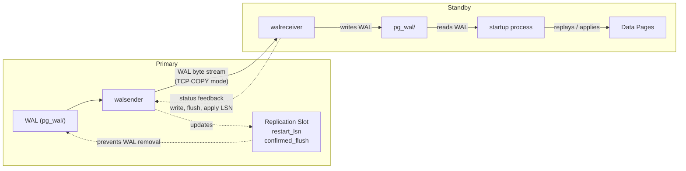

# Streaming Replication

## Summary

Physical streaming replication ships raw WAL bytes from a primary to one or
more standbys, producing byte-identical copies of the database cluster. The
primary runs a **walsender** process for each connected standby, and each
standby runs a single **walreceiver** process that writes incoming WAL to
disk. Replication slots track consumer progress and prevent premature WAL
removal. This section traces the full lifecycle from connection establishment
through steady-state streaming and failover.

---

## Overview

Physical streaming replication was introduced in PostgreSQL 9.0 and has been
the foundation of PostgreSQL high availability ever since. It works at the
storage level: the walsender reads WAL segment files from `pg_wal/` on the
primary and streams the raw bytes over a TCP connection. The walreceiver on
the standby writes these bytes to its own `pg_wal/` directory, and the startup
process replays them to keep the standby's data pages in sync.



This design has several important consequences:
- The standby is a **byte-identical** copy (same data directory layout, same OIDs)
- All databases and all objects are replicated (no selective filtering)
- The standby can serve read-only queries while replay continues (Hot Standby)
- Cascading replication is supported (a standby can feed another standby)

---

## Key Source Files

| File | Purpose |
|---|---|
| `src/backend/replication/walsender.c` | Walsender process main loop and protocol handling |
| `src/backend/replication/walreceiver.c` | Walreceiver process main loop |
| `src/backend/replication/walreceiverfuncs.c` | Shared memory management for walreceiver state |
| `src/backend/replication/slot.c` | Replication slot creation, persistence, and invalidation |
| `src/backend/replication/slotfuncs.c` | SQL-callable slot management functions |
| `src/backend/replication/libpqwalreceiver/` | libpq-based transport for walreceiver |
| `src/include/replication/walsender_private.h` | `WalSnd`, `WalSndCtlData` structures |
| `src/include/replication/walreceiver.h` | `WalRcvData` structure and walreceiver states |
| `src/include/replication/slot.h` | `ReplicationSlot`, `ReplicationSlotPersistentData` |
| `src/backend/replication/repl_gram.y` | Grammar for replication protocol commands |

---

## How It Works

### 1. Connection Establishment

When a standby starts (or restarts streaming), the startup process fills in
`WalRcvData->conninfo` and `WalRcvData->receiveStart` in shared memory, then
signals the postmaster to launch a walreceiver. The walreceiver connects to
the primary using the configured `primary_conninfo`:

```
Standby                                     Primary
  |                                            |
  | startup process sets WalRcvData            |
  | signals postmaster                         |
  |                                            |
  | walreceiver starts                         |
  |-------- libpq connection (replication) --->|
  |                                            | postmaster forks walsender
  |                                            |
  |<------- AuthenticationOk ------------------|
  |                                            |
  |-------- IDENTIFY_SYSTEM ------------------>|
  |<------- systemid, timeline, xlogpos -------|
  |                                            |
  |-------- START_REPLICATION SLOT s PHYSICAL  |
  |         WAL_POSITION 0/3000000 ----------->|
  |                                            |
  |<------- CopyBothResponse ------------------|
  |                                            |
  |<======= WAL data stream ==================>|
  |         (with bidirectional feedback)       |
```

The walsender identifies itself by marking its slot in the `PMSignalState`
array, which allows the postmaster to treat it differently during shutdown
(walsenders are kept alive longer to stream the shutdown checkpoint).

### 2. The Streaming Protocol

Once `START_REPLICATION` is issued, the connection enters COPY mode with
bidirectional data flow:

**Primary to Standby (WAL data messages):**

Each message contains:
- Message type byte (`'w'` for WAL data)
- Start WAL position of this chunk
- End WAL position (current end of WAL on primary)
- Server send timestamp
- Raw WAL data (up to `MAX_SEND_SIZE`, typically 128 KB)

**Standby to Primary (status updates):**

The walreceiver sends `StandbyStatusUpdate` messages containing:
- Write position (WAL written to OS cache)
- Flush position (WAL fsynced to disk)
- Apply position (WAL replayed by startup process)
- Client send timestamp
- Reply requested flag

```
Primary (walsender)              Standby (walreceiver)
  |                                        |
  |--- WAL data (LSN 0/3000000-0/3010000)->|
  |--- WAL data (LSN 0/3010000-0/3020000)->|
  |                                        | writes to pg_wal/
  |                                        | updates WalRcv->flushedUpto
  |<-- Status: write=0/3020000             |
  |           flush=0/3020000              |
  |           apply=0/3015000 -------------|
  |                                        |
  | updates WalSnd->write/flush/apply      |
  | (used by sync rep and monitoring)      |
  |                                        |
```

### 3. Walsender Main Loop

The walsender main loop in `WalSndLoop()` alternates between sending WAL and
processing feedback. The core logic:

```
WalSndLoop():
    while not stopping:
        // Check for new WAL to send
        SendDataUntilCaughtUp():
            while sentPtr < GetFlushRecPtr():
                XLogSendPhysical()  // read WAL from disk, send via COPY
                sentPtr += bytes_sent

        // If caught up, wait for new WAL or timeout
        if caught_up:
            WaitForWALToBecomeAvailable()
            // uses WalSndCtl->wal_flush_cv condition variable

        // Process any feedback from standby
        ProcessRepliesIfAny():
            // updates WalSnd->write, flush, apply
            // triggers SyncRepReleaseWaiters() if sync rep enabled

        // Send keepalive if wal_sender_timeout approaching
        WalSndKeepalive()
```

The walsender reads WAL using standard file I/O (not shared buffers), reading
directly from WAL segment files in `pg_wal/`. It tracks its position via
`sentPtr` and sends data in chunks up to `MAX_SEND_SIZE` (128 KB with default
8 KB block size).

### 4. Walreceiver Main Loop

The walreceiver runs a complementary loop in `WalReceiverMain()`:

```
WalReceiverMain():
    // Connect to primary
    wrconn = walrcv_connect(conninfo)

    // Start streaming
    walrcv_startstreaming(wrconn, startpoint, slotname)

    while connected:
        // Receive WAL data
        len = walrcv_receive(wrconn, &buf)

        if len > 0:
            XLogWalRcvWrite(buf, len, recvPtr)  // write to pg_wal/
            recvPtr += len

            // Periodically flush to disk
            if should_flush:
                XLogWalRcvFlush()
                // updates WalRcv->flushedUpto in shared memory
                // wakes startup process to replay more WAL

        // Send status feedback
        if interval_elapsed or flush_happened:
            XLogWalRcvSendReply()
            XLogWalRcvSendHSFeedback()  // hot_standby_feedback
```

The walreceiver uses the dynamically loaded `libpqwalreceiver` module for
actual network communication. This design allows the main server binary to
avoid linking against libpq. The module implements functions defined in the
`WalReceiverFunctionsType` function table.

### 5. Replication Slots

Replication slots solve a critical problem: without them, the primary has no
reliable way to know which WAL segments a standby still needs. Slots provide:

- **WAL retention**: `restart_lsn` prevents `pg_wal/` cleanup past this point
- **Row retention**: `xmin` / `catalog_xmin` hold back vacuum's horizon
- **Progress tracking**: `confirmed_flush` records the consumer's position
- **Crash safety**: slot state is persisted to `pg_replslot/<slotname>/state`

#### Slot Types

| Type | Persistency | Use |
|---|---|---|
| Physical, persistent | `RS_PERSISTENT` | Standby that may disconnect and reconnect |
| Physical, temporary | `RS_TEMPORARY` | Session-scoped, dropped on disconnect |
| Logical, persistent | `RS_PERSISTENT` | Logical replication subscriptions |
| Logical, ephemeral | `RS_EPHEMERAL` | Transitional state during slot creation |

#### Slot Lifecycle

```
CREATE_REPLICATION_SLOT:
    ReplicationSlotCreate():
        acquire ReplicationSlotAllocationLock (exclusive)
        find free slot in ReplicationSlotCtl->replication_slots[]
        set slot->in_use = true
        initialize ReplicationSlotPersistentData
        release lock
        CreateSlotOnDisk():
            mkdir pg_replslot/<name>/
            SaveSlotToPath()  // write state file with CRC

START_REPLICATION (using slot):
    ReplicationSlotAcquire():
        set slot->active_proc = MyProcNumber

Periodic status updates:
    PhysicalConfirmReceivedLocation():
        update slot->data.restart_lsn
        if dirty: SaveSlotToPath()

DROP_REPLICATION_SLOT:
    ReplicationSlotDrop():
        ReplicationSlotMarkDirty()
        remove pg_replslot/<name>/ directory
        set slot->in_use = false
```

#### Slot Invalidation

Slots can be invalidated when they block critical operations. The
`ReplicationSlotInvalidationCause` enum tracks the reason:

- `RS_INVAL_WAL_REMOVED` -- required WAL was removed (exceeds `max_slot_wal_keep_size`)
- `RS_INVAL_HORIZON` -- required rows were removed (vacuum advanced past the slot's xmin)
- `RS_INVAL_WAL_LEVEL` -- `wal_level` was reduced below what the slot requires
- `RS_INVAL_IDLE_TIMEOUT` -- slot exceeded the configured idle timeout

An invalidated slot will refuse `START_REPLICATION` and the consumer must
create a new slot and re-synchronize from scratch.

---

## Key Data Structures

### WalSnd (walsender_private.h)

Each active walsender gets a `WalSnd` entry in the shared memory array
`WalSndCtl->walsnds[]`. The array has `max_wal_senders` entries:

```c
typedef struct WalSnd
{
    pid_t       pid;               /* 0 if slot is free */
    WalSndState state;             /* STARTUP -> CATCHUP -> STREAMING -> STOPPING */
    XLogRecPtr  sentPtr;           /* WAL sent up to this point */

    /* Reported positions from the standby */
    XLogRecPtr  write;
    XLogRecPtr  flush;
    XLogRecPtr  apply;

    /* Measured replication lag */
    TimeOffset  writeLag;
    TimeOffset  flushLag;
    TimeOffset  applyLag;

    int         sync_standby_priority;  /* 0 = not in sync list */
    slock_t     mutex;
    TimestampTz replyTime;
    ReplicationKind kind;               /* physical or logical */
} WalSnd;
```

### WalSndCtlData (walsender_private.h)

The global coordination structure for all walsenders:

```c
typedef struct WalSndCtlData
{
    /* Synchronous replication queues (one per wait mode) */
    dlist_head  SyncRepQueue[NUM_SYNC_REP_WAIT_MODE];  /* write, flush, apply */
    XLogRecPtr  lsn[NUM_SYNC_REP_WAIT_MODE];

    bits8       sync_standbys_status;

    /* Condition variables for waking walsenders */
    ConditionVariable wal_flush_cv;       /* physical walsenders */
    ConditionVariable wal_replay_cv;      /* logical walsenders */
    ConditionVariable wal_confirm_rcv_cv; /* failover slot sync */

    WalSnd      walsnds[FLEXIBLE_ARRAY_MEMBER];
} WalSndCtlData;
```

### WalRcvData (walreceiver.h)

The walreceiver's shared memory state, used for communication with the
startup process:

```c
typedef struct WalRcvData
{
    ProcNumber  procno;
    pid_t       pid;
    WalRcvState walRcvState;       /* STOPPED -> STARTING -> STREAMING -> ... */

    XLogRecPtr  receiveStart;      /* where to start streaming (set by startup) */
    TimeLineID  receiveStartTLI;

    XLogRecPtr  flushedUpto;       /* WAL flushed to disk (updated by walreceiver) */
    TimeLineID  receivedTLI;

    XLogRecPtr  latestChunkStart;  /* start of current batch */
    XLogRecPtr  latestWalEnd;      /* latest WAL end reported by sender */
    TimestampTz latestWalEndTime;

    char        conninfo[MAXCONNINFO];
    char        slotname[NAMEDATALEN];
    /* ... */
} WalRcvData;
```

### ReplicationSlotOnDisk (slot.c)

The on-disk format for slot persistence:

```c
typedef struct ReplicationSlotOnDisk
{
    /* Version-independent header */
    uint32      magic;
    pg_crc32c   checksum;

    /* Versioned payload */
    uint32      version;
    uint32      length;
    ReplicationSlotPersistentData slotdata;
} ReplicationSlotOnDisk;
```

---

## Walsender State Machine

The walsender transitions through well-defined states:

```
                      Connection
                      established
                          |
                          v
                   +------------+
                   |  STARTUP   |  Initializing, handshake
                   +------------+
                          |
                    START_REPLICATION
                          |
              +-----------+-----------+
              |                       |
              v                       v
       +------------+         +------------+
       |  CATCHUP   |         |   BACKUP   |  (BASE_BACKUP command)
       +------------+         +------------+
              |
         caught up with
         primary WAL
              |
              v
       +------------+
       | STREAMING  |  Steady state
       +------------+
              |
         shutdown signal
         (PROCSIG_WALSND_INIT_STOPPING)
              |
              v
       +------------+
       |  STOPPING  |  Sending final WAL including
       +------------+  shutdown checkpoint
              |
           exit(0)
```

---

## Cascading Replication

PostgreSQL supports cascading replication where a standby serves as a
replication source for downstream standbys. This is enabled when
`hot_standby = on` and `max_wal_senders > 0` on the intermediate standby.

```
Primary -----> Standby A -----> Standby B
(walsender)   (walreceiver     (walreceiver)
               + walsender)
```

A cascading walsender (`am_cascading_walsender = true`) reads WAL from the
standby's local `pg_wal/` directory, which was written by the standby's own
walreceiver. The standby uses `GetStandbyFlushRecPtr()` instead of
`GetFlushRecPtr()` to determine how much WAL is available for streaming.

---

## Hot Standby Feedback

The `hot_standby_feedback` parameter enables the walreceiver to send its
oldest active transaction ID (`xmin`) back to the primary. The primary uses
this to hold back vacuum, preventing the removal of rows that active queries
on the standby might still need.

This feedback is sent via `XLogWalRcvSendHSFeedback()` as part of the regular
status update cycle. The primary's walsender calls
`PhysicalReplicationSlotNewXmin()` to update the slot's effective xmin.

The trade-off is clear: enabling hot standby feedback prevents "rows removed"
query cancellations on the standby, but can cause table bloat on the primary
if the standby runs long transactions.

---

## Shutdown Coordination

Walsender shutdown follows a carefully orchestrated sequence to ensure the
standby receives all WAL including the shutdown checkpoint:

1. All regular backends exit
2. Checkpointer sends `PROCSIG_WALSND_INIT_STOPPING` to all walsenders
3. Walsenders transition to `WALSNDSTATE_STOPPING` and refuse new commands
4. Checkpointer writes the shutdown checkpoint
5. Postmaster sends `SIGUSR2` to walsenders
6. Walsenders send remaining WAL (including shutdown checkpoint)
7. Walsenders wait for standby acknowledgment (if sync rep)
8. Walsenders exit

---

## Connections to Other Sections

- **[Logical Replication](logical.html)** -- Logical walsenders share the same
  `WalSnd` infrastructure but use the logical decoding pipeline instead of raw
  WAL streaming.

- **[Synchronous Replication](synchronous.html)** -- The `WalSnd->write`,
  `flush`, and `apply` positions reported by walreceivers are the inputs to
  the synchronous commit mechanism.

- **[Conflict Resolution](conflict-resolution.html)** -- WAL replay on a hot
  standby can conflict with read queries, and hot standby feedback is one
  mechanism to mitigate these conflicts.
