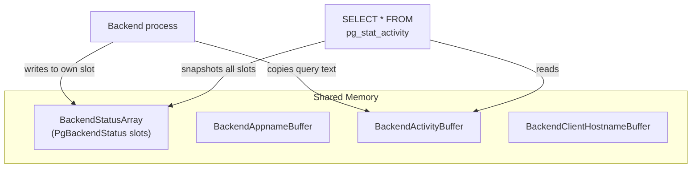
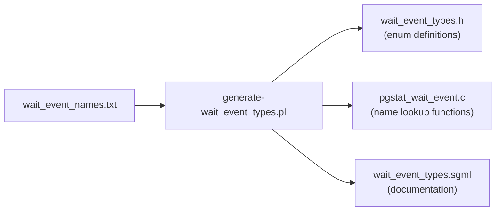
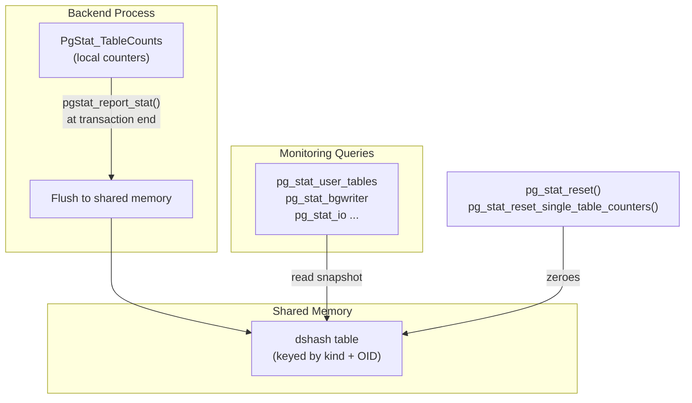

# Activity Monitoring

## Summary

PostgreSQL provides three complementary mechanisms for runtime observability. **Backend status reporting** (`pg_stat_activity`) shows what every backend is doing right now -- its current query, transaction state, and wait event. **Wait events** classify exactly what a process is blocked on, from lock acquisition to client I/O to disk reads. **Progress reporting** tracks the completion percentage of long-running commands like VACUUM, ANALYZE, CREATE INDEX, COPY, and CLUSTER. All three share the same architecture: each backend writes to a pre-allocated slot in shared memory, and monitoring queries take a consistent snapshot of all slots.

---

## Overview

Before PostgreSQL 9.6, diagnosing "what is this backend waiting for?" required external tools like `strace`, `perf`, or OS-level wait analysis. The wait event infrastructure changed this by embedding lightweight instrumentation directly into the server. A backend sets its wait event before entering any potentially blocking operation and clears it upon return. Since setting a wait event is just writing an integer to a shared-memory field, the overhead is negligible even at high throughput.

The cumulative statistics system (pg_stat_user_tables, pg_stat_bgwriter, pg_stat_io, and others) complements the real-time view by tracking aggregate counters over the lifetime of the server. Since PostgreSQL 15, these counters live in shared memory hash tables rather than being managed by a separate stats collector process.

---

## Key Source Files

| File | Purpose |
|------|---------|
| `src/include/utils/backend_status.h` | `PgBackendStatus` struct, `BackendState` enum |
| `src/include/utils/backend_progress.h` | `ProgressCommandType`, progress parameter API |
| `src/include/utils/wait_event.h` | Wait event type definitions, set/reset macros |
| `src/backend/utils/activity/backend_status.c` | Shared memory allocation, status read/write |
| `src/backend/utils/activity/backend_progress.c` | Progress counter update functions |
| `src/backend/utils/activity/wait_event.c` | Wait event name resolution |
| `src/backend/utils/activity/wait_event_names.txt` | Master list of all wait events with descriptions |
| `src/backend/utils/activity/pgstat.c` | Cumulative statistics infrastructure |
| `src/backend/utils/activity/pgstat_relation.c` | Per-relation cumulative stats |
| `src/backend/utils/activity/pgstat_database.c` | Per-database cumulative stats |
| `src/backend/utils/activity/pgstat_io.c` | I/O statistics |
| `src/include/pgstat.h` | Top-level cumulative stats types and functions |

---

## How It Works

### Backend Status Reporting

Every backend (and auxiliary process) has a `PgBackendStatus` slot in shared memory, allocated at startup in `BackendStatusShmemInit()`. The total number of slots is `MaxBackends + NUM_AUXILIARY_PROCS`.



**Lock-free reads via st_changecount**: To avoid locking overhead, backends use a sequence-number protocol:

1. Before modifying its slot, the backend increments `st_changecount` (making it odd).
2. After finishing the modification, it increments `st_changecount` again (making it even).
3. A reader copies the entire slot into local memory, then checks `st_changecount`. If the value changed during the copy, or if it is odd, the reader retries.

This protocol requires memory barriers (provided by macros `pgstat_begin_changecount_write/read`) to prevent CPU reordering from violating the invariants.

### PgBackendStatus Structure

```c
typedef struct PgBackendStatus {
    int             st_changecount;     /* lock-free protocol counter */
    int             st_procpid;         /* backend PID (0 = unused slot) */
    ProcNumber      st_procno;          /* ProcNumber for this backend */
    TimestampTz     st_proc_start_timestamp;
    TimestampTz     st_xact_start_timestamp;
    TimestampTz     st_activity_start_timestamp;
    TimestampTz     st_state_start_timestamp;

    BackendState    st_state;           /* idle, active, idle-in-transaction, etc. */
    Oid             st_databaseid;
    Oid             st_userid;

    /* Wait event info (packed into a single uint32) */
    uint32          st_wait_event_info;

    /* Progress reporting */
    ProgressCommandType st_progress_command;
    Oid             st_progress_command_target;
    int64           st_progress_param[PGSTAT_NUM_PROGRESS_PARAM]; /* 20 slots */

    /* Pointers into separate buffers */
    char           *st_appname;
    char           *st_clienthostname;
    char           *st_activity;        /* current query string */

    /* Connection info */
    SockAddr        st_clientaddr;
    BackendType     st_backendType;
} PgBackendStatus;
```

The `BackendState` enum maps directly to the `state` column in `pg_stat_activity`:

| Enum Value | pg_stat_activity.state |
|------------|----------------------|
| `STATE_IDLE` | `idle` |
| `STATE_RUNNING` | `active` |
| `STATE_IDLEINTRANSACTION` | `idle in transaction` |
| `STATE_IDLEINTRANSACTION_ABORTED` | `idle in transaction (aborted)` |
| `STATE_FASTPATH` | `fastpath function call` |
| `STATE_DISABLED` | `disabled` |

### Wait Events

Wait events are categorized into classes, each covering a different kind of blocking:

| Class | Description | Examples |
|-------|-------------|----------|
| **Activity** | Background process idle loops | `AutoVacuumMain`, `BgWriterMain`, `WalWriterMain` |
| **Client** | Waiting for client I/O | `ClientRead`, `ClientWrite` |
| **IPC** | Waiting for another process | `BufferIO`, `CheckpointDone`, `ExecuteGather` |
| **Timeout** | Sleeping on a timer | `PgSleep`, `VacuumDelay`, `CheckpointWriteDelay` |
| **IO** | Waiting for disk I/O | `AioIOCompletion`, `DataFileRead`, `WALWrite` |
| **LWLock** | Lightweight lock waits | Named per lwlock tranche (buffer mapping, WAL insert, etc.) |
| **Lock** | Heavyweight (relation) lock waits | Row, relation, transaction locks |
| **BufferPin** | Waiting for a buffer pin | Another backend holds a pin on needed buffer |

The wait event is packed into a single `uint32` in `st_wait_event_info`, with the high bits encoding the class and the low bits encoding the specific event within that class. Setting a wait event is a single memory store:

```c
/* Simplified from wait_event.h */
static inline void
pgstat_report_wait_start(uint32 wait_event_info)
{
    MyProc->wait_event_info = wait_event_info;
    MyBEEntry->st_wait_event_info = wait_event_info;
}

static inline void
pgstat_report_wait_end(void)
{
    MyProc->wait_event_info = 0;
    MyBEEntry->st_wait_event_info = 0;
}
```

The `wait_event_names.txt` file is the master source of truth. A Perl script (`generate-wait_event_types.pl`) generates C header files, C name-lookup functions, and SGML documentation from this single file.



### Progress Reporting

Long-running commands report progress through a fixed array of 20 `int64` counters in `PgBackendStatus`. Each command type defines its own mapping of counter indices to meanings.

```c
typedef enum ProgressCommandType {
    PROGRESS_COMMAND_INVALID,
    PROGRESS_COMMAND_VACUUM,
    PROGRESS_COMMAND_ANALYZE,
    PROGRESS_COMMAND_CLUSTER,
    PROGRESS_COMMAND_CREATE_INDEX,
    PROGRESS_COMMAND_BASEBACKUP,
    PROGRESS_COMMAND_COPY,
} ProgressCommandType;
```

The API is straightforward:

```c
/* At command start */
pgstat_progress_start_command(PROGRESS_COMMAND_VACUUM, relid);

/* During execution */
pgstat_progress_update_param(PROGRESS_VACUUM_PHASE, phase);
pgstat_progress_update_param(PROGRESS_VACUUM_HEAP_BLKS_SCANNED, blks);

/* At command end */
pgstat_progress_end_command();
```

Corresponding views expose these counters with meaningful column names:

| View | Command |
|------|---------|
| `pg_stat_progress_vacuum` | VACUUM |
| `pg_stat_progress_analyze` | ANALYZE |
| `pg_stat_progress_create_index` | CREATE INDEX / REINDEX |
| `pg_stat_progress_cluster` | CLUSTER / VACUUM FULL |
| `pg_stat_progress_basebackup` | pg_basebackup |
| `pg_stat_progress_copy` | COPY |

### Cumulative Statistics Infrastructure

Since PostgreSQL 15, cumulative statistics are stored in shared memory hash tables, replacing the old stats collector process. The architecture:



Each backend accumulates counters locally in `PgStat_TableCounts` (for relations) or similar per-kind structures. At transaction commit (or periodically for long transactions), counters are flushed to the shared hash table. This batching reduces contention on the shared data structures.

Key counter categories:

| Stats Kind | View | Key Counters |
|-----------|------|--------------|
| Relations | `pg_stat_user_tables` | `seq_scan`, `idx_scan`, `n_tup_ins/upd/del`, `n_live_tup`, `n_dead_tup` |
| Indexes | `pg_stat_user_indexes` | `idx_scan`, `idx_tup_read`, `idx_tup_fetch` |
| Database | `pg_stat_database` | `xact_commit`, `xact_rollback`, `blks_read`, `blks_hit` |
| IO | `pg_stat_io` | `reads`, `writes`, `extends`, `hits`, `evictions` by backend type and context |
| WAL | `pg_stat_wal` | `wal_records`, `wal_bytes`, `wal_buffers_full` |
| BGWriter | `pg_stat_bgwriter` | `buffers_clean`, `buffers_alloc` |
| Checkpointer | `pg_stat_checkpointer` | `num_timed`, `num_requested`, `buffers_written` |

---

## Key Data Structures

### PgStat_TableCounts

The per-table counters accumulated locally in each backend:

```c
typedef struct PgStat_TableCounts {
    PgStat_Counter numscans;
    PgStat_Counter tuples_returned;
    PgStat_Counter tuples_fetched;
    PgStat_Counter tuples_inserted;
    PgStat_Counter tuples_updated;
    PgStat_Counter tuples_deleted;
    PgStat_Counter tuples_hot_updated;
    PgStat_Counter tuples_newpage_updated;
    PgStat_Counter delta_live_tuples;
    PgStat_Counter delta_dead_tuples;
    PgStat_Counter changed_tuples;
    /* ... block-level counters ... */
} PgStat_TableCounts;
```

The `delta_live_tuples` and `delta_dead_tuples` fields can be negative. They are set at commit or abort time to reflect the net change. The `changed_tuples` counter drives autovacuum's decision to trigger ANALYZE.

---

## Practical Monitoring Patterns

### Finding Blocked Queries

```sql
SELECT pid, wait_event_type, wait_event, state,
       left(query, 80) AS query
FROM pg_stat_activity
WHERE wait_event IS NOT NULL
  AND state = 'active'
ORDER BY query_start;
```

### Identifying Lock Waiters and Blockers

```sql
SELECT blocked.pid AS blocked_pid,
       blocked.query AS blocked_query,
       blocking.pid AS blocking_pid,
       blocking.query AS blocking_query
FROM pg_stat_activity blocked
JOIN pg_locks bl ON bl.pid = blocked.pid AND NOT bl.granted
JOIN pg_locks gl ON gl.locktype = bl.locktype
    AND gl.database IS NOT DISTINCT FROM bl.database
    AND gl.relation IS NOT DISTINCT FROM bl.relation
    AND gl.granted
JOIN pg_stat_activity blocking ON blocking.pid = gl.pid
WHERE blocked.pid != blocking.pid;
```

### Monitoring VACUUM Progress

```sql
SELECT p.relid::regclass AS table_name,
       p.phase,
       p.heap_blks_total,
       p.heap_blks_scanned,
       p.heap_blks_vacuumed,
       CASE WHEN p.heap_blks_total > 0
            THEN round(100.0 * p.heap_blks_vacuumed / p.heap_blks_total, 1)
            ELSE 0 END AS pct_complete
FROM pg_stat_progress_vacuum p;
```

### Finding Long-Running Idle-in-Transaction Sessions

```sql
SELECT pid, usename, state,
       now() - xact_start AS xact_duration,
       now() - state_start AS state_duration,
       left(query, 80) AS last_query
FROM pg_stat_activity
WHERE state = 'idle in transaction'
  AND now() - state_start > interval '5 minutes'
ORDER BY state_start;
```

---

## The pg_stat_statements Extension

While not part of core, `pg_stat_statements` is the most important monitoring extension. It tracks per-query-pattern statistics (total time, calls, rows, block I/O, WAL usage) by normalizing query text into parameterized forms. It stores its data in shared memory with a configurable maximum number of entries (`pg_stat_statements.max`).

This extension fills the gap between "what is happening now" (`pg_stat_activity`) and "what has been happening over time" (cumulative stats), providing the query-level granularity needed for performance analysis.

---

## Connections to Other Chapters

- **Chapter 2 (Shared Memory)**: All activity monitoring data lives in shared memory. `BackendStatusShmemInit()` allocates the arrays during postmaster startup. The cumulative stats hash tables are also in shared memory (via DSA/dshash since PostgreSQL 15).
- **Chapter 6 (Locking)**: Wait events for `Lock` and `LWLock` classes directly expose the locking subsystem. The `pg_locks` view complements `pg_stat_activity` for lock analysis.
- **Chapter 8 (VACUUM)**: Progress reporting for VACUUM is the primary way to track long-running vacuum operations. The `n_dead_tup` counter from cumulative stats drives autovacuum scheduling.
- **Chapter 13 (pg_statistic)**: The `changed_tuples` counter in cumulative stats triggers autovacuum-initiated ANALYZE, which populates the planner statistics described in the preceding sections.
- **Chapter 5 (WAL)**: WAL-related wait events (`WALWrite`, `WALSync`, `WALSenderMain`) are critical for diagnosing replication lag and write bottlenecks.
