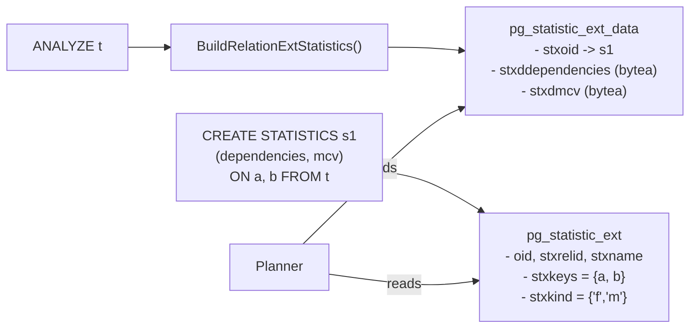
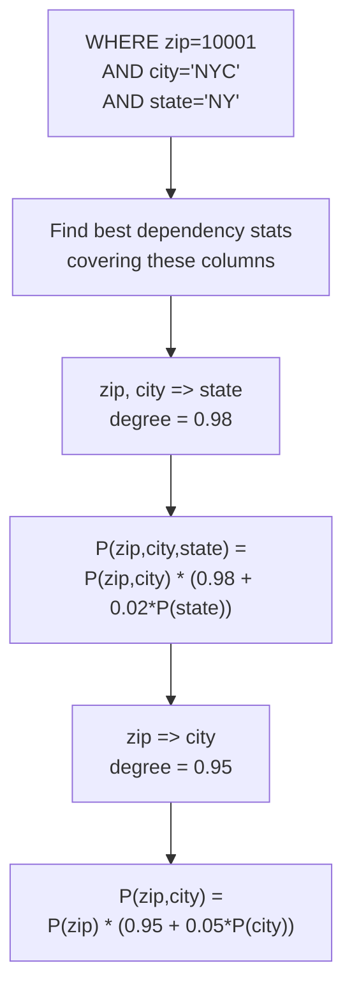
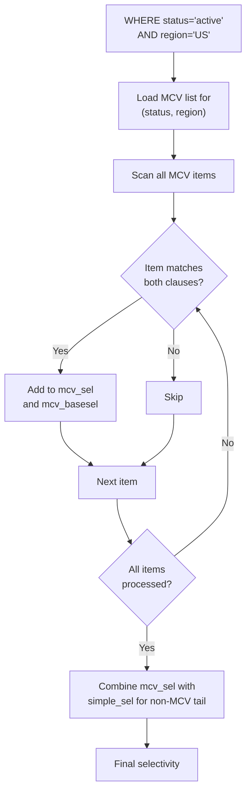
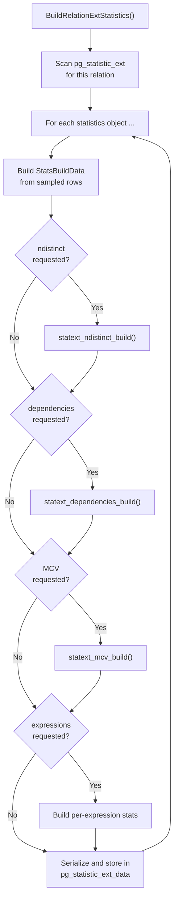

# Extended Statistics

## Summary

Single-column statistics assume independence between columns. When that assumption fails -- a ZIP code determines a city, or two columns are strongly correlated -- the planner can produce wildly wrong row estimates and choose terrible plans. Extended statistics, created via `CREATE STATISTICS`, let PostgreSQL track three kinds of multi-column relationships: **functional dependencies** (one column determines another), **ndistinct coefficients** (how many distinct combinations exist), and **multi-column MCV lists** (most common value combinations with their actual frequencies). These statistics are stored across two catalogs: `pg_statistic_ext` (the object definition) and `pg_statistic_ext_data` (the computed data, populated by ANALYZE).

---

## Overview

The extended statistics system addresses a fundamental limitation of the Attribute Value Independence Assumption (AVIA). Under AVIA, the selectivity of `WHERE city = 'Seattle' AND state = 'WA'` is estimated as `P(city='Seattle') * P(state='WA')`, which massively underestimates the true selectivity because knowing the city almost fully determines the state.

PostgreSQL supports four kinds of extended statistics:

| Kind Code | Character | What It Tracks | Used For |
|-----------|-----------|----------------|----------|
| ndistinct | `'d'` | Number of distinct value combinations across column subsets | GROUP BY cardinality estimation |
| dependencies | `'f'` | Soft functional dependencies between columns | AND-ed equality clause selectivity |
| MCV | `'m'` | Most common value combinations with frequencies | Equality, inequality, IS NULL, OR clauses |
| expressions | `'e'` | Per-expression statistics (like single-column stats, but for expressions) | Expression-based conditions |

Creating extended statistics:

```sql
-- All three kinds at once
CREATE STATISTICS s_city_state (dependencies, ndistinct, mcv)
    ON city, state FROM addresses;

-- Expression statistics
CREATE STATISTICS s_year ON (EXTRACT(year FROM created_at)) FROM orders;

ANALYZE addresses;
ANALYZE orders;
```

---

## Key Source Files

| File | Purpose |
|------|---------|
| `src/include/catalog/pg_statistic_ext.h` | Extended statistics object catalog, kind codes |
| `src/include/catalog/pg_statistic_ext_data.h` | Data storage catalog |
| `src/include/statistics/statistics.h` | MVNDistinct, MVDependency, MCVList structs |
| `src/include/statistics/extended_stats_internal.h` | Internal build/serialize APIs, SortItem, StatsBuildData |
| `src/backend/statistics/extended_stats.c` | Build orchestration, `BuildRelationExtStatistics()` |
| `src/backend/statistics/dependencies.c` | Dependency mining and selectivity estimation |
| `src/backend/statistics/mcv.c` | Multi-column MCV build and clause matching |
| `src/backend/statistics/mvdistinct.c` | Ndistinct computation for column combinations |
| `src/backend/statistics/README` | Architecture overview |
| `src/backend/statistics/README.dependencies` | Functional dependency algorithm details |
| `src/backend/statistics/README.mcv` | Multi-column MCV design notes |

---

## How It Works

### Catalog Architecture

Extended statistics use a two-catalog design that separates definition from data:



`pg_statistic_ext` stores:
- `stxrelid`: The table the statistics are defined on
- `stxkeys`: An `int2vector` of column attribute numbers
- `stxkind`: Array of kind characters (`'d'`, `'f'`, `'m'`, `'e'`)
- `stxexprs`: Expression trees for expression statistics

`pg_statistic_ext_data` stores:
- `stxoid`: References the definition in `pg_statistic_ext`
- `stxdinherit`: Whether inheritance children are included
- `stxdndistinct`: Serialized `pg_ndistinct` blob
- `stxddependencies`: Serialized `pg_dependencies` blob
- `stxdmcv`: Serialized `pg_mcv_list` blob
- `stxdexpr`: Per-expression single-column statistics

### Functional Dependencies

Functional dependencies capture relationships like "ZIP code determines city." The degree of a dependency `(a => b)` ranges from 0.0 (no dependency) to 1.0 (perfect dependency).

**Mining algorithm** (during ANALYZE):

1. For each possible dependency `(X => Y)` where X is a subset of columns and Y is a single column not in X:
2. Sort the sampled data lexicographically by X, then Y.
3. For each group of rows sharing the same X values, check if Y has a single distinct value.
4. The degree = (rows consistent with the dependency) / (total rows).

**Selectivity estimation** (during planning):

Given `WHERE a = 1 AND b = 2` with dependency `a => b` of degree `d`:

```
P(a=1, b=2) = P(a=1) * (d + (1-d) * P(b=2))
```

When `d = 1.0` (perfect dependency), this simplifies to `P(a=1)` -- knowing `a` fully determines `b`, so the `b` condition adds no additional filtering. When `d = 0.0`, it reduces to `P(a=1) * P(b=2)`, the independence assumption.

For three or more columns, the formula applies recursively. Given `(a, b => c)` with degree `e`:

```
P(a=1, b=2, c=3) = P(a=1, b=2) * (e + (1-e) * P(c=3))
```

Then `P(a=1, b=2)` is further decomposed using `(a => b)`.



**Limitation**: Dependencies only help with equality clauses combined with AND. They do not help with inequality conditions or OR clauses. They can also overestimate when the clause values are inconsistent with the dependency (e.g., a ZIP code paired with the wrong city).

### Multi-Column Ndistinct

Ndistinct coefficients track how many distinct value combinations exist across subsets of the specified columns. The planner uses these for GROUP BY cardinality estimation.

For columns `(a, b, c)`, ndistinct stores coefficients for all 2+ column subsets: `{a,b}`, `{a,c}`, `{b,c}`, `{a,b,c}`. Each coefficient is a `double` representing the estimated number of distinct combinations.

Without extended statistics, the planner estimates `SELECT COUNT(DISTINCT (a, b))` by multiplying the individual ndistinct values, which often massively overestimates. With ndistinct statistics, the planner uses the directly observed count.

### Multi-Column MCV Lists

Multi-column MCV lists are the most powerful and most general form of extended statistics. They track the most frequent value combinations along with their actual frequencies and "base frequencies" (the frequency that would be expected under independence).

**Build algorithm**:

1. Sort sampled rows by all columns using `MultiSortSupport`.
2. Count frequency of each unique combination.
3. Keep the top `statistics_target` combinations that appear more than once.
4. For each kept combination, compute the base frequency as the product of individual column frequencies (the independence assumption).
5. Serialize using a deduplicated format to minimize storage.

**Selectivity estimation**:

For a clause list, `mcv_clauselist_selectivity()`:

1. Iterate over all MCV items.
2. For each item, evaluate whether it matches all clauses.
3. Sum the frequencies of matching items (`mcv_sel`).
4. Sum the base frequencies of matching items (`mcv_basesel`).
5. Compute the "total" MCV coverage (`mcv_totalsel`) and base coverage.
6. Combine with the simple (independence-based) selectivity for non-MCV values:

```
final_sel = mcv_sel + (simple_sel - mcv_basesel) * correction_factor
```

This approach handles the full range of clause types: equality, inequality, IS NULL, IS NOT NULL, and OR combinations.



### Expression Statistics

Added in PostgreSQL 14, expression statistics let you collect single-column-style statistics (MCV, histogram, ndistinct) on arbitrary expressions:

```sql
CREATE STATISTICS s_expr ON (a + b), (lower(name)) FROM t;
```

After ANALYZE, the `stxdexpr` field stores per-expression statistics in the same format as `pg_statistic` rows. The planner can then estimate conditions like `WHERE a + b = 10` or `WHERE lower(name) = 'smith'` accurately.

---

## Key Data Structures

### MVNDistinct

```c
typedef struct MVNDistinctItem {
    double      ndistinct;      /* distinct count for this combination */
    int         nattributes;    /* number of columns */
    AttrNumber *attributes;     /* column attribute numbers */
} MVNDistinctItem;

typedef struct MVNDistinct {
    uint32      magic;          /* STATS_NDISTINCT_MAGIC (0xA352BFA4) */
    uint32      type;           /* STATS_NDISTINCT_TYPE_BASIC */
    uint32      nitems;         /* number of column combinations */
    MVNDistinctItem items[FLEXIBLE_ARRAY_MEMBER];
} MVNDistinct;
```

### MVDependencies

```c
typedef struct MVDependency {
    double      degree;         /* validity degree: 0.0 to 1.0 */
    AttrNumber  nattributes;    /* number of attributes */
    AttrNumber  attributes[FLEXIBLE_ARRAY_MEMBER];
    /* Last attribute is the "dependent" column */
} MVDependency;

typedef struct MVDependencies {
    uint32      magic;          /* STATS_DEPS_MAGIC (0xB4549A2C) */
    uint32      type;           /* STATS_DEPS_TYPE_BASIC */
    uint32      ndeps;          /* number of dependencies */
    MVDependency *deps[FLEXIBLE_ARRAY_MEMBER];
} MVDependencies;
```

### MCVList and MCVItem

```c
typedef struct MCVItem {
    double      frequency;      /* actual observed frequency */
    double      base_frequency; /* expected frequency under independence */
    bool       *isnull;         /* NULL flags per dimension */
    Datum      *values;         /* values per dimension */
} MCVItem;

typedef struct MCVList {
    uint32      magic;          /* STATS_MCV_MAGIC (0xE1A651C2) */
    uint32      type;           /* STATS_MCV_TYPE_BASIC */
    uint32      nitems;         /* number of MCV items */
    AttrNumber  ndimensions;    /* number of columns */
    Oid         types[STATS_MAX_DIMENSIONS]; /* column type OIDs */
    MCVItem     items[FLEXIBLE_ARRAY_MEMBER];
} MCVList;
```

`STATS_MAX_DIMENSIONS` is 8, limiting extended statistics to at most 8 columns.

### StatsBuildData

The unified working structure passed to all extended statistics build functions:

```c
typedef struct StatsBuildData {
    int         numrows;        /* sample size */
    int         nattnums;       /* number of columns */
    AttrNumber *attnums;        /* column numbers */
    VacAttrStats **stats;       /* per-column stats info */
    Datum     **values;         /* values[col][row] */
    bool      **nulls;          /* nulls[col][row] */
} StatsBuildData;
```

---

## The Build Orchestration

`BuildRelationExtStatistics()` in `extended_stats.c` is called from ANALYZE after single-column statistics are computed:



Each build function serializes its result to `bytea` for storage. The serialization uses custom binary formats with magic numbers for integrity checking during deserialization.

---

## Planner Integration

The planner integration lives in `statext_clauselist_selectivity()`, called from `clauselist_selectivity()` when extended statistics exist for a relation:

1. **MCV check first**: If any MCV statistics cover the clause columns, apply `mcv_clauselist_selectivity()`. This handles equality, inequality, NULL checks, and OR clauses.
2. **Dependencies fallback**: For equality-only AND clauses not fully covered by MCV, try `dependencies_clauselist_selectivity()`.
3. **Clause marking**: Each function marks which clauses it has estimated via a `Bitmapset`. Remaining clauses fall through to standard single-column estimation.

The `choose_best_statistics()` function selects which statistics object to use when multiple objects cover overlapping column sets, preferring the one that covers the most clauses.

---

## Inspecting Extended Statistics

```sql
-- View defined statistics objects
SELECT stxname, stxkeys, stxkind
FROM pg_statistic_ext
WHERE stxrelid = 'addresses'::regclass;

-- Inspect MCV list contents
SELECT m.*
FROM pg_statistic_ext s
JOIN pg_statistic_ext_data d ON d.stxoid = s.oid
CROSS JOIN LATERAL pg_mcv_list_items(d.stxdmcv) m
WHERE s.stxname = 's_city_state'
ORDER BY m.frequency DESC
LIMIT 10;

-- Inspect ndistinct values
SELECT stxdndistinct
FROM pg_statistic_ext_data d
JOIN pg_statistic_ext s ON s.oid = d.stxoid
WHERE s.stxname = 's_city_state';
```

---

## Connections to Other Chapters

- **Chapter 7 (Query Planner)**: Extended statistics plug directly into `clauselist_selectivity()`, the central selectivity estimation function. Without them, the planner relies on the independence assumption.
- **Chapter 13 (pg_statistic)**: Extended statistics reuse the same ANALYZE sampling infrastructure and complement single-column statistics rather than replacing them.
- **Chapter 8 (VACUUM)**: Autovacuum-triggered ANALYZE builds extended statistics alongside single-column statistics. There is no separate mechanism to trigger extended stats computation.
- **Chapter 3 (Transactions)**: Extended statistics data in `pg_statistic_ext_data` is a regular catalog table subject to MVCC. Concurrent ANALYZE runs are serialized by locking the statistics object.
