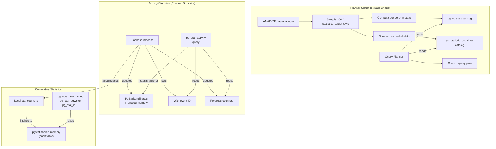

# Chapter 13: Statistics & Monitoring

PostgreSQL relies on two fundamentally different kinds of statistics. **Planner statistics** describe the shape of data inside tables -- how many distinct values a column has, which values appear most often, how values are distributed -- and the query optimizer uses them to choose between sequential scans, index scans, hash joins, merge joins, and other plan alternatives. **Activity statistics** describe what the server is doing right now -- which queries are running, what each backend is waiting on, how far along a long-running VACUUM has progressed -- and they are the primary tool for operational monitoring and troubleshooting.

Both systems are read-heavy by design. Planner statistics are written only during ANALYZE (or autovacuum-triggered analysis) and read on every query planning cycle. Activity statistics are written continuously by every backend into shared memory and read by monitoring queries against `pg_stat_activity` and related views.

## Why Statistics Matter

Without accurate planner statistics, PostgreSQL falls back on hardcoded constants (selectivity of 0.005 for equality on an unknown column, for example) and produces plans that can be orders of magnitude slower than necessary. A missing ANALYZE after bulk loading a table is one of the most common causes of sudden performance regressions in production.

Without activity monitoring, operators cannot answer the most basic questions: "What is this backend doing?" and "Why is it slow?" The wait event infrastructure, introduced incrementally from PostgreSQL 9.6 onward, finally gave PostgreSQL a lightweight, always-on mechanism to answer those questions without resorting to external profiling tools.

## Chapter Overview

| Section | What It Covers |
|---------|---------------|
| [pg_statistic and Single-Column Statistics](pg-statistic.html) | Histograms, MCVs, correlation, ndistinct, the slot system, ANALYZE sampling |
| [Extended Statistics](extended-stats.html) | Multi-column dependencies, ndistinct, MCV lists, CREATE STATISTICS |
| [Activity Monitoring](activity-monitoring.html) | pg_stat_activity, wait events, progress reporting, cumulative stats |

## Key Source Files at a Glance

| File | Purpose |
|------|---------|
| `src/include/catalog/pg_statistic.h` | Single-column statistics catalog definition, slot kinds |
| `src/include/catalog/pg_statistic_ext.h` | Extended statistics object definitions |
| `src/include/catalog/pg_statistic_ext_data.h` | Extended statistics data storage |
| `src/include/statistics/statistics.h` | MVNDistinct, MVDependency, MCVList structs |
| `src/include/statistics/extended_stats_internal.h` | Internal build/serialize/deserialize functions |
| `src/backend/commands/analyze.c` | ANALYZE command, sampling, per-column stats computation |
| `src/backend/statistics/extended_stats.c` | Extended statistics build orchestration |
| `src/backend/statistics/dependencies.c` | Functional dependency mining and estimation |
| `src/backend/statistics/mcv.c` | Multi-column MCV list build and selectivity |
| `src/backend/statistics/mvdistinct.c` | Multi-column ndistinct computation |
| `src/backend/utils/activity/backend_status.c` | PgBackendStatus shared memory management |
| `src/backend/utils/activity/wait_event.c` | Wait event reporting |
| `src/backend/utils/activity/backend_progress.c` | Progress reporting for long-running commands |
| `src/backend/utils/activity/pgstat.c` | Cumulative statistics collector infrastructure |
| `src/include/utils/backend_status.h` | PgBackendStatus, BackendState enum |
| `src/include/utils/backend_progress.h` | ProgressCommandType, progress parameter API |

## How the Pieces Fit Together

## The Two Statistics Architectures

PostgreSQL has two separate architectures for statistics, and confusing them is a common source of misunderstanding.

**Planner statistics** (pg_statistic, pg_statistic_ext_data) are stored as regular catalog rows, updated only by ANALYZE, and cached in the relcache/syscache. They describe data distributions and are consumed exclusively by the planner's selectivity estimation functions.

**Activity/cumulative statistics** (pgstat infrastructure) live in shared memory as of PostgreSQL 15. Before that, they were maintained by a separate stats collector process that communicated via temporary files. The shared-memory approach eliminates the stats collector process and provides instant visibility into counters. These statistics track operational metrics: row counts, block hits, sequential scans, function call counts, and so on.

## The default_statistics_target GUC

The `default_statistics_target` parameter (default: 100) controls how many entries appear in MCV lists and histogram bins for single-column stats. It also determines the ANALYZE sample size: `300 * statistics_target` rows. Per-column overrides are possible via `ALTER TABLE ... ALTER COLUMN ... SET STATISTICS`. Extended statistics objects can have their own target set via `ALTER STATISTICS ... SET STATISTICS`.

Higher targets produce more accurate statistics at the cost of longer ANALYZE times, more catalog storage, and slightly slower planning (more MCV entries to scan).

## Connections to Other Chapters

- **Chapter 5 (WAL)**: Catalog updates from ANALYZE are WAL-logged like any other catalog modification.
- **Chapter 7 (Query Planner)**: The planner is the primary consumer of pg_statistic data; selectivity estimation drives join order, access method, and join strategy choices.
- **Chapter 8 (VACUUM)**: Autovacuum triggers ANALYZE when the number of modified tuples exceeds a threshold. VACUUM and ANALYZE share the same sampling infrastructure.
- **Chapter 2 (Shared Memory)**: Activity statistics and backend status live in shared memory structures allocated at startup.
- **Chapter 3 (Transactions)**: Planner statistics are catalog rows subject to MVCC; a long-running transaction sees the statistics that were current when its snapshot was taken.
