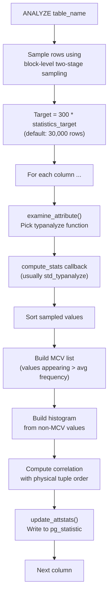
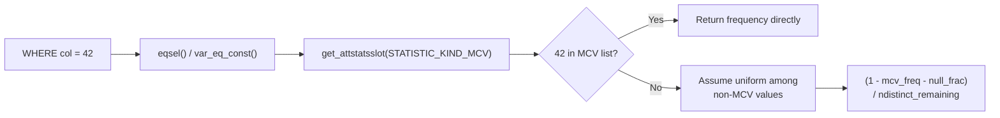

# pg_statistic and Single-Column Statistics

## Summary

Every column in every analyzed table gets a row in `pg_statistic` containing up to five "slots" of statistical data. The most important slots hold the **Most Common Values (MCV)** list, an equi-depth **histogram** of the remaining values, a **correlation** coefficient between logical and physical tuple order, and for array/tsvector types, **most common elements**. These statistics drive virtually every selectivity estimate in the query planner. Understanding the slot system, how ANALYZE populates it, and how the planner reads it is essential for diagnosing bad query plans.

---

## Overview

PostgreSQL does not hardcode the meaning of statistical data into the `pg_statistic` catalog. Instead, it provides a generic **slot system**: each row has five slots, and each slot has a `stakind` integer that identifies what kind of data it holds, an associated operator OID, a collation OID, a `float4[]` array for numeric statistical values, and an `anyarray` for data values. This design allows custom data types to define their own statistics kinds through custom `typanalyze` functions.

The standard statistics kinds defined by core PostgreSQL are:

| Kind | Constant | Slot Contents |
|------|----------|---------------|
| 1 | `STATISTIC_KIND_MCV` | Most common values and their frequencies |
| 2 | `STATISTIC_KIND_HISTOGRAM` | Equi-depth histogram boundary values |
| 3 | `STATISTIC_KIND_CORRELATION` | Physical-vs-logical order correlation coefficient |
| 4 | `STATISTIC_KIND_MCELEM` | Most common elements (for arrays, tsvector) |
| 5 | `STATISTIC_KIND_DECHIST` | Distinct element count histogram |
| 6 | `STATISTIC_KIND_RANGE_LENGTH_HISTOGRAM` | Range type length distribution |
| 7 | `STATISTIC_KIND_BOUNDS_HISTOGRAM` | Range type bounds histogram |

---

## Key Source Files

| File | Purpose |
|------|---------|
| `src/include/catalog/pg_statistic.h` | Catalog definition, slot kind constants, field documentation |
| `src/backend/commands/analyze.c` | ANALYZE command, sampling, `std_typanalyze`, `compute_scalar_stats` |
| `src/backend/utils/cache/lsyscache.c` | `get_attstatsslot()` -- planner's API to read statistics |
| `src/backend/utils/adt/selfuncs.c` | Selectivity estimation functions that consume statistics |
| `src/include/commands/vacuum.h` | `VacAttrStats` struct used during ANALYZE |

---

## How It Works

### The ANALYZE Pipeline

ANALYZE follows a well-defined sequence to populate statistics for each column of a table.



**Sampling strategy**: ANALYZE uses a two-phase block sampling algorithm (Vitter's reservoir sampling variant). It first selects a random set of pages, then takes all visible tuples from those pages. The target sample size is `300 * statistics_target`.

**typanalyze dispatch**: For most scalar types, the default `std_typanalyze` function is used. It sets up callbacks for `compute_scalar_stats()`, which handles MCV, histogram, and correlation computation. Custom types (arrays, tsvectors, ranges) register their own typanalyze functions that compute type-specific statistics.

### Most Common Values (MCV)

The MCV list captures values that appear significantly more often than average. During `compute_scalar_stats()`:

1. Sort all non-null sampled values.
2. Count runs of identical values.
3. Include a value in the MCV list if its frequency exceeds `1.0 / statistics_target` AND the value appears more than once.
4. Store up to `statistics_target` values, ordered by decreasing frequency.

The MCV slot stores:
- `stavalues`: The actual values (as `anyarray`)
- `stanumbers`: Their frequencies as fractions of total rows
- `staop`: The `=` operator OID for the data type

### Histogram

The histogram describes the distribution of values that are NOT in the MCV list (a "compressed histogram"). This is crucial: when both MCV and histogram exist, the histogram covers only the non-MCV portion of the data.

1. Remove all values that appear in the MCV list.
2. Sort the remaining values.
3. Pick `statistics_target + 1` boundary values at equal intervals (equi-depth bins).
4. The first boundary is the minimum, the last is the maximum.

The histogram slot stores:
- `stavalues`: The boundary values (M values defining M-1 bins)
- `stanumbers`: NULL (not used for standard histograms)
- `staop`: The `<` operator OID for the data type

### Correlation

Correlation measures how closely the physical (on-disk) order of tuples matches the logical sort order of a column's values. It ranges from -1.0 to +1.0.

- **+1.0**: Perfectly sorted in ascending order (common after CLUSTER or after loading sorted data)
- **-1.0**: Perfectly sorted in descending order
- **~0.0**: No correlation (random order)

The planner uses correlation to decide between index scan and bitmap index scan. A high correlation means an index scan will read pages roughly sequentially (good for I/O). A low correlation means random page access, making bitmap scans (which sort TIDs by block number before fetching) more attractive.

```
Correlation = Pearson coefficient between:
  - sequence number of each value in sort order
  - physical tuple position (block number * tuples_per_block + offset)
```

### The stadistinct Field

Outside the slots, `pg_statistic` has a `stadistinct` field with special encoding:

| Value | Meaning |
|-------|---------|
| `0` | Unknown or not computed |
| `> 0` | Actual number of distinct values (e.g., 5 for a boolean-like column) |
| `< 0` | Negative multiplier of the table's row count (e.g., -1.0 means unique, -0.5 means ~50% distinct) |

The negative encoding handles the common case where the number of distinct values is proportional to table size. Since `pg_class.reltuples` may be updated more frequently than `pg_statistic`, expressing ndistinct as a fraction avoids stale absolute counts.

---

## Key Data Structures

### FormData_pg_statistic

The catalog tuple structure, defined in `pg_statistic.h`:

```c
CATALOG(pg_statistic,2619,StatisticRelationId)
{
    Oid     starelid;       /* relation OID */
    int16   staattnum;      /* column number */
    bool    stainherit;     /* includes inheritance children? */

    float4  stanullfrac;    /* fraction of NULLs */
    int32   stawidth;       /* average width in bytes (post-TOAST) */
    float4  stadistinct;    /* distinct value count (see encoding above) */

    /* Five slots, each with kind/op/coll/numbers/values */
    int16   stakind1 ... stakind5;
    Oid     staop1   ... staop5;
    Oid     stacoll1 ... stacoll5;

    /* Variable-length portion */
    float4  stanumbers1[1] ... stanumbers5[1];
    anyarray stavalues1    ... stavalues5;
};
```

The unique key is `(starelid, staattnum, stainherit)`. There is one row per column per inheritance mode (own stats vs. including children).

### VacAttrStats

The in-memory working structure during ANALYZE:

```c
typedef struct VacAttrStats {
    /* Column identity */
    int         attr_cnt;
    Form_pg_attribute *attrs;

    /* Sampling info */
    int         rows_in_sample;
    double      total_rows;

    /* Computed statistics (copied into pg_statistic) */
    float4      stanullfrac;
    int32       stawidth;
    float4      stadistinct;

    /* Slot data */
    int16       stakind[STATISTIC_NUM_SLOTS];
    Oid         staop[STATISTIC_NUM_SLOTS];
    int         numnumbers[STATISTIC_NUM_SLOTS];
    float4     *stanumbers[STATISTIC_NUM_SLOTS];
    int         numvalues[STATISTIC_NUM_SLOTS];
    Datum      *stavalues[STATISTIC_NUM_SLOTS];

    /* Callbacks set by typanalyze */
    AnalyzeAttrComputeStatsFunc compute_stats;
    /* ... */
} VacAttrStats;
```

---

## How the Planner Reads Statistics

The planner accesses statistics through `get_attstatsslot()` in `lsyscache.c`. This function:

1. Fetches the `pg_statistic` tuple from the syscache.
2. Searches the five `stakind` fields for the requested kind.
3. Extracts the `stanumbers` and `stavalues` arrays from the matching slot.
4. Returns them in a `AttStatsSlot` struct for the caller.

Selectivity functions in `selfuncs.c` then use these arrays. For example, `var_eq_const()` estimates the selectivity of `column = constant` by:

1. Searching the MCV list for the constant. If found, return its frequency directly.
2. If not found, compute `(1 - sum_of_mcv_frequencies - null_fraction) / num_distinct_non_mcv`. This assumes uniform distribution among non-MCV values.



For range queries (`col < 42`), the planner uses `scalarineqsel()`, which:

1. Sums MCV frequencies for values satisfying the condition.
2. Uses the histogram to interpolate what fraction of non-MCV values satisfy it.
3. Combines the two fractions.

---

## Practical Implications

### When Statistics Go Stale

After bulk operations (COPY, mass UPDATE, mass DELETE), the statistics in `pg_statistic` no longer reflect the actual data distribution. Common symptoms:

- Sequential scans on large tables where index scans would be faster
- Nested loop joins where hash joins would be appropriate
- Grossly wrong row count estimates visible in `EXPLAIN ANALYZE`

Autovacuum triggers ANALYZE when `pg_stat_user_tables.n_mod_since_analyze` exceeds `autovacuum_analyze_threshold + autovacuum_analyze_scale_factor * reltuples`. The defaults (50 + 10% of rows) mean small tables are re-analyzed quickly, but large tables may take many modifications before re-analysis.

### Adjusting statistics_target

For columns used in WHERE clauses with highly skewed distributions, raising the per-column statistics target captures more of the tail in the MCV list:

```sql
ALTER TABLE orders ALTER COLUMN status SET STATISTICS 1000;
ANALYZE orders;
```

This produces up to 1000 MCV entries and 1001 histogram bins for that column, at the cost of a larger sample (300,000 rows) and more catalog storage.

### Inspecting Statistics

The `pg_stats` view provides a human-readable interface to `pg_statistic`:

```sql
SELECT attname, null_frac, n_distinct,
       most_common_vals, most_common_freqs,
       histogram_bounds, correlation
FROM pg_stats
WHERE tablename = 'orders' AND attname = 'status';
```

---

## Connections to Other Chapters

- **Chapter 7 (Query Planner)**: Every selectivity function in `selfuncs.c` depends on the data described here. Bad statistics produce bad plans.
- **Chapter 8 (VACUUM)**: Autovacuum is responsible for triggering ANALYZE. The `n_mod_since_analyze` counter in cumulative stats drives the decision.
- **Chapter 13 (Extended Statistics)**: When single-column statistics are insufficient due to column correlations, extended statistics (next section) fill the gap.
- **Chapter 2 (Storage)**: The `stawidth` field reflects post-TOAST storage width, not the logical value size. The `correlation` field directly relates to the physical layout of heap pages.
