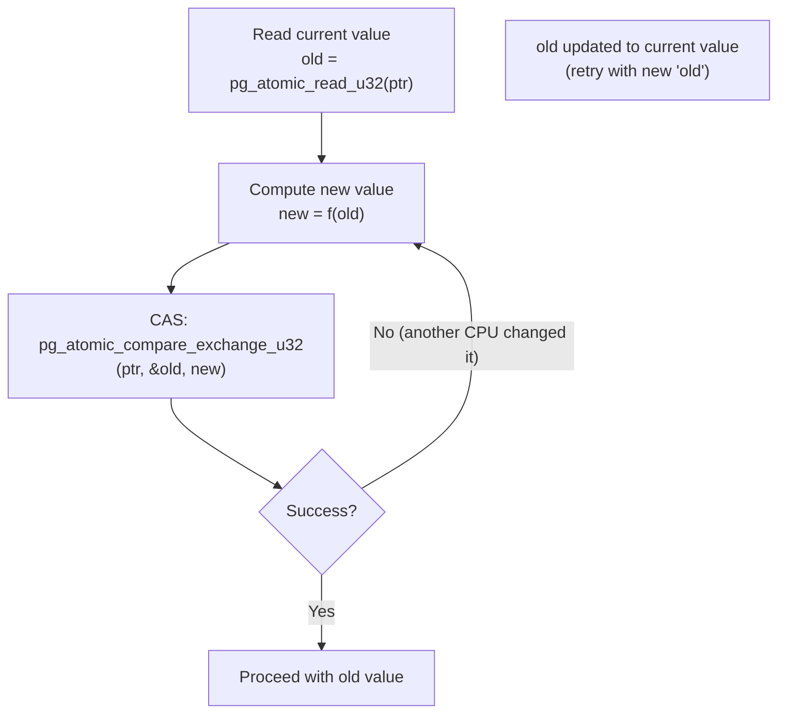

# Atomic Operations and Memory Barriers

## Summary

PostgreSQL implements lock-free algorithms throughout its shared-memory
infrastructure: buffer pin counts, lightweight lock state words, WAL insert
positions, and procarray transaction ID snapshots all rely on atomic
operations. The `src/include/port/atomics/` subsystem provides a portable
abstraction that maps these operations onto architecture-specific instructions
(x86 `LOCK CMPXCHG`, ARM `LDXR/STXR`) or compiler intrinsics
(`__atomic_compare_exchange_n`), with a spinlock-based fallback for platforms
that provide neither.

## Overview

The atomics API solves three related problems:

1. **Indivisible read-modify-write.** Operations like "increment a counter" or
   "swap a value if it matches an expected value" must execute as a single unit
   visible to all CPUs.

2. **Memory ordering.** Modern CPUs reorder loads and stores for performance.
   The atomics layer provides barrier primitives that constrain this reordering
   to the minimum extent each algorithm requires.

3. **Portability.** The same `pg_atomic_fetch_add_u32()` call compiles to a
   single `LOCK XADD` on x86-64, a `LDXR/STXR` loop on ARM64, or a
   `__sync_fetch_and_add` via GCC builtins on less common architectures.



## Key Source Files

| File | Role |
|------|------|
| `src/include/port/atomics.h` | Public API: includes arch headers, defines generic wrappers |
| `src/include/port/atomics/arch-x86.h` | x86/x86-64 inline assembly implementations |
| `src/include/port/atomics/arch-arm.h` | ARM/AArch64 configuration (mostly defers to GCC) |
| `src/include/port/atomics/arch-ppc.h` | PowerPC barrier and atomics definitions |
| `src/include/port/atomics/generic-gcc.h` | GCC `__sync_*` and `__atomic_*` builtin implementations |
| `src/include/port/atomics/generic-msvc.h` | MSVC `_InterlockedCompareExchange` implementations |
| `src/include/port/atomics/fallback.h` | Spinlock-based fallback for unsupported platforms |
| `src/backend/storage/lmgr/README.barrier` | Detailed explanation of barrier usage in PostgreSQL |

## How It Works

### The Include Chain

When backend code includes `atomics.h`, a carefully ordered chain of
`#include` directives assembles the final implementation:

```
atomics.h
  |
  +---> arch-{x86,arm,ppc}.h       Architecture-specific types and barriers
  |         (selected by #if defined(__x86_64__) etc.)
  |
  +---> generic-{gcc,msvc}.h       Compiler intrinsic implementations
  |         (fills in anything arch headers did not define)
  |
  +---> fallback.h                 Spinlock fallback for remaining gaps
```

Each layer checks whether prior layers have already defined a given operation
using `#ifndef PG_HAVE_ATOMIC_*` guards. This means the most efficient
implementation always wins: hand-written assembly beats compiler intrinsics,
which beat the spinlock fallback.

### Memory Barrier Taxonomy

PostgreSQL defines four barrier levels, each mapping differently per CPU:

| Barrier | x86-64 | ARM64 | Purpose |
|---------|--------|-------|---------|
| `pg_compiler_barrier()` | `asm volatile("" ::: "memory")` | same | Prevent compiler reordering only |
| `pg_read_barrier()` | compiler barrier (TSO suffices) | `__atomic_thread_fence(ACQUIRE)` | Order load-before-load |
| `pg_write_barrier()` | compiler barrier (TSO suffices) | `__atomic_thread_fence(RELEASE)` | Order store-before-store |
| `pg_memory_barrier()` | `lock; addl $0,0(%rsp)` | `__atomic_thread_fence(SEQ_CST)` | Full fence: order everything |

The key insight for x86-64 is that its **Total Store Order** (TSO) memory model
already guarantees that loads are not reordered with other loads, and stores are
not reordered with other stores. The only reordering x86 permits is a store
followed by a load to a *different* address. Therefore `pg_read_barrier()` and
`pg_write_barrier()` collapse to mere compiler barriers on x86, saving the cost
of an actual fence instruction.

On ARM64, the weakly-ordered memory model means nearly any pair of operations
can be reordered. PostgreSQL must emit real hardware barriers (via the
`__atomic_thread_fence` intrinsic, which maps to `DMB` instructions).

### The Core Atomic Types

```c
/* From arch-x86.h */
typedef struct pg_atomic_flag
{
    volatile char value;
} pg_atomic_flag;

typedef struct pg_atomic_uint32
{
    volatile uint32 value;
} pg_atomic_uint32;

typedef struct pg_atomic_uint64
{
    /* Alignment guaranteed on 64-bit platforms */
    volatile uint64 value;
} pg_atomic_uint64;
```

The `volatile` qualifier prevents the compiler from caching the value in a
register, but does **not** provide inter-CPU ordering -- that is the job of the
barrier and atomic-operation implementations.

### Compare-and-Swap: The Fundamental Primitive

Nearly every lock-free algorithm in PostgreSQL is built on
compare-and-swap (CAS). The x86 implementation uses inline assembly:

```c
/* From arch-x86.h -- simplified for clarity */
static inline bool
pg_atomic_compare_exchange_u32_impl(volatile pg_atomic_uint32 *ptr,
                                    uint32 *expected, uint32 newval)
{
    char ret;
    __asm__ __volatile__(
        " lock          \n"
        " cmpxchgl %4,%5 \n"
        " setz     %2    \n"
    : "=a" (*expected), "=m"(ptr->value), "=q" (ret)
    : "a" (*expected), "r" (newval), "m"(ptr->value)
    : "memory", "cc");
    return (bool) ret;
}
```

The `LOCK CMPXCHG` instruction atomically: (a) compares `*ptr` to `*expected`,
(b) if equal, stores `newval` into `*ptr`, (c) if not equal, loads the current
value into `*expected`. The `LOCK` prefix asserts the bus lock (or cache-line
lock on modern CPUs), making this a full memory barrier on x86.

### Fetch-and-Add: The Fast Path for Counters

For simple counters (buffer pin counts, WAL insert position), fetch-and-add
avoids the retry loop inherent in CAS:

```c
/* From arch-x86.h */
static inline uint32
pg_atomic_fetch_add_u32_impl(volatile pg_atomic_uint32 *ptr, int32 add_)
{
    uint32 res;
    __asm__ __volatile__(
        " lock          \n"
        " xaddl %0,%1   \n"
    : "=q"(res), "=m"(ptr->value)
    : "0" (add_), "m"(ptr->value)
    : "memory", "cc");
    return res;
}
```

`LOCK XADD` atomically adds `add_` to `*ptr` and returns the *previous* value.
This is a single instruction with no possibility of spurious failure, making it
the preferred primitive for high-contention counters.

### The Spin-Delay Hint

When a spin lock or atomic retry loop must spin, PostgreSQL calls
`pg_spin_delay()`, which maps to the x86 `PAUSE` instruction:

```c
static __inline__ void
pg_spin_delay_impl(void)
{
    __asm__ __volatile__(" rep; nop \n");
}
```

`PAUSE` (encoded as `REP NOP` for backward compatibility with pre-Pentium-4
CPUs) provides two benefits:

1. **Pipeline hint.** It tells the CPU that this is a spin-wait loop, avoiding
   the memory-order-violation pipeline flush that would otherwise occur when the
   spin variable changes.
2. **Power reduction.** It introduces a small delay, reducing power consumption
   and bus traffic during the spin.

### 64-Bit Atomics and the 32-Bit Problem

On 32-bit x86 and 32-bit ARM, 64-bit atomic operations are not natively
available as single instructions. PostgreSQL handles this with:

```c
/* From arch-arm.h */
#if !defined(__aarch64__)
#define PG_DISABLE_64_BIT_ATOMICS
#endif
```

When `PG_DISABLE_64_BIT_ATOMICS` is defined, `fallback.h` implements 64-bit
atomics using a spinlock. This is correct but slow, which is why PostgreSQL
documents that 64-bit platforms are strongly preferred for production use.

### Single-Copy Atomicity

Some algorithms need to know that a plain (non-locked) 64-bit read or write is
atomic. The `PG_HAVE_8BYTE_SINGLE_COPY_ATOMICITY` define indicates this:

```c
/* Defined for x86-64 and AArch64 */
#define PG_HAVE_8BYTE_SINGLE_COPY_ATOMICITY
```

When this is defined, code can use `pg_atomic_read_u64()` /
`pg_atomic_write_u64()` without additional locking, knowing the hardware
guarantees a torn read cannot occur.

## Key Data Structures

```
pg_atomic_uint32                pg_atomic_uint64
+------------------+            +------------------+
| volatile uint32  |            | volatile uint64  |
| value            |            | value            |
+------------------+            +------------------+
        |                               |
        v                               v
  Accessed via:                   Accessed via:
  - pg_atomic_read_u32()          - pg_atomic_read_u64()
  - pg_atomic_write_u32()         - pg_atomic_write_u64()
  - pg_atomic_fetch_add_u32()     - pg_atomic_fetch_add_u64()
  - pg_atomic_compare_exchange    - pg_atomic_compare_exchange
      _u32()                          _u64()

pg_atomic_flag
+------------------+
| volatile char    |    Used for: test-and-set spinlocks
| value            |    API: pg_atomic_test_set_flag()
+------------------+          pg_atomic_clear_flag()
```

### Implementation Selection Flow

```
                    +-------------------+
                    | atomics.h included|
                    +--------+----------+
                             |
              +--------------+--------------+
              |              |              |
         __x86_64__    __aarch64__    __powerpc64__
              |              |              |
         arch-x86.h    arch-arm.h    arch-ppc.h
              |              |              |
              +--------------+--------------+
                             |
                   +---------+----------+
                   |                    |
              HAVE_GCC_*          _MSC_VER
                   |                    |
            generic-gcc.h      generic-msvc.h
                   |                    |
                   +---------+----------+
                             |
                    Still missing ops?
                             |
                         fallback.h
                    (spinlock-based)
```

## Practical Impact

| Use site | Atomic operation | Why it matters |
|----------|-----------------|----------------|
| Buffer pin/unpin | `pg_atomic_fetch_add_u32` | Avoids heavyweight lock for every buffer access |
| LWLock acquire | `pg_atomic_compare_exchange_u32` | Enables fast-path exclusive lock without spinlock |
| WAL insert | `pg_atomic_fetch_add_u64` | Allows concurrent WAL writers to claim insert slots |
| ProcArray snapshot | `pg_atomic_read_u64` + barrier | Enables consistent MVCC snapshots without locks |
| Spin lock | `pg_atomic_test_set_flag` | Implements short-duration mutual exclusion |

## Connections

- **Chapter 6 (Lock Manager):** LWLocks use `pg_atomic_compare_exchange_u32` on the lock state word to implement the shared/exclusive protocol without falling back to OS semaphores on the fast path.
- **Chapter 4 (Buffer Manager):** `BufferDesc.state` is a `pg_atomic_uint32` that packs the reference count, usage count, and flag bits into a single atomically-updated word.
- **Chapter 5 (WAL):** The WAL insert lock uses `pg_atomic_fetch_add_u64` to allow multiple backends to concurrently reserve space in the WAL buffer.
- **Chapter 12 (Shared Memory):** All atomic variables used for inter-process synchronization must reside in shared memory segments, since each PostgreSQL backend is a separate OS process.
