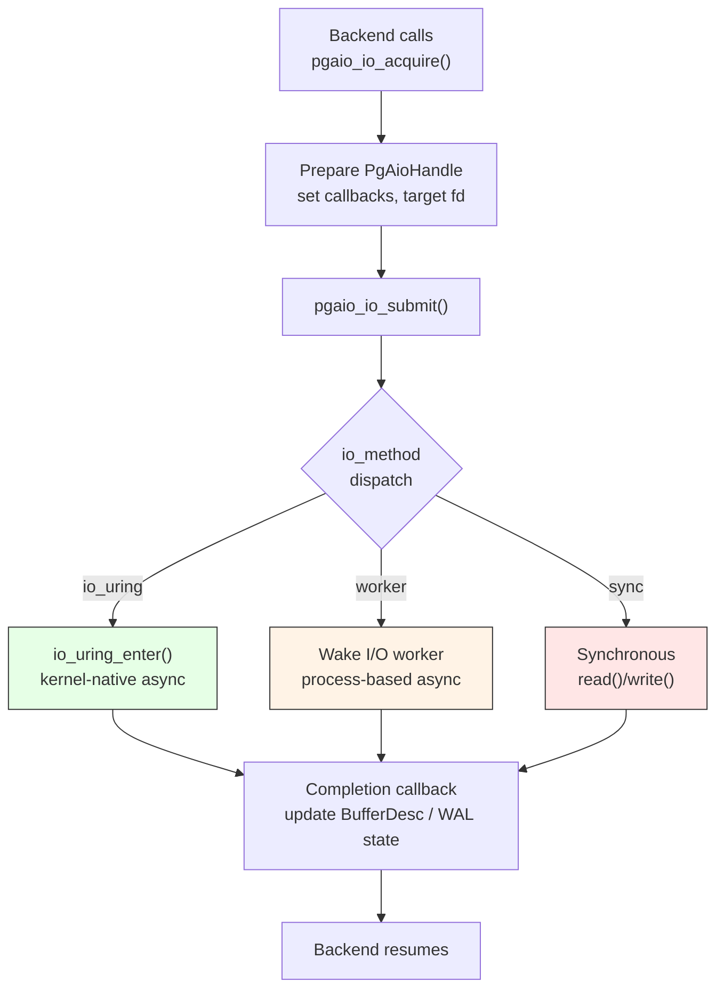

# I/O Backends: io_uring, Workers, and Synchronous Fallback

## Summary

PostgreSQL's AIO (Asynchronous I/O) subsystem decouples I/O initiation from I/O
completion, allowing backends to overlap computation with storage latency. The
subsystem provides three interchangeable **I/O methods** -- `io_uring` (Linux
kernel-native), `worker` (portable, process-based), and `sync` (debugging
fallback) -- behind a single `IoMethodOps` interface. This design lets a backend
call `pgaio_io_acquire()`, attach callbacks, and hand the handle down through
the storage stack without knowing which kernel mechanism will execute the I/O.

## Overview



Traditional PostgreSQL I/O is fully synchronous: a backend calls `read()` or
`write()`, blocks until the kernel returns, and only then continues processing.
The operating system's page cache hides much of the latency for buffered I/O,
but critical operations like `fdatasync()` and Direct I/O cannot be hidden.

The AIO subsystem addresses this by:

1. **Pipelining.** A backend can start I/O for several buffers, perform other
   work (CPU-bound query processing, additional I/O submissions), and wait only
   when results are actually needed.

2. **Batching.** Multiple I/Os can be submitted to the kernel in a single system
   call (one `io_uring_enter()` or one worker wakeup fan-out), reducing
   per-I/O syscall overhead.

3. **Completion callbacks.** Shared-memory state (buffer descriptors, WAL
   positions) is updated by registered callbacks that run in any backend,
   decoupling the I/O initiator from the completer.

## Key Source Files

| File | Role |
|------|------|
| `src/include/storage/aio.h` | Public AIO API: handle acquisition, flags, op types |
| `src/include/storage/aio_internal.h` | Internal: handle state machine, method ops vtable |
| `src/backend/storage/aio/aio.c` | Core handle lifecycle, submission, completion |
| `src/backend/storage/aio/aio_callback.c` | Callback registration and invocation |
| `src/backend/storage/aio/aio_io.c` | `pgaio_io_start_readv()`, `pgaio_io_start_writev()` |
| `src/backend/storage/aio/aio_target.c` | Target-specific (smgr, WAL) describe/reopen logic |
| `src/backend/storage/aio/method_io_uring.c` | Linux io_uring method implementation |
| `src/backend/storage/aio/method_worker.c` | Worker-process method implementation |
| `src/backend/storage/aio/method_sync.c` | Synchronous fallback method |
| `src/backend/storage/aio/read_stream.c` | High-level read-ahead helper |
| `src/backend/storage/aio/README.md` | Comprehensive design rationale |

## How It Works

### The IoMethodOps Interface

Each I/O method implements a vtable of function pointers:

```c
typedef struct IoMethodOps
{
    bool  wait_on_fd_before_close;

    /* Shared memory sizing and initialization */
    size_t (*shmem_size)(void);
    void   (*shmem_init)(bool first_time);
    void   (*init_backend)(void);

    /* Can this IO be executed asynchronously, or must it be sync? */
    bool   (*needs_synchronous_execution)(PgAioHandle *ioh);

    /* Submit staged IOs to the kernel */
    int    (*submit)(uint16 num_staged, PgAioHandle **staged);

    /* Wait for a specific IO to complete */
    void   (*wait_one)(PgAioHandle *ioh, uint64 ref_generation);
} IoMethodOps;
```

The active method is selected by the `io_method` GUC (`sync`, `worker`, or
`io_uring`) and stored as a global `IoMethodOps` pointer.

### AIO Handle Lifecycle

```
  pgaio_io_acquire(resowner, &ioret)
       |
       v
  +--[IDLE]--+
  |  Handle  |   <--- from shared-memory pool (fixed count)
  +----------+
       |
       | pgaio_io_register_callbacks(ioh, CB_ID, flags)
       | pgaio_io_set_handle_data_32(ioh, data, n)
       | pgaio_io_set_flag(ioh, PGAIO_HF_*)
       v
  +--[DEFINED]-+
  |  Callbacks |   <--- has target, callbacks, op data
  |  registered|
  +------------+
       |
       | pgaio_io_start_readv() / pgaio_io_start_writev()
       |   (called in lower-level code, e.g. md.c, fd.c)
       v
  +--[STAGED]--+
  |  Ready for |   <--- in method's submission queue
  |  submission|
  +------------+
       |
       | pgaio_submit_staged() or batch-mode exit
       v
  +--[SUBMITTED]+
  |  In-flight  |  <--- kernel / worker is executing the IO
  +-------------+
       |
       | Kernel/worker completes; callbacks invoked
       v
  +--[COMPLETED]+
  |  ioret      |  <--- PgAioReturn filled with result
  |  filled     |
  +-------------+
       |
       | Handle returned to free pool for reuse
       v
  +--[IDLE]----+
```

### Method 1: io_uring (Linux 5.1+)

`io_uring` is a kernel interface that uses two shared-memory ring buffers
between userspace and the kernel: a **submission queue (SQ)** for outgoing I/O
requests and a **completion queue (CQ)** for results.

PostgreSQL creates one io_uring instance per backend in shared memory (during
postmaster startup), so that any backend can drain completions from another
backend's ring. This is critical for avoiding deadlocks when a backend blocks
while its I/O completions are pending.

```
  Backend A                    Kernel                    Backend B
  =========                    ======                    =========
  pgaio_io_start_readv()
       |
       v
  io_uring SQE pushed
  to ring A's SQ
       |
       v
  io_uring_enter()  -------->  Kernel processes SQE
                               DMA read from disk
                               CQE placed in ring A's CQ
                                              |
                                              |  (Backend A is busy)
                                              v
                               Backend B calls pgaio_uring_wait_one()
                               Drains CQE from ring A's CQ
                               Invokes completion callbacks
                               Updates BufferDesc atomically
```

Key implementation details:

- **One ring per backend.** Each backend submits only to its own ring, avoiding
  submission-side locking.
- **Cross-backend completion.** Any backend can reap CQEs from any ring,
  enabling forward progress even when the issuer is blocked.
- **`IOSQE_ASYNC` caveat.** When io_uring is told to force async execution, FDs
  must not be closed while I/O is in flight. The `wait_on_fd_before_close` flag
  in the ops vtable handles this.
- **Incompatible with `EXEC_BACKEND`.** On platforms that emulate `fork()` (like
  Windows), the shared ring mappings cannot be inherited, so io_uring is
  disabled.

### Method 2: Worker (All Platforms)

The worker method is the default and works everywhere PostgreSQL runs. It
offloads I/O to a pool of dedicated **I/O worker** processes that perform
traditional synchronous `preadv()` / `pwritev()` calls.

```
  Backend                    Shared Memory              IO Worker
  =======                   =============              =========
  pgaio_io_start_readv()
       |
       v
  Push handle index to
  PgAioWorkerSubmissionQueue
  (lock-free ring buffer)
       |
       v
  Wake one idle worker
  via latch
                             +-------------------+
                             | Submission Queue   |
                             | head, tail, sqes[] |-----> Worker dequeues
                             +-------------------+        handle index
                                                              |
                                                              v
                                                         preadv(fd, iovs, ...)
                                                              |
                                                              v
                                                         Run completion
                                                         callbacks in worker
                                                         process context
```

Key design choices:

- **Fan-out wakeups.** When a batch of I/Os is submitted, one worker is woken.
  That worker, upon finding more items in the queue, wakes up to
  `IO_WORKER_WAKEUP_FANOUT` (2) additional workers. This avoids the thundering
  herd of waking all workers at once while still achieving parallel I/O.

- **Synchronous fallback for local-memory I/O.** If an I/O references
  backend-local memory (`PGAIO_HF_REFERENCES_LOCAL`), a worker process cannot
  access it. Such I/Os are executed synchronously by the issuing backend, using
  the sync method's code path.

- **File reopening.** Workers may not have the same file descriptors as the
  issuing backend. The AIO target's `reopen` callback (e.g., for smgr targets)
  provides the path information needed for workers to open the file themselves.

### Method 3: Sync (Debugging)

The synchronous method executes all I/O inline within the issuing backend. Its
`needs_synchronous_execution` always returns `true`, and its `submit` function
simply errors out (it should never be called, since all I/Os are executed
before reaching submission).

This method exists for:
- **Regression testing.** Comparing AIO-enabled code paths against synchronous
  execution to isolate AIO-specific bugs.
- **Fallback.** The worker method uses the sync code path internally when it
  encounters I/Os that cannot be offloaded.

### Completion Callbacks

Multiple subsystems register callbacks on a single I/O handle. Callbacks are
identified by integer IDs (not function pointers) because AIO state resides in
shared memory, and `EXEC_BACKEND` builds cannot guarantee consistent function
addresses across processes due to ASLR.

```
  IO Handle
  +---------------------------+
  | callback_ids[0] = SMGR    |  --> Checks for short read, validates offset
  | callback_ids[1] = BUFMGR  |  --> Verifies checksum, updates BufferDesc
  | callback_ids[2] = ...     |
  +---------------------------+
  | handle_data_32[]          |  --> Buffer IDs, for callbacks to look up
  +---------------------------+
```

Callbacks are invoked in registration order and serve two phases:
- **Stage phase:** Called when I/O is about to be submitted (e.g., to increment
  buffer reference counts so the buffer is not evicted while I/O is in flight).
- **Completion phase:** Called when I/O finishes (e.g., to update the buffer
  descriptor's state flags and verify page checksums).

### The Read Stream Helper

Most code should not use the low-level AIO API directly. The **Read Stream**
(`read_stream.c`) provides a higher-level abstraction for sequential and
semi-sequential read patterns:

```
  User provides:  callback that returns next BlockNumber
                  |
                  v
  Read Stream:    Maintains a window of in-flight AIO reads
                  Automatically submits new reads as prior ones complete
                  Returns completed buffers to caller in order
                  |
                  v
  Result:         Transparent prefetching with configurable depth
```

This is used by sequential scans, bitmap heap scans, and VACUUM to achieve
read-ahead without manual AIO handle management.

## Key Data Structures

### PgAioHandle (Shared Memory)

```
PgAioHandle
+-------------------------------------+
| PgAioOp         op                  |  READV or WRITEV
| PgAioHandleFlags flags              |  LOCAL, SYNCHRONOUS, BUFFERED
| PgAioTargetID   target              |  SMGR, WAL, etc.
| uint64           generation         |  Monotonic, for wait-ref validity
|                                     |
| PgAioHandleCallbackID  cb_ids[N]    |  Registered completion callbacks
| uint32           handle_data_32[M]  |  Opaque data for callbacks
|                                     |
| target-specific union               |  RelFileLocator, fork, blkno (smgr)
|                                     |  or TimeLineID, lsn (WAL)
|                                     |
| PgAioOpData      op_data            |  fd, iovcnt, offset, iov[]
+-------------------------------------+
```

### PgAioWorkerSubmissionQueue

```
PgAioWorkerSubmissionQueue
+---------------------------+
| uint32  size              |  Power-of-2 ring buffer size
| uint32  head              |  Next slot to dequeue (workers)
| uint32  tail              |  Next slot to enqueue (backends)
| int     sqes[size]        |  AIO handle indices
+---------------------------+

PgAioWorkerControl
+---------------------------+
| uint64  idle_worker_mask  |  Bitmask: 1 = worker is idle
| PgAioWorkerSlot workers[] |
|   +-- Latch *latch        |  For wakeup
|   +-- bool   in_use       |
+---------------------------+
```

### IoMethod Dispatch

```
  GUC io_method = ?
       |
       +--- "sync"    ---> pgaio_sync_ops     (method_sync.c)
       +--- "worker"  ---> pgaio_worker_ops   (method_worker.c)
       +--- "io_uring" --> pgaio_uring_ops    (method_io_uring.c)
                              [Linux only, requires USE_LIBURING,
                               incompatible with EXEC_BACKEND]
```

## Connections

- **Chapter 4 (Buffer Manager):** The buffer manager acquires AIO handles for read I/O, registers the `PGAIO_HCB_SHARED_BUFFER_READV` callback, and passes handles down through smgr to md.c. The read stream helper is the primary interface for prefetching into shared buffers.
- **Chapter 5 (WAL):** AIO enables overlapping WAL writes with transaction processing. Combined with `O_DIRECT + O_DSYNC`, a single Force Unit Access (FUA) write replaces the traditional write-then-fdatasync two-step, reducing WAL flush latency.
- **Chapter 3 (Storage Manager, md.c):** `md.c` translates block numbers into file offsets within segments and calls `pgaio_io_start_readv()` / `pgaio_io_start_writev()` to define the I/O operation on the handle.
- **Chapter 14 (this chapter), Portability:** The VFD layer (`fd.c`) manages file descriptors that AIO handles reference. The worker method's file-reopening mechanism must work through the VFD indirection.
- **Chapter 12 (Shared Memory):** All AIO handles, the worker submission queue, and io_uring ring buffers reside in shared memory so that any backend can process completions.
