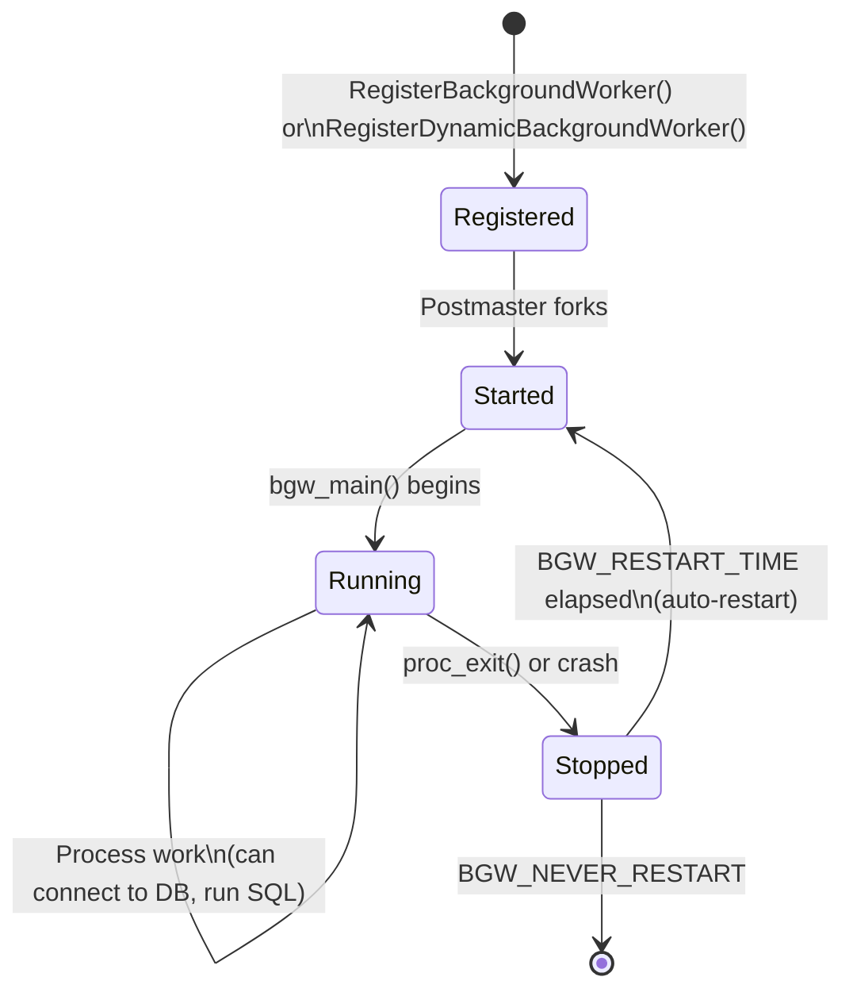

# Background Workers: Extension-Managed Server Processes

> *A background worker is a PostgreSQL process forked by the postmaster that runs arbitrary extension-supplied code. Unlike a regular backend, it does not serve a client connection -- but it can connect to databases, run transactions, and coordinate with other processes through shared memory.*

## Overview

The background worker API lets extensions run long-lived or short-lived processes within the PostgreSQL server. Workers are forked from the postmaster just like regular backends, inherit the shared memory mapping, and can optionally establish database connections to run SQL. The API provides a complete lifecycle: registration, startup notification, status monitoring, and termination.

Background workers power some of PostgreSQL's own subsystems (logical replication launcher, autovacuum launcher) and are essential for extensions like TimescaleDB (background schedulers), pg_cron (periodic job execution), and Citus (distributed query execution workers).

There are two registration paths. **Static registration** happens during `_PG_init` when `shared_preload_libraries` are loaded, before any backends start. **Dynamic registration** happens at runtime from a regular backend using `RegisterDynamicBackgroundWorker`. Static workers survive postmaster restarts; dynamic workers are tied to the session that created them (though the worker process itself runs independently).

## Key Source Files

| File | Purpose |
|------|---------|
| `src/include/postmaster/bgworker.h` | `BackgroundWorker` struct, registration APIs, status queries |
| `src/backend/postmaster/bgworker.c` | Worker slot management, fork/signal handling |
| `src/backend/postmaster/postmaster.c` | Postmaster loop that starts/restarts workers |
| `src/backend/utils/init/miscinit.c` | `BackgroundWorkerInitializeConnection` |



## How It Works

### Registration

A background worker is described by the `BackgroundWorker` struct:

```c
typedef struct BackgroundWorker
{
    char        bgw_name[BGW_MAXLEN];           /* human-readable name */
    char        bgw_type[BGW_MAXLEN];           /* worker type for ps display */
    int         bgw_flags;                       /* BGWORKER_SHMEM_ACCESS, etc. */
    BgWorkerStartTime bgw_start_time;           /* when to start */
    int         bgw_restart_time;                /* seconds, or BGW_NEVER_RESTART */
    char        bgw_library_name[MAXPGPATH];    /* shared library name */
    char        bgw_function_name[BGW_MAXLEN];  /* entry point function */
    Datum       bgw_main_arg;                   /* argument to main function */
    char        bgw_extra[BGW_EXTRALEN];        /* extra data (128 bytes) */
    pid_t       bgw_notify_pid;                 /* send SIGUSR1 on state change */
} BackgroundWorker;
```

#### Flags

```
BGWORKER_SHMEM_ACCESS               (0x0001)  Required. Access shared memory.
BGWORKER_BACKEND_DATABASE_CONNECTION (0x0002)  Can establish a DB connection.
                                               Requires SHMEM_ACCESS.
BGWORKER_INTERRUPTIBLE               (0x0004)  Exit if database involved in
                                               CREATE/ALTER/DROP DATABASE.
BGWORKER_CLASS_PARALLEL              (0x0010)  Internal: parallel query workers.
```

#### Start Time

```c
typedef enum {
    BgWorkerStart_PostmasterStart,    /* start as soon as postmaster starts */
    BgWorkerStart_ConsistentState,    /* start when recovery reaches consistent state */
    BgWorkerStart_RecoveryFinished,   /* start after recovery completes */
} BgWorkerStartTime;
```

### Lifecycle

```
Extension _PG_init()
     |
     | RegisterBackgroundWorker(&worker)
     v
+------------------+
| Postmaster       |
| (worker slots)   |     Stores worker in shared memory slot
+------------------+
     |
     | fork() when bgw_start_time condition is met
     v
+------------------+
| Worker Process   |
|                  |     1. Shared memory is already mapped (inherited from postmaster)
|  bgw_main()     |     2. Calls BackgroundWorkerInitializeConnection() if needed
|                  |     3. Runs extension logic (transactions, queries, etc.)
|                  |     4. Exits with code 0 (no restart) or 1 (restart after interval)
+------------------+
     |
     | exit(0) or exit(1) or SIGTERM
     v
+------------------+
| Postmaster       |
|                  |     If exit code != 0 and bgw_restart_time != BGW_NEVER_RESTART:
|                  |       wait bgw_restart_time seconds, then fork() again
|                  |     If exit code == 0 or BGW_NEVER_RESTART:
|                  |       unregister worker, free slot
+------------------+
```

### Static vs Dynamic Registration

```
STATIC REGISTRATION                    DYNAMIC REGISTRATION
(during shared_preload_libraries)      (from a running backend)

_PG_init() {                           some_backend_function() {
  BackgroundWorker worker;               BackgroundWorker worker;
  /* fill in worker... */                BackgroundWorkerHandle *handle;
  RegisterBackgroundWorker(&worker);     /* fill in worker... */
}                                        RegisterDynamicBackgroundWorker(
                                           &worker, &handle);
                                         WaitForBackgroundWorkerStartup(
                                           handle, &pid);
                                       }

- Registered before backends exist     - Registered at runtime
- Survives postmaster restart          - Lost on postmaster restart
- No handle returned                   - Returns handle for monitoring
- Cannot wait for startup              - Can wait for startup/shutdown
```

### Worker Entry Point

The postmaster resolves `bgw_library_name` and `bgw_function_name` via `dlopen`/`dlsym` and calls the function with `bgw_main_arg`:

```c
/* Entry point signature */
typedef void (*bgworker_main_type)(Datum main_arg);

/* Example worker main function */
void
my_worker_main(Datum main_arg)
{
    /* Set up signal handlers */
    pqsignal(SIGTERM, die);
    BackgroundWorkerUnblockSignals();

    /* Connect to a database (optional) */
    BackgroundWorkerInitializeConnection("mydb", NULL, 0);

    /* Main loop */
    while (!got_sigterm)
    {
        int rc = WaitLatch(MyLatch,
                          WL_LATCH_SET | WL_TIMEOUT | WL_EXIT_ON_PM_DEATH,
                          1000L,  /* 1 second timeout */
                          PG_WAIT_EXTENSION);

        ResetLatch(MyLatch);

        if (rc & WL_LATCH_SET)
            CHECK_FOR_INTERRUPTS();

        /* Do work: run queries, process data, etc. */
        StartTransactionCommand();
        SPI_connect();
        SPI_execute("SELECT process_pending_jobs()", false, 0);
        SPI_finish();
        CommitTransactionCommand();
    }

    proc_exit(0);  /* Exit code 0 = don't restart */
}
```

### Monitoring Worker Status

Dynamic workers return a `BackgroundWorkerHandle` that the launching backend can use to check status:

```c
typedef enum BgwHandleStatus
{
    BGWH_STARTED,           /* worker is running */
    BGWH_NOT_YET_STARTED,   /* worker hasn't started yet */
    BGWH_STOPPED,           /* worker has exited */
    BGWH_POSTMASTER_DIED,   /* postmaster died; status unclear */
} BgwHandleStatus;

/* Non-blocking status check */
BgwHandleStatus GetBackgroundWorkerPid(handle, &pid);

/* Blocking waits */
BgwHandleStatus WaitForBackgroundWorkerStartup(handle, &pid);
BgwHandleStatus WaitForBackgroundWorkerShutdown(handle);

/* Termination */
void TerminateBackgroundWorker(handle);  /* sends SIGTERM */
```

### Connection Initialization

Workers that need database access call one of:

```c
/* Connect by name */
BackgroundWorkerInitializeConnection(
    const char *dbname,     /* database name, or NULL for no database */
    const char *username,   /* role name, or NULL for bootstrap superuser */
    uint32 flags            /* BGWORKER_BYPASS_ALLOWCONN, etc. */
);

/* Connect by OID */
BackgroundWorkerInitializeConnectionByOid(
    Oid dboid,
    Oid useroid,
    uint32 flags
);
```

After this call, the worker can use SPI (Server Programming Interface) to run SQL queries, or directly call executor functions.

## Key Data Structures

### BackgroundWorker

```
BackgroundWorker
 +-- bgw_name[96]         : display name (visible in pg_stat_activity)
 +-- bgw_type[96]         : type string (for ps output and grouping)
 +-- bgw_flags            : capability bitmask (SHMEM_ACCESS, DB_CONNECTION)
 +-- bgw_start_time       : PostmasterStart | ConsistentState | RecoveryFinished
 +-- bgw_restart_time     : seconds to wait before restart, or BGW_NEVER_RESTART
 +-- bgw_library_name     : shared library containing entry point
 +-- bgw_function_name    : name of entry point function
 +-- bgw_main_arg         : Datum argument passed to entry point
 +-- bgw_extra[128]       : opaque extra data (extension-defined use)
 +-- bgw_notify_pid       : PID to send SIGUSR1 on state changes
```

### Worker Slot Management

The postmaster maintains an array of worker slots in shared memory. The maximum number of background workers is controlled by `max_worker_processes` (default: 8). Each slot tracks:

```
Worker Slot (in shared memory)
 +-- in_use              : bool
 +-- terminate           : bool (SIGTERM requested)
 +-- pid                 : pid_t (0 if not running)
 +-- generation          : uint64 (monotonic, prevents stale handle use)
 +-- bgw                 : BackgroundWorker (copy of registration data)
```

The `generation` counter prevents a race where a handle refers to a slot that has been reused by a different worker.

## Practical Patterns

### Pattern 1: Periodic Background Task

```c
void _PG_init(void)
{
    BackgroundWorker worker;

    if (!process_shared_preload_libraries_in_progress)
        return;

    memset(&worker, 0, sizeof(worker));
    snprintf(worker.bgw_name, BGW_MAXLEN, "my periodic worker");
    snprintf(worker.bgw_type, BGW_MAXLEN, "my_extension");
    worker.bgw_flags = BGWORKER_SHMEM_ACCESS |
                        BGWORKER_BACKEND_DATABASE_CONNECTION;
    worker.bgw_start_time = BgWorkerStart_RecoveryFinished;
    worker.bgw_restart_time = BGW_DEFAULT_RESTART_INTERVAL;  /* 60 seconds */
    snprintf(worker.bgw_library_name, MAXPGPATH, "my_extension");
    snprintf(worker.bgw_function_name, BGW_MAXLEN, "my_worker_main");
    worker.bgw_main_arg = (Datum) 0;
    worker.bgw_notify_pid = 0;

    RegisterBackgroundWorker(&worker);
}
```

### Pattern 2: On-Demand Parallel Workers

```c
void launch_helper_worker(int task_id)
{
    BackgroundWorker worker;
    BackgroundWorkerHandle *handle;
    pid_t pid;

    memset(&worker, 0, sizeof(worker));
    snprintf(worker.bgw_name, BGW_MAXLEN, "helper worker %d", task_id);
    worker.bgw_flags = BGWORKER_SHMEM_ACCESS |
                        BGWORKER_BACKEND_DATABASE_CONNECTION;
    worker.bgw_start_time = BgWorkerStart_RecoveryFinished;
    worker.bgw_restart_time = BGW_NEVER_RESTART;
    snprintf(worker.bgw_library_name, MAXPGPATH, "my_extension");
    snprintf(worker.bgw_function_name, BGW_MAXLEN, "helper_main");
    worker.bgw_main_arg = Int32GetDatum(task_id);
    worker.bgw_notify_pid = MyProcPid;

    if (!RegisterDynamicBackgroundWorker(&worker, &handle))
        ereport(ERROR, errmsg("could not register background worker"));

    if (WaitForBackgroundWorkerStartup(handle, &pid) != BGWH_STARTED)
        ereport(ERROR, errmsg("could not start background worker"));

    /* Worker is now running with PID = pid */
}
```

### Restart Behavior

```
Exit code 0  +  any restart_time        --> Worker removed, slot freed
Exit code 1  +  BGW_NEVER_RESTART       --> Worker removed, slot freed
Exit code 1  +  restart_time = 60       --> Postmaster waits 60s, forks again
SIGTERM      +  restart_time = 60       --> Postmaster waits 60s, forks again
SIGTERM      +  BGW_NEVER_RESTART       --> Worker removed, slot freed
Postmaster   +  crash restart           --> Static workers re-registered
  crash                                     Dynamic workers lost
```

## Connections to Other Chapters

| Chapter | Connection |
|---------|-----------|
| [Chapter 0: Architecture](../00-architecture/) | Background workers are postmaster-forked processes following the same model as regular backends, autovacuum workers, and WAL sender processes |
| [Chapter 11: IPC](../11-ipc/) | Workers coordinate with backends through shared memory, latches, and the SIGUSR1 signaling mechanism |
| [Chapter 10: Memory](../10-memory/) | Workers inherit the shared memory mapping from the postmaster; `shmem_request_hook` lets extensions reserve additional shared memory |
| [Chapter 3: Transactions](../03-transactions/) | Workers with database connections can start transactions and use SPI, following the same transaction lifecycle as regular backends |
| [Chapter 4: WAL](../04-wal/) | Workers that modify data generate WAL records; `BgWorkerStart_ConsistentState` ensures workers don't start until recovery reaches a consistent point |
