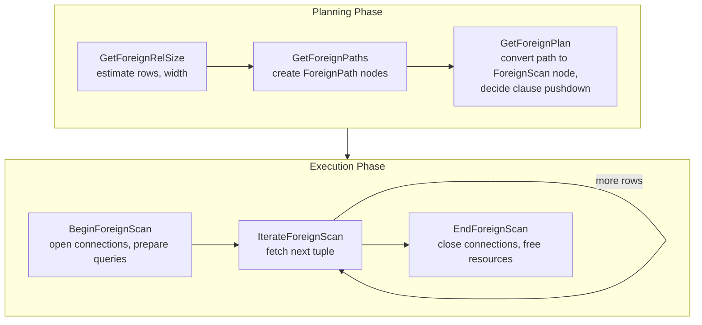

# Foreign Data Wrappers: The FDW API

> *A Foreign Data Wrapper makes any external data source -- another PostgreSQL instance, a CSV file, a REST API, Redis, MongoDB -- look like a local table. The FDW API is the most complex extension interface in PostgreSQL, spanning planning, execution, modification, EXPLAIN, ANALYZE, parallel scan, and asynchronous execution.*

## Overview

The SQL/MED (Management of External Data) standard defines the concept of foreign tables -- tables whose data lives outside the local database. PostgreSQL implements this through the Foreign Data Wrapper API, a callback-based protocol defined by the `FdwRoutine` struct. An FDW handler function returns this struct, and the planner and executor call its function pointers at each stage of query processing.

The API is divided into required and optional callbacks. At minimum, an FDW must implement seven functions: three for planning (`GetForeignRelSize`, `GetForeignPaths`, `GetForeignPlan`) and four for execution (`BeginForeignScan`, `IterateForeignScan`, `ReScanForeignScan`, `EndForeignScan`). Optional callbacks add support for DML operations, join pushdown, aggregate pushdown, parallel scans, EXPLAIN output, ANALYZE statistics, and asynchronous execution.



## Key Source Files

| File | Purpose |
|------|---------|
| `src/include/foreign/fdwapi.h` | `FdwRoutine` struct and all callback typedefs |
| `src/include/foreign/foreign.h` | `ForeignServer`, `ForeignTable`, `UserMapping` structs |
| `src/backend/foreign/foreign.c` | `GetFdwRoutine`, catalog lookups |
| `src/backend/optimizer/plan/createplan.c` | Calls `GetForeignPlan` to create `ForeignScan` nodes |
| `src/backend/executor/nodeForeignscan.c` | Drives `BeginForeignScan`/`IterateForeignScan`/`EndForeignScan` |
| `contrib/postgres_fdw/` | Reference implementation (remote PostgreSQL access) |
| `contrib/file_fdw/` | Simple example (CSV file access) |

## How It Works

### SQL Setup

```sql
-- 1. Create the FDW (references the handler shared library)
CREATE FOREIGN DATA WRAPPER my_fdw
    HANDLER my_fdw_handler
    VALIDATOR my_fdw_validator;

-- 2. Create a server (connection parameters)
CREATE SERVER remote_srv
    FOREIGN DATA WRAPPER my_fdw
    OPTIONS (host 'remote.example.com', port '5432', dbname 'mydb');

-- 3. Create user mapping (authentication)
CREATE USER MAPPING FOR current_user
    SERVER remote_srv
    OPTIONS (user 'remote_user', password 'secret');

-- 4. Create foreign table
CREATE FOREIGN TABLE remote_orders (
    id integer,
    customer_id integer,
    total numeric
) SERVER remote_srv
  OPTIONS (schema_name 'public', table_name 'orders');

-- Now use it like a local table
SELECT * FROM remote_orders WHERE customer_id = 42;
```

### The Handler Function

```c
PG_FUNCTION_INFO_V1(my_fdw_handler);
Datum
my_fdw_handler(PG_FUNCTION_ARGS)
{
    FdwRoutine *routine = makeNode(FdwRoutine);

    /* Required scan callbacks */
    routine->GetForeignRelSize = myGetForeignRelSize;
    routine->GetForeignPaths = myGetForeignPaths;
    routine->GetForeignPlan = myGetForeignPlan;
    routine->BeginForeignScan = myBeginForeignScan;
    routine->IterateForeignScan = myIterateForeignScan;
    routine->ReScanForeignScan = myReScanForeignScan;
    routine->EndForeignScan = myEndForeignScan;

    /* Optional: DML support */
    routine->AddForeignUpdateTargets = myAddForeignUpdateTargets;
    routine->PlanForeignModify = myPlanForeignModify;
    routine->BeginForeignModify = myBeginForeignModify;
    routine->ExecForeignInsert = myExecForeignInsert;
    routine->ExecForeignUpdate = myExecForeignUpdate;
    routine->ExecForeignDelete = myExecForeignDelete;
    routine->EndForeignModify = myEndForeignModify;

    /* Optional: join and aggregate pushdown */
    routine->GetForeignJoinPaths = myGetForeignJoinPaths;
    routine->GetForeignUpperPaths = myGetForeignUpperPaths;

    /* Optional: EXPLAIN */
    routine->ExplainForeignScan = myExplainForeignScan;

    PG_RETURN_POINTER(routine);
}
```

### Query Lifecycle Through the FDW API

```
SQL: SELECT * FROM remote_orders WHERE customer_id = 42

PLANNING PHASE
==============

1. GetForeignRelSize(root, baserel, foreigntableid)
   |
   |  Purpose: Estimate the size of the foreign table scan.
   |  The FDW sets baserel->rows, baserel->reltarget->width,
   |  and stores private state in baserel->fdw_private.
   |
   |  postgres_fdw: Opens a connection, runs EXPLAIN on the remote
   |  server to get row estimates.
   |
   v

2. GetForeignPaths(root, baserel, foreigntableid)
   |
   |  Purpose: Create one or more ForeignPath nodes representing
   |  different ways to scan the foreign table.
   |
   |  The FDW calls add_path() for each alternative. A typical
   |  FDW creates one path for a full remote scan and possibly
   |  a parameterized path for nested-loop joins.
   |
   v

3. GetForeignPlan(root, baserel, foreigntableid, best_path, tlist, scan_clauses, outer_plan)
   |
   |  Purpose: Convert the chosen ForeignPath into a ForeignScan
   |  plan node. The FDW decides which WHERE clauses to push down
   |  to the remote side and which to evaluate locally.
   |
   |  Returns: ForeignScan node with fdw_private data encoding
   |  the remote query to execute.
   |
   v

EXECUTION PHASE
===============

4. BeginForeignScan(node, eflags)
   |
   |  Purpose: Initialize execution state. Open remote connections,
   |  prepare remote queries, allocate buffers.
   |
   |  The FDW stores its state in node->fdw_state.
   |
   v

5. IterateForeignScan(node)  [called repeatedly]
   |
   |  Purpose: Fetch the next tuple from the foreign source.
   |  Returns a TupleTableSlot with data, or an empty slot
   |  when the scan is complete.
   |
   |  postgres_fdw: Fetches batches of rows from the remote cursor,
   |  returns them one at a time.
   |
   v

6. ReScanForeignScan(node)
   |
   |  Purpose: Restart the scan, possibly with new parameters
   |  (for parameterized nested-loop joins).
   |
   v

7. EndForeignScan(node)
   |
   |  Purpose: Release resources. Close remote connections/cursors,
   |  free buffers.
   |
   v
   Done.
```

### DML Callbacks

For `INSERT`, `UPDATE`, and `DELETE` on foreign tables:

```
INSERT INTO remote_orders VALUES (1, 42, 99.99)

Planning:
  AddForeignUpdateTargets(root, rtindex, rte, relation)
    --> Add junk columns needed to identify rows (e.g., ctid)
  PlanForeignModify(root, plan, resultRelation, subplan_index)
    --> Return fdw_private list with remote DML plan

Execution:
  BeginForeignModify(mtstate, rinfo, fdw_private, subplan_index, eflags)
    --> Prepare remote INSERT/UPDATE/DELETE statement
  ExecForeignInsert(estate, rinfo, slot, planSlot)
    --> Execute remote INSERT, return result slot
  EndForeignModify(estate, rinfo)
    --> Close remote statement
```

For batch inserts, `ExecForeignBatchInsert` and `GetForeignModifyBatchSize` allow the FDW to insert multiple rows in a single round-trip:

```c
typedef TupleTableSlot **(*ExecForeignBatchInsert_function) (
    EState *estate, ResultRelInfo *rinfo,
    TupleTableSlot **slots, TupleTableSlot **planSlots,
    int *numSlots);

typedef int (*GetForeignModifyBatchSize_function) (ResultRelInfo *rinfo);
```

### Join Pushdown

The `GetForeignJoinPaths` callback lets an FDW push joins to the remote server:

```c
typedef void (*GetForeignJoinPaths_function) (
    PlannerInfo *root,
    RelOptInfo *joinrel,
    RelOptInfo *outerrel,
    RelOptInfo *innerrel,
    JoinType jointype,
    JoinPathExtraData *extra);
```

When both sides of a join are foreign tables on the same remote server, `postgres_fdw` creates a `ForeignPath` that represents executing the entire join remotely. The planner compares this path's cost against local join alternatives and picks the cheapest.

### Upper Relation Pushdown (Aggregates, Sorts, Limits)

```c
typedef void (*GetForeignUpperPaths_function) (
    PlannerInfo *root,
    UpperRelationKind stage,   /* GROUP_AGG, ORDERED, FINAL, etc. */
    RelOptInfo *input_rel,
    RelOptInfo *output_rel,
    void *extra);
```

This allows FDWs to push `GROUP BY`, `ORDER BY`, `LIMIT`, and other post-scan operations to the remote server. `postgres_fdw` uses this to generate remote queries like `SELECT customer_id, SUM(total) FROM orders GROUP BY customer_id ORDER BY 1 LIMIT 10`.

### Parallel Foreign Scans

FDWs can participate in parallel query execution:

```
IsForeignScanParallelSafe(root, rel, rte)
  --> Return true if this scan can run in parallel workers

EstimateDSMForeignScan(node, pcxt)
  --> Return shared memory needed for parallel coordination

InitializeDSMForeignScan(node, pcxt, coordinate)
  --> Set up shared state in DSM segment (leader process)

InitializeWorkerForeignScan(node, toc, coordinate)
  --> Attach to shared state (worker processes)

ReInitializeDSMForeignScan(node, pcxt, coordinate)
  --> Reset for rescan in parallel context

ShutdownForeignScan(node)
  --> Cleanup before DSM is destroyed
```

### Asynchronous Execution

Added in PostgreSQL 14, async execution allows the executor to request data from multiple foreign scans concurrently:

```
IsForeignPathAsyncCapable(path)
  --> Return true if this path supports async execution

ForeignAsyncRequest(areq)
  --> Initiate an asynchronous data fetch

ForeignAsyncConfigureWait(areq)
  --> Register wait events (socket fd) with the wait event set

ForeignAsyncNotify(areq)
  --> Process completed async request, provide result tuple
```

This enables the Append node to issue concurrent requests to multiple foreign servers, overlapping network latency.

## Key Data Structures

### FdwRoutine

The complete callback struct (approximately 40 function pointers):

```
FdwRoutine
 +-- type: NodeTag (T_FdwRoutine)
 |
 +-- REQUIRED: Scan Planning & Execution
 |    +-- GetForeignRelSize
 |    +-- GetForeignPaths
 |    +-- GetForeignPlan
 |    +-- BeginForeignScan
 |    +-- IterateForeignScan
 |    +-- ReScanForeignScan
 |    +-- EndForeignScan
 |
 +-- OPTIONAL: Join & Upper Pushdown
 |    +-- GetForeignJoinPaths
 |    +-- GetForeignUpperPaths
 |
 +-- OPTIONAL: DML
 |    +-- AddForeignUpdateTargets
 |    +-- PlanForeignModify
 |    +-- BeginForeignModify
 |    +-- ExecForeignInsert / ExecForeignBatchInsert
 |    +-- GetForeignModifyBatchSize
 |    +-- ExecForeignUpdate
 |    +-- ExecForeignDelete
 |    +-- EndForeignModify
 |    +-- BeginForeignInsert / EndForeignInsert
 |    +-- IsForeignRelUpdatable
 |
 +-- OPTIONAL: Direct Modify (UPDATE/DELETE pushdown)
 |    +-- PlanDirectModify
 |    +-- BeginDirectModify
 |    +-- IterateDirectModify
 |    +-- EndDirectModify
 |
 +-- OPTIONAL: Row Locking
 |    +-- GetForeignRowMarkType
 |    +-- RefetchForeignRow
 |    +-- RecheckForeignScan
 |
 +-- OPTIONAL: EXPLAIN
 |    +-- ExplainForeignScan
 |    +-- ExplainForeignModify
 |    +-- ExplainDirectModify
 |
 +-- OPTIONAL: ANALYZE
 |    +-- AnalyzeForeignTable
 |
 +-- OPTIONAL: IMPORT FOREIGN SCHEMA
 |    +-- ImportForeignSchema
 |
 +-- OPTIONAL: TRUNCATE
 |    +-- ExecForeignTruncate
 |
 +-- OPTIONAL: Parallel Execution
 |    +-- IsForeignScanParallelSafe
 |    +-- EstimateDSMForeignScan
 |    +-- InitializeDSMForeignScan
 |    +-- ReInitializeDSMForeignScan
 |    +-- InitializeWorkerForeignScan
 |    +-- ShutdownForeignScan
 |
 +-- OPTIONAL: Path Reparameterization
 |    +-- ReparameterizeForeignPathByChild
 |
 +-- OPTIONAL: Async Execution
      +-- IsForeignPathAsyncCapable
      +-- ForeignAsyncRequest
      +-- ForeignAsyncConfigureWait
      +-- ForeignAsyncNotify
```

### ForeignScanState (execution state)

```
ForeignScanState
 +-- ss (ScanState)       : base scan state with result slot, projection, quals
 +-- fdw_state (void*)    : FDW-private execution state
 +-- fdw_recheck_quals    : quals needing recheck for RecheckForeignScan
 +-- pscan_len            : parallel scan descriptor size
 +-- resultRelInfo        : for DML operations
```

### Catalog Objects

```
SQL Object                  Catalog Table          C Struct
-----------                 -------------          --------
FOREIGN DATA WRAPPER        pg_foreign_data_wrapper ForeignDataWrapper
SERVER                      pg_foreign_server       ForeignServer
USER MAPPING                pg_user_mapping         UserMapping
FOREIGN TABLE               pg_foreign_table        ForeignTable
                            (+ pg_class for columns)
```

## Clause Pushdown Decision Flow

The most important design decision for an FDW is which clauses to push down to the remote source:

```
GetForeignPlan receives scan_clauses (all applicable WHERE clauses)
  |
  For each clause:
  |
  +-- Can remote evaluate this expression?
  |    +-- Only built-in operators?
  |    +-- No local functions?
  |    +-- No volatile expressions?
  |    +-- Collation compatible?
  |
  +-- YES: Add to remote_conds (pushed down)
  |         --> Deparse into remote SQL WHERE clause
  |         --> Remove from local execution
  |
  +-- NO:  Add to local_conds (evaluated locally)
            --> Keep in scan_clauses for local filtering
            --> extract_actual_clauses() to get executable form
```

`postgres_fdw` implements this in `classifyConditions()` and `is_foreign_expr()`, which walk the expression tree checking that every node is safe to send to the remote server.

## Connections to Other Chapters

| Chapter | Connection |
|---------|-----------|
| [Chapter 7: Query Optimizer](../07-query-optimizer/) | `GetForeignRelSize`/`GetForeignPaths` integrate with the optimizer's path-based planning; `GetForeignJoinPaths` and `GetForeignUpperPaths` participate in join and upper planning |
| [Chapter 8: Executor](../08-executor/) | `ForeignScan` is an executor node driven by `nodeForeignscan.c`, following the same Init/Execute/End pattern as all plan nodes |
| [Chapter 3: Transactions](../03-transactions/) | `postgres_fdw` manages remote transactions coordinated with local transaction boundaries, including two-phase commit support |
| [Chapter 12: Replication](../12-replication/) | Logical replication can target foreign tables; FDW-based replication solutions use the same callback infrastructure |
| [Chapter 13: Statistics](../13-statistics/) | `AnalyzeForeignTable` lets FDWs provide statistics to the planner, enabling accurate cost estimation for foreign scans |
