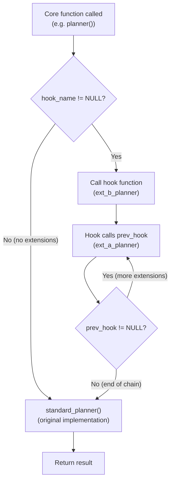

# Hooks: Intercepting Core Code Paths

> *A PostgreSQL hook is a global function pointer initialized to NULL. When an extension sets it to a non-NULL value, the core code calls the extension's function instead of (or in addition to) its default behavior. This single mechanism is how pg_stat_statements tracks queries, how sepgsql enforces mandatory access control, and how Citus reroutes queries to distributed shards.*

## Overview

PostgreSQL exposes dozens of hooks across the planner, executor, authentication, utility command processing, and logging subsystems. Each hook follows the same pattern: a global variable of a typedef'd function-pointer type, declared with `PGDLLIMPORT` so shared libraries can see and set it. The core code checks whether the pointer is non-NULL before calling it, and provides a `standard_*` fallback function that implements the default behavior.

This design has three important properties. First, it is zero-cost when unused -- a NULL check is a single branch instruction. Second, it supports chaining -- each extension saves the previous hook value and calls it, forming a call chain. Third, it is not thread-safe -- but that does not matter because PostgreSQL uses processes, not threads, and hooks are set once during `_PG_init`.



## Key Source Files

| File | Purpose |
|------|---------|
| `src/include/optimizer/planner.h` | `planner_hook`, `create_upper_paths_hook`, `planner_setup_hook`, `planner_shutdown_hook` |
| `src/include/optimizer/paths.h` | `set_rel_pathlist_hook`, `set_join_pathlist_hook`, `join_search_hook`, `join_path_setup_hook` |
| `src/include/optimizer/plancat.h` | `get_relation_info_hook` |
| `src/include/executor/executor.h` | `ExecutorStart_hook`, `ExecutorRun_hook`, `ExecutorFinish_hook`, `ExecutorEnd_hook`, `ExecutorCheckPerms_hook` |
| `src/include/libpq/auth.h` | `ClientAuthentication_hook`, `ldap_password_hook` |
| `src/include/utils/elog.h` | `emit_log_hook` |
| `src/include/tcop/utility.h` | `ProcessUtility_hook` |
| `src/include/miscadmin.h` | `shmem_request_hook` |

## How It Works

### The Hook Pattern

Every hook in PostgreSQL follows this three-part structure:

```
1. DECLARATION (in a header file):

   typedef ReturnType (*hook_name_type)(Args...);
   extern PGDLLIMPORT hook_name_type hook_name;

2. DEFAULT VALUE (in a .c file):

   hook_name_type hook_name = NULL;

3. CALL SITE (in core code):

   if (hook_name)
       result = hook_name(args...);
   else
       result = standard_function(args...);
```

The `PGDLLIMPORT` annotation ensures the symbol is visible from shared libraries on all platforms, including Windows where DLL symbol visibility is explicit.

### Hook Chaining

When multiple extensions install the same hook, they form a chain. The installation order (determined by the order in `shared_preload_libraries`) determines the call order -- the last extension loaded is the first called:

```
shared_preload_libraries = 'ext_a, ext_b'

Loading order:          ext_a._PG_init()  then  ext_b._PG_init()

ext_a saves:            prev = NULL (original)
ext_a installs:         planner_hook = ext_a_planner

ext_b saves:            prev = ext_a_planner
ext_b installs:         planner_hook = ext_b_planner

Call chain when planner runs:

    planner()
      |
      +--> planner_hook (= ext_b_planner)
              |
              +--> ext_b's prev_hook (= ext_a_planner)
                      |
                      +--> ext_a's prev_hook (= NULL)
                              |
                              +--> standard_planner()
```

### Planner Hooks

The planner offers the richest set of hooks, allowing extensions to intercept planning at multiple granularities:

```
  Query arrives
       |
       v
  +--------------------+
  | planner_hook       |  Replace or wrap the entire planner
  | (planner.h)        |  pg_hint_plan, Citus use this
  +--------------------+
       |
       v
  +--------------------+
  | planner_setup_hook |  Runs after PlannerGlobal is initialized,
  | (planner.h)        |  before actual planning begins
  +--------------------+
       |
       v
  +--------------------+
  | get_relation_info  |  Intercept relation metadata gathering
  | _hook (plancat.h)  |  (index list, stats, etc.)
  +--------------------+
       |
       v
  +--------------------+
  | set_rel_pathlist   |  Add or remove paths for a single relation
  | _hook (paths.h)    |  (custom scan providers use this)
  +--------------------+
       |
       v
  +--------------------+
  | set_join_pathlist  |  Add custom join paths
  | _hook (paths.h)    |
  +--------------------+
       |
       v
  +--------------------+
  | join_search_hook   |  Replace the entire join-order search
  | (paths.h)          |  (e.g., replace dynamic programming
  +--------------------+   with genetic algorithm)
       |
       v
  +--------------------+
  | create_upper_paths |  Add paths for post-scan/join processing
  | _hook (planner.h)  |  (GROUP BY, ORDER BY, LIMIT, etc.)
  +--------------------+
       |
       v
  +--------------------+
  | planner_shutdown   |  Runs before PlannerGlobal is freed
  | _hook (planner.h)  |  Cleanup, stats collection
  +--------------------+
```

#### planner_hook

The most powerful planner hook. It receives the parsed `Query` tree and must return a `PlannedStmt`:

```c
/* src/include/optimizer/planner.h */
typedef PlannedStmt *(*planner_hook_type) (Query *parse,
                                           const char *query_string,
                                           int cursorOptions,
                                           ParamListInfo boundParams,
                                           ExplainState *es);
extern PGDLLIMPORT planner_hook_type planner_hook;
```

Extensions that use this hook typically call `standard_planner` for normal queries and only intervene for specific patterns. Citus, for example, intercepts distributed queries here and replaces them with plans that route to worker nodes.

#### create_upper_paths_hook

Called once per `UpperRelationKind` stage, this hook lets extensions inject custom paths for aggregation, sorting, limits, and other upper-level processing:

```c
typedef void (*create_upper_paths_hook_type) (PlannerInfo *root,
                                              UpperRelationKind stage,
                                              RelOptInfo *input_rel,
                                              RelOptInfo *output_rel,
                                              void *extra);
```

The `stage` parameter tells the extension which upper-planning phase is executing (e.g., `UPPERREL_GROUP_AGG`, `UPPERREL_ORDERED`, `UPPERREL_FINAL`).

### Executor Hooks

The executor hooks form a symmetric set wrapping the four phases of query execution:

```c
/* src/include/executor/executor.h */
typedef void (*ExecutorStart_hook_type) (QueryDesc *queryDesc, int eflags);
typedef void (*ExecutorRun_hook_type) (QueryDesc *queryDesc,
                                       ScanDirection direction,
                                       uint64 count);
typedef void (*ExecutorFinish_hook_type) (QueryDesc *queryDesc);
typedef void (*ExecutorEnd_hook_type) (QueryDesc *queryDesc);
```

Each hook has a corresponding `standard_*` function:

```
  ExecutorStart()
       |
       +---> ExecutorStart_hook? --yes--> hook(queryDesc, eflags)
       |                           no
       +---> standard_ExecutorStart(queryDesc, eflags)

  ExecutorRun()
       |
       +---> ExecutorRun_hook? --yes--> hook(queryDesc, direction, count)
       |                         no
       +---> standard_ExecutorRun(queryDesc, direction, count)

  ExecutorFinish()
       |
       +---> ExecutorFinish_hook? --yes--> hook(queryDesc)
       |                            no
       +---> standard_ExecutorFinish(queryDesc)

  ExecutorEnd()
       |
       +---> ExecutorEnd_hook? --yes--> hook(queryDesc)
       |                         no
       +---> standard_ExecutorEnd(queryDesc)
```

**pg_stat_statements** is the canonical example. It installs all four hooks:
- `ExecutorStart_hook`: records the start timestamp
- `ExecutorRun_hook`: passes through to `standard_ExecutorRun`
- `ExecutorFinish_hook`: passes through
- `ExecutorEnd_hook`: calculates elapsed time, accumulates statistics in shared memory

#### ExecutorCheckPerms_hook

A special executor hook for row-level security extensions:

```c
typedef bool (*ExecutorCheckPerms_hook_type) (List *rangeTable,
                                              List *rtePermInfos,
                                              bool ereport_on_violation);
```

The **sepgsql** extension uses this to enforce SELinux mandatory access control policies on table access. If the hook returns `false` and `ereport_on_violation` is true, the query is rejected with a permission error.

### Authentication Hooks

```c
/* src/include/libpq/auth.h */
typedef void (*ClientAuthentication_hook_type) (Port *, int);
extern PGDLLIMPORT ClientAuthentication_hook_type ClientAuthentication_hook;
```

This hook is called after PostgreSQL's built-in authentication succeeds or fails. The second parameter is the authentication status. Extensions like **auth_delay** use this to add a configurable delay after failed login attempts (to slow down brute-force attacks).

```c
/* Password transformation hook for LDAP */
typedef char *(*auth_password_hook_typ) (char *input);
extern PGDLLIMPORT auth_password_hook_typ ldap_password_hook;
```

### Logging Hook

```c
/* src/include/utils/elog.h */
typedef void (*emit_log_hook_type) (ErrorData *edata);
extern PGDLLIMPORT emit_log_hook_type emit_log_hook;
```

Called for every log message that passes the `log_min_messages` threshold. The `ErrorData` struct contains the message text, severity, SQLSTATE code, and source location. Extensions like **pgaudit** use this to route audit events to external logging systems.

## Key Data Structures

### QueryDesc (executor hook parameter)

The `QueryDesc` is the central state object passed to all executor hooks. It contains everything needed to execute a query:

```
QueryDesc
 +-- operation       : CmdType (SELECT, INSERT, UPDATE, DELETE)
 +-- plannedstmt     : PlannedStmt* (the plan tree)
 +-- sourceText      : const char* (original SQL string)
 +-- snapshot        : Snapshot (MVCC visibility snapshot)
 +-- crosscheck_snapshot : Snapshot (for RI checks)
 +-- dest            : DestReceiver* (where to send results)
 +-- params          : ParamListInfo (bind parameters)
 +-- queryEnv        : QueryEnvironment*
 +-- instrument_options : int (EXPLAIN ANALYZE flags)
 +-- estate          : EState* (runtime executor state, set by ExecutorStart)
 +-- planstate       : PlanState* (root of executor plan tree)
 +-- totaltime       : InstrumentState* (timing for EXPLAIN ANALYZE)
```

### ErrorData (logging hook parameter)

```
ErrorData
 +-- elevel          : int (DEBUG5..PANIC)
 +-- sqlerrcode      : int (5-character SQLSTATE as int)
 +-- message         : char* (primary error message)
 +-- detail          : char* (optional detail)
 +-- hint            : char* (optional hint)
 +-- context         : char* (call stack context)
 +-- filename        : const char* (source file)
 +-- lineno          : int (source line)
 +-- funcname        : const char* (source function)
```

## Complete Hook Inventory

The following table lists all major hooks available in PostgreSQL. Each is a global function pointer that defaults to NULL:

| Hook | Header | Purpose | Notable Users |
|------|--------|---------|---------------|
| `planner_hook` | planner.h | Replace/wrap entire planner | Citus, pg_hint_plan |
| `planner_setup_hook` | planner.h | Post-PlannerGlobal init | |
| `planner_shutdown_hook` | planner.h | Pre-PlannerGlobal cleanup | |
| `create_upper_paths_hook` | planner.h | Add upper-relation paths | Citus, TimescaleDB |
| `get_relation_info_hook` | plancat.h | Intercept relation metadata | HypoPG |
| `set_rel_pathlist_hook` | paths.h | Add/remove relation paths | Custom scan providers |
| `set_join_pathlist_hook` | paths.h | Add custom join paths | |
| `join_search_hook` | paths.h | Replace join-order search | pg_hint_plan |
| `join_path_setup_hook` | paths.h | Initialize join path data | |
| `ExecutorStart_hook` | executor.h | Wrap executor startup | pg_stat_statements |
| `ExecutorRun_hook` | executor.h | Wrap tuple retrieval | pg_stat_statements |
| `ExecutorFinish_hook` | executor.h | Wrap post-scan cleanup | pg_stat_statements |
| `ExecutorEnd_hook` | executor.h | Wrap executor shutdown | pg_stat_statements |
| `ExecutorCheckPerms_hook` | executor.h | Override permission checks | sepgsql |
| `ClientAuthentication_hook` | auth.h | Post-authentication callback | auth_delay |
| `ldap_password_hook` | auth.h | Transform LDAP passwords | |
| `emit_log_hook` | elog.h | Intercept log messages | pgaudit |
| `shmem_request_hook` | miscadmin.h | Request shared memory | pg_stat_statements |

## Practical Example: How pg_stat_statements Uses Hooks

pg_stat_statements installs hooks at five points:

```
_PG_init()
  |
  +-- shmem_request_hook     --> request shared memory for stats hash table
  |
  +-- planner_hook           --> normalize query text, track planning time
  |
  +-- ExecutorStart_hook     --> record start time
  +-- ExecutorRun_hook       --> chain to standard (needed for timing)
  +-- ExecutorFinish_hook    --> chain to standard
  +-- ExecutorEnd_hook       --> calculate elapsed time, update stats entry
```

On every query completion, the `ExecutorEnd` hook:
1. Computes wall-clock time and resource usage deltas
2. Looks up (or creates) an entry in the shared hash table keyed by query ID
3. Atomically updates counters: `calls`, `total_time`, `rows`, `shared_blks_hit`, etc.
4. Chains to the previous `ExecutorEnd` hook (or `standard_ExecutorEnd`)

## Connections to Other Chapters

| Chapter | Connection |
|---------|-----------|
| [Chapter 7: Query Optimizer](../07-query-optimizer/) | Planner hooks operate on `Query`, `PlannerInfo`, `RelOptInfo`, and `Path` structures documented there |
| [Chapter 8: Executor](../08-executor/) | Executor hooks wrap the `ExecutorStart`/`Run`/`Finish`/`End` lifecycle; `QueryDesc` is the executor's central state |
| [Chapter 10: Memory](../10-memory/) | Hook functions execute within the same memory contexts as the core code they intercept |
| [Chapter 13: Statistics](../13-statistics/) | pg_stat_statements uses executor hooks to collect per-query statistics |
